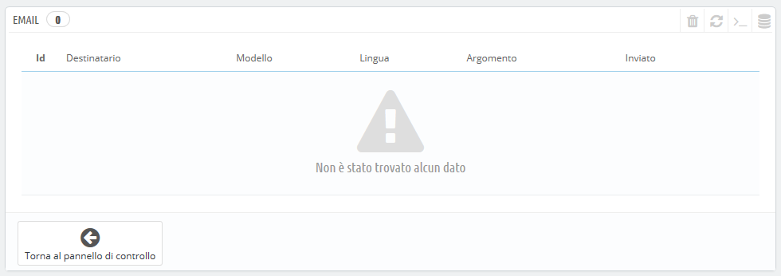
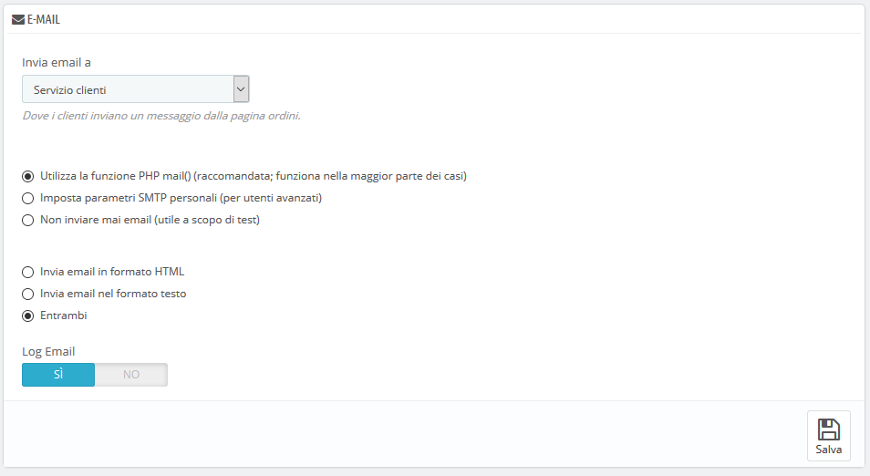
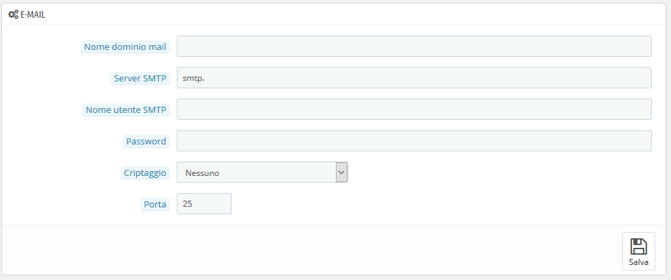
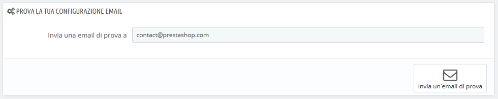

# E-mail

Il tuo negozio invia molti messaggi durante tutte le fasi della registrazione e dell'invio di un ordine. Qui puoi configurare il modo in cui inviare questi messaggi e vedere quali messaggi sono stati inviati.

## Email 

La prima sezione della pagina presenta un elenco di tutte le email inviate da PrestaShop, specificando il destinatario, il modello utilizzato, la lingua del messaggio, l'oggetto della email e la data di invio.

## Email 

Qui scegli come le tue email vengono inviate e ricevute.

Sono disponibili tre impostazioni:

* **Invia email a**: è un'impostazione per il front end. Al termine del processo di pagamento, il cliente può inviare un messaggio. Puoi scegliere a chi invierà questo messaggio selezionando il destinatario dall'elenco a discesa. Per aggiungere altri indirizzi è necessario andare in Parametri negozio &gt; Contatti.
* **Parametri email**: qui si può scegliete tra le tre opzioni il modo in cui vengono inviate tecnicamente le email. Per ulteriori informazioni, vedi sotto.
* **Formato email**: qui si può scegliete tra le tre opzioni di visualizzazione grafica delle email. Per ulteriori informazioni, vedi sotto.
* **Registra email**. Disattiva questa opzione se non desideri tenere traccia delle email inviate dal tuo negozio, come mostrato nella sezione email sopra.

### Configurazione Tecnica 

Configura PrestaShop per inviare email ai tuoi clienti. Ti consigliamo vivamente di consultare il tuo hosting web per conoscere le impostazioni da utilizzare per questa funzionalità. Le opzioni sono:

* **Non inviare mai email**. Utilizza questa impostazione esclusivamente durante la fase di prova. Una volta che il tuo negozio è pubblico, non dovresti mai usare questa impostazione.
* **Utilizza la funzione PHP mail**. Questa opzione è consigliata per impostazione predefinita. Se non funziona utilizza l'opzione SMPT qui sotto.
* **Imposta parametri SMTP personali**. In questo caso viene visualizzata una nuova sezione con più campi. Le informazioni per questi campi dovrebbero essere fornite dal tuo hosting web: nome del dominio di posta elettronica, server SMTP, utente SMTP, ecc. Assicurati di trascrivere esattamente ciò che il tuo hosting web ti fornisce.

Le informazioni per configurare l’SMTP ti possono essere fornite tramite:

* L’amministratore del tuo sistema,
* Il tuo hosting,
* Il tuo ISP,
* Il tuo provider e-mail.

Il tuo hosting web può dirti se il tuo nome utente è obbligatorio, nonché fornirti le informazioni sulla password e il criptaggio da utilizzare.

Ad esempio, nel caso di Gmail \(il servizio di posta elettronica offerto da Google\), potrebbe essere necessario immettere informazioni come quelle seguenti:

* SMTP server: [smtp.gmail.com](http://smtp.gmail.com/)
* User: [my.user.name@gmail.com](mailto:my.user.name@gmail.com) \(esempio\)
* Password: RT22UE87 \(esempio\)
* Critptaggio: SSL
* Porta: 465

### Configurazione visuale 

Sono disponibili due formati per le email: l'HTML è più gradevole alla vista, ma potrebbe non funzionare ovunque; il testo è noioso visivamente, ma funziona ovunque.

Puoi scegliere di utilizzare solo uno dei due o entrambi. Entrambi è la modalità consigliata.

## Prova la tua configurazione email  

Dopo aver configurato le tue email utilizzando uno dei due metodi disponibili, inserisci il tuo indirizzo email in questa sezione, quindi clicca sul pulsante "Invia una email di prova".

Ora controlla la casella di posta dell'indirizzo fornito per verificare di aver ricevuto l'email di prova nel formato corretto. Se non l'hai ricevuta, aggiorna la configurazione con le informazioni corrette.

