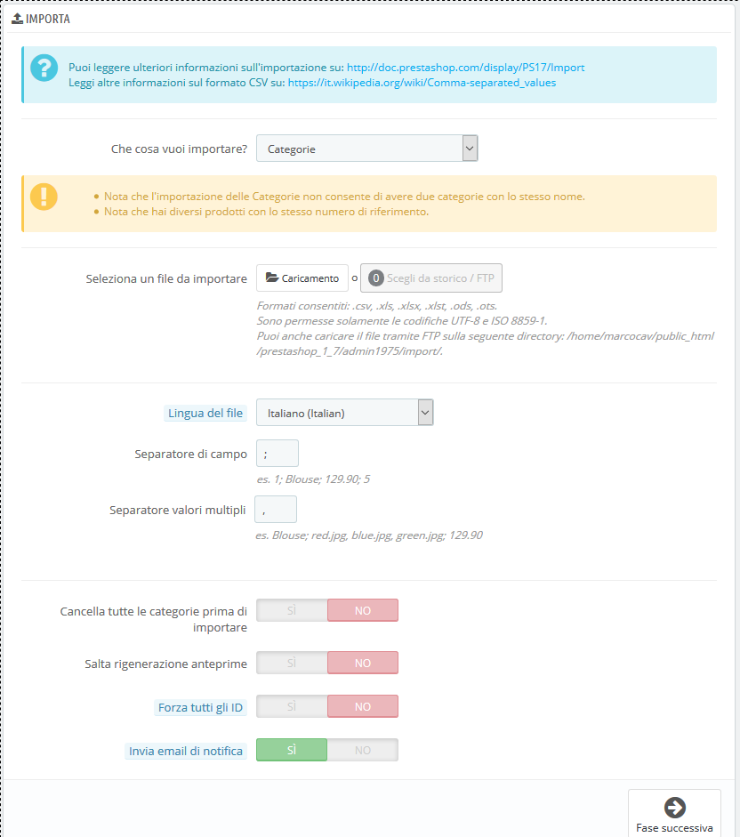
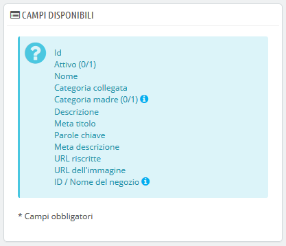
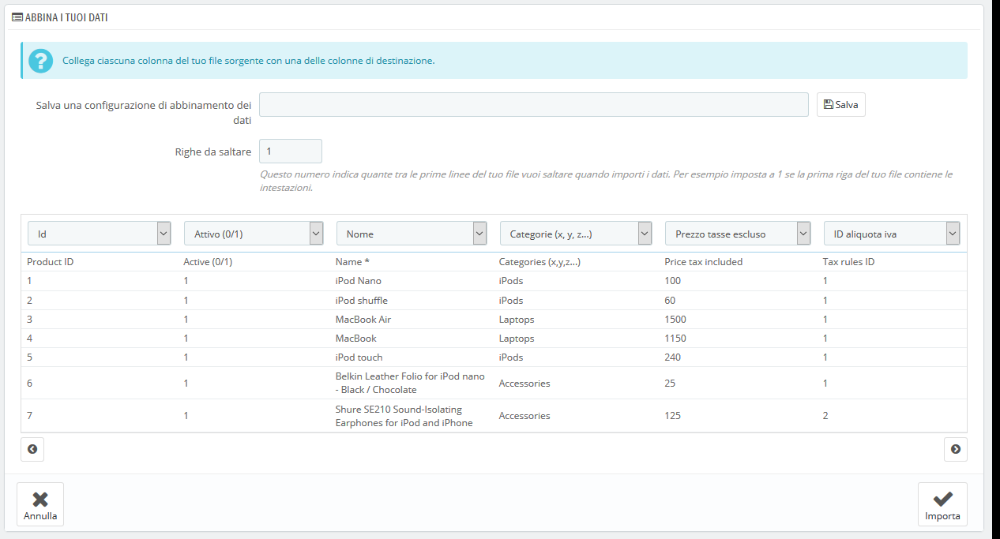
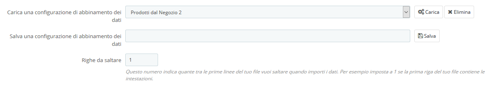

# Importazione

La pagina di importazione consente di inserire facilmente prodotti nel catalogo anche se si dispone di una quantità molto grande di prodotti e di importare i dati esportati e convertiti da un altro strumento di e-commerce.

Storicamente in PrestaShop le importazioni si effettuano utilizzando i file .CSV. A partire dalla versione 1.7 sono supportati anche altri formati di file, come .xls, .xlsx,, .xlst, .ods e .ots.

CSV è l’acronimo di "Comma-separated values” \(valori separati da virgole\). È un formato comune utile a importare, esportare o semplicemente memorizzare i dati in un formato non proprietario. Quasi tutti gli strumenti di gestione dei dati supportano il formato CSV. Puoi saperne di più sul formato CSV su Wikipedia: [https://it.wikipedia.org/wiki/Comma-separated\_values](https://it.wikipedia.org/wiki/Comma-separated_values).



Il processo di importazione richiede preparazione e inizia con un form che presenta le impostazioni primarie:

* **Che cosa vuoi importare?**. Scegli dall'elenco a discesa che tipo di entità desideri importare nel tuo negozio. I campi "disponibili" a destra vengono aggiornati quando si sceglie un'entità, in modo da conoscere il tipo di dati che il file di importazione deve contenere. PrestaShop consente di importare i seguenti tipi di dati:
  * Categorie,
  * Prodotti,
  * Combinazioni,
  * Clienti,
  * Indirizzi,
  * Marchi,
  * Fornitori,
  * Alias,
  * Ordini fornitori \(se è abilitata la Gestione Avanzata delle Scorte\),
  * Dettagli ordini fornitori \(se è abilitata la Gestione Avanzata delle Scorte\),
  * Contatti negozio
* **Seleziona un file da importare**. Puoi importare più di un file alla volta, ma assicurati che contengano tutti lo stesso tipo di dati. È possibile caricare i file dal computer o scegliere i file già disponibili sul tuo FTP / nella tua cronologia.

  È possibile scaricare i file di esempio per ciascun tipo di dati dalla sezione "Scarica file di esempio CSV" a destra. Ciò consente di confrontare questi file di esempio con i propri file, in modo da assicurarsi che i file da importare siano effettivamente pronti per essere importati in PrestaShop. Essi sono memorizzati nella cartella / `docs/csv_import` dell'installazione di PrestaShop.

* **Lingua del file.** I dati possono essere importati solo per una sola lingua alla volta. Se i tuoi dati sono in più lingue, a ogni file deve appartenere una lingua.
* **Separatore di campo.** Non tutti i file CSV utilizzano virgole per separare i valori: alcuni utilizzano tabulazioni, altri punti e virgola, ecc. In questo campo è possibile indicare quali separatori utilizzano.
* **Separatore valore multipli.** Quando un attributo può supportare più di un valore, questi valori devono essere separati con un separatore specifico. Dopo aver esaminato i tuoi file, indica qui il tuo separatore.
* **Cancella tutti \_\_\_\_\_ prima di importare.** Questa opzione cancella tutte le voci precedenti del tipo di dati che si sta importando. 
* **Usa il riferimento prodotto come chiave.** Solo per l’importazione dei prodotti. Puoi scegliere di impostare il codice del prodotto da PrestaShop oppure utilizzare il riferimento del prodotto come ID. In questo caso assicurati che il file contenga i riferimenti di tutti i prodotti importati.
* **Salta rigenerazione anteprime.** Solo per l'importazione delle categorie e dei prodotti. Puoi scegliere che PrestaShop rigeneri le miniature collegate dal file CSV \(nel campo "URL immagine" o " Image URL "\).
* **Forza tutti i numeri di identificazione.** È possibile mantenere gli ID importati oppure consentire di incrementarli automaticamente attraverso l’importazione.
* **Invia** **email di notifica**. Se stai importando file di grandi dimensioni, attiva questa opzione per ricevere un'email quando l'importazione è terminata. 

Quando si modifica l'entità che si desidera importare, la sezione a destra, intitolata "Campi disponibili", si modifica per presentare i campi con i dati importati. Sebbene lo strumento di importazione interfacci nel modo più corretto possibile i tuoi dati in PrestaShop, è bene renderli il più possibile “import-friendly” seguendo lo schema con le relative denominazioni e ordini dei campi presentati. Altrimenti, l'importazione sarà un po’ più macchinosa, anche se non impossibile.  
Alcuni campi dispongono di un piccolo popup di informazioni \(rappresentato da un logo "i"\), che è possibile visualizzare spostando il cursore del mouse sopra di esso. Essi riguardano principalmente le funzioni di gestione multistore e la gestione avanzate delle scorte. Assicurati di leggerli tutti per migliorare la creazione / modifica dei file di dati.



## Formato dati <a id="Importazione-Formatodati"></a>

Il file di dati importato deve essere un file di testo, utilizza un formato basato su CSV \(con estensione di file .csv\). Raccomandiamo di utilizzare un punto e virgola ";" come separatore di campo. Se i dati testuali \(descrizione del prodotto e simili\) contengono dei punti e virgola, dovresti rimuoverli oppure scegliere un altro separatore nell'opzione "Separatore di campo".

Puoi creare un file CSV usando un editor di testo \(come Notepad++: [http://notepad-plus-plus.org/](http://notepad-plus-plus.org/)\), ma ti consigliamo di utilizzare un programma di fogli di calcolo e di salvare il tuo lavoro nel formato CSV. L'utilizzo di un programma di fogli di calcolo consente di avere una comprensione più semplice e visuale dei dati rispetto al file di testo normale. Puoi usare Microsoft Excel che necessita di licenza commerciale \([https://products.office.com/it-it/business/office-365-business/](https://products.office.com/it-it/business/office-365-business/) o il calc. gratuito [http://www.openoffice.org/it/](http://www.openoffice.org/it/)\)

Ecco un esempio di un file da importare con un elenco di prodotti:

```text
"Abilita";"Nome";"Categorie";"Prezzo";"ID Regole Imposte";"Prezzo d’acquisto";"In saldo";"Referenza";"Peso";"Quantità";"Breve desc.";"Desc completa";"URL Immagine"
1;"Test";"1,2,3";130;1;75;0;"PROD-TEST";"0.500";10;"Questa è una desc. breve";"Questa è una desc. completa ";"http://www.myprestashop/immagine/prodotto1.gif"
0;"Test 02";"1,5";110;1;65;0;"PROD-TEST2";"0.500";10;"'Tis also a short desc.";" 'Anche Questa è una desc. completa.";"http://www.myprestashop/immagine/prodotto2.gif"
1;"Test 03";"4,5";150;1;85;0;"PROD-TEST3";"0.500";10;" 'Di nuovouna desc. completa ";"'Anche Questa è una desc. completa.";"http://www.myprestashop/imamagine/produtto3.gif"
```

Si noti che questo è solo un file di esempio standard creato per questa dimostrazione; non è intenzionalmente ottimizzato per l'importazione di PrestaShop. Se hai bisogno di un file di esempio per imparare, utilizza gli esempi che puoi scaricare dal file "Scarica il file CSV di esempio".

La prima riga è un nome descrittivo per la colonna dati \(potrai saltarla durante il processo di importazione\). Deve avere lo stesso numero di colonne in ogni riga.

Devi ricordare che:

* La colonna dei prezzi utilizzerà la valuta predefinita del tuo negozio.
* Le categorie devono essere specificate utilizzando i loro ID esistenti \(quindi dovresti averli importati innanzitutto\) e devono essere separate da una virgola \(per impostazione predefinita\).
* L'URL dell'immagine deve essere un collegamento effettivo. In altre parole, dovrebbe essere il collegamento che può essere utilizzato in un browser web per visualizzare l'immagine. Per esempio: [http://www.myprestashop/immagine/prodottoXXX.gif](http://www.myprestashop/immagine/prodottoXXX.gif).
* La codifica dei caratteri del file deve essere UTF-8. Altrimenti usa ISO-8859-1.
* I dati usano il formato ISO 8601, senza un indicatore di zona temporale \(l’indicatore di zona temporale è quello del tuo negozio\): `2017-09-02 15:07:27`.

## Caricare il file  <a id="Importazione-Caricareilfile"></a>

Una volta che tutti i tuoi dati sono in formato CSV, puoi caricarli nel database del tuo negozio utilizzando il modulo in questa pagina.

Hai due modi per registrare i file da importare:

* Utilizzando il tuo browser: clicca sul pulsante "Carica", troverai quindi il file da convalidare. Ripeti questa operazione tutte le volte necessarie per specificare tutti i file di importazione.
* Utilizzando il client FTP: carica i file nella cartella / `admin-dev/import` dell'installazione di PrestaShop. Ricarica la pagina di importazione: il pulsante "Scegli dallo storico / FTP" dovrebbe indicare un numero. Clicca sul pulsante per visualizzare l'elenco dei file disponibili \(inclusi quelli precedentemente caricati utilizzando il browser\), quindi clicca sul pulsante "Usa" per il file che si desidera importare.

Una volta che tutti i file sono nell’elenco nella sezione "Seleziona un file da importare", puoi procedere con il form:

1. **Conferma il tipo di dati contenuti nel file**, utilizzando l'elenco a discesa denominato "Cosa vuoi importare?". Dopo aver selezionato il tipo di dati, sulla destra appare l'elenco dei campi disponibili che ti aiuta a perfezionare il file CSV - almeno per l'ordine delle colonne, che si dimostrerà presto utile.
2. **Seleziona la lingua del contenuto importato**. Se la lingua di destinazione non è disponibile, è necessario prima installarla nella pagina "Traduzioni" nel menu "Internazionale".
3. **Seleziona i separatori**. Suggeriamo di lasciare i valori predefiniti \("separatore di campo" con un punto e virgola ";", "separatori di valori multipli" con una virgola ","\). Ovviamente, se il file CSV è costruito in modo diverso, è necessario modificare di conseguenza tali valori
4. Se si desidera rimuovere tutti i prodotti del catalogo prima dell'importazione, selezionare l'opzione appropriata.
5. Una volta che tutte le tue scelte sono state fatte, clicca su "Passo successivo".

Tutti i file di importazione vengono caricati direttamente nella cartella amministratore `import` sotto-cartella. Se il menu a discesa del file è troppo pieno è possibile eliminare le vecchie importazioni utilizzando direttamente il client FTP.

Quando si clicca sul pulsante "Passo successivo" la pagina viene ricaricata con lo strumento di mappatura dei dati. Questa interfaccia ti aiuta a mappare le colonne del file dati con quelle richieste da PrestaShop.



In questa tabella si presentano le righe del tuo file, poste sotto colonne arbitrarie corrispondenti alle esigenze del database di PrestaShop. Sta a te assicurarti che tutte le colonne del file CSV siano abbinate all'intestazione corretta della colonna, utilizzando il selettore a discesa di ciascuna intestazione, in modo da importare correttamente i contenuti.

Ad esempio, con il nostro file di esempio:

* **Prima colonna**. Lo abbiamo contrassegnato come "Abilitato", PrestaShop presenta "ID" come intestazione. Clicca sul menu a discesa dell'intestazione e seleziona "Attivo \(0/1\)".
* **Seconda colonna**. Contrassegnata con "Nome", l'intestazione indica "Attivo \(0/1\)". Inseriamo "Nome \*" nell'intestazione.
* **Terza colonna**. Ti sei fatto un’idea...

Lo schermo non può contenere più di 6 colonne, quindi clicca sui pulsanti "&gt;" e "&lt;" per visualizzare le altre colonne e assicurati che corrispondano correttamente.

Nel nostro esempio abbiamo usato la prima riga per i nomi delle colonne. Poiché non vogliamo che vengano importati, inserisci "1" nelle "Righe da saltare".

Una volta fatto corrispondere le colonne, clicca sul pulsante "Importa" \(in basso a destra dello schermo\) e PrestaShop avvierà il processo di importazione. Si aprirà una finestra pop-up per mostrare il progresso dell'importazione.

Quando il processo è completo, apparirà "100% convalidato" e "100% importato". Quando si chiude questo pop-up, si viene reindirizzati alla schermata principale. Se si verifica un errore durante l'importazione, verrà visualizzato un avviso dei problemi riscontrati. In questo secondo caso è necessario esaminare il file e assicurarsi di correggere tutto.

### Mappare configurazioni <a id="Importazione-Mappareconfigurazioni"></a>

Il processo di mappatura può essere un compito noioso se non è possibile personalizzare l'ordine delle colonne di file in base a quelle utilizzate dall'importazione di PrestaShop, soprattutto se occorre farlo più volte. È per questo che PrestaShop offre un piccolo strumento per salvare l'ordine corrente di mappatura impostato, utilizzando tutti i selettori a discesa delle intestazioni.



Lo strumento è un semplice campo nella parte superiore dello strumento di corrispondenza. È possibile eseguire le tre azioni principali \(solo se non è stata salvata una configurazione di mappatura\):

* **Salva**. Inserisci un nome descrittivo nel campo e clicca su "Salva". L'interfaccia si aggiorna per visualizzare la configurazione salvata nell'elenco a discesa.
* **Carica**. Seleziona una configurazione di mappatura nell'elenco a discesa e clicca su "Carica".
* **Elimina**. Seleziona una configurazione di mappatura nell'elenco a discesa e clicca su "Elimina".

