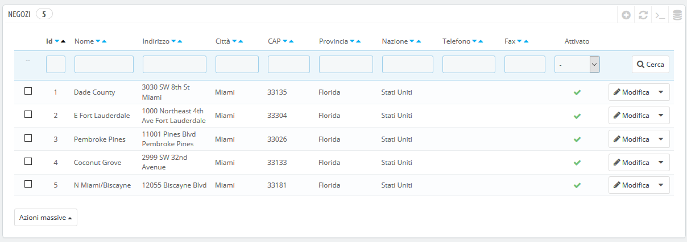
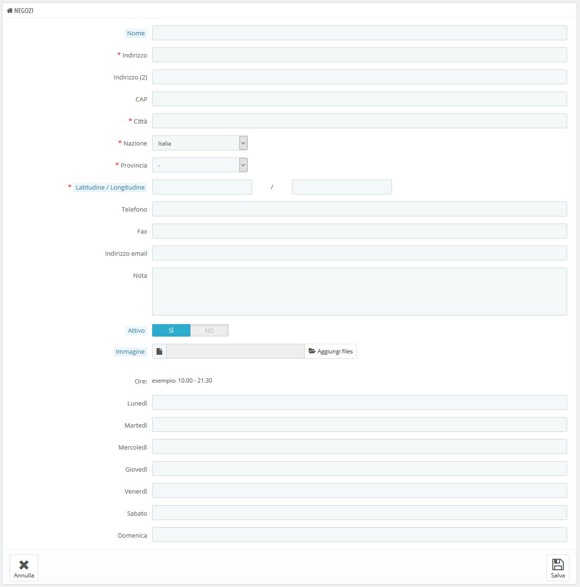
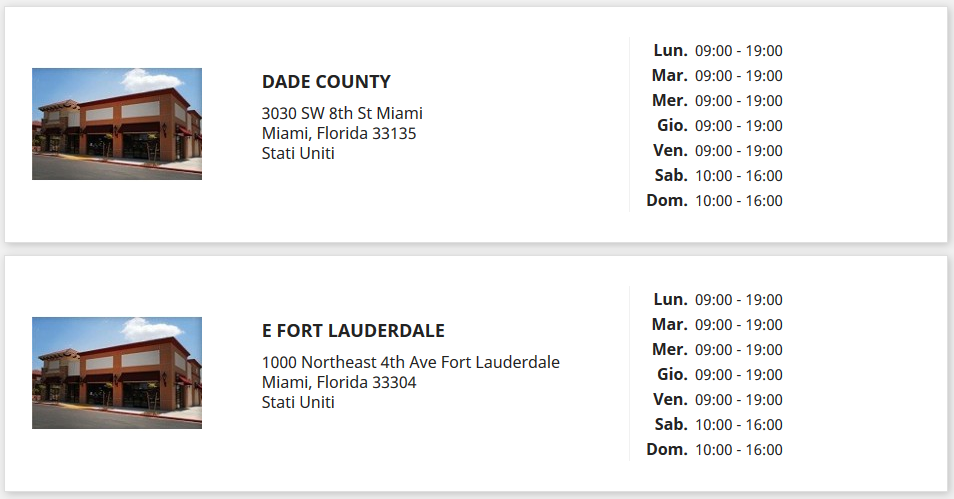

# Negozio e Dettagli di Contatto

## Preferenze di Contatto Negozio 

PrestaShop fornisce ai tuoi clienti un elenco dei tuoi negozi fisici con informazioni dettagliate sui contatti. Ovviamente, questa caratteristica è utile solo se si dispone di negozi fisici in cui i clienti possono venire a comprare prodotti.

I clienti possono raggiungere la pagina "Negozi" dal footer del negozio.

Non puoi disattivare questa funzionalità, ma renderla inaccessibile ai clienti:

* Disattiva o elimina tutti i negozi elencati nella pagina di amministrazione "Negozi".
* Disattiva il collegamento nel footer: nella pagina di amministrazione di "Link Widget", rimuovi il collegamento "Negozi" dal blocco "La nostra azienda".

In questo modo la pagina esiterà ancora e sarà accessibile ai motori di ricerca. Per eliminarla definitivamente, dovresti:

* Andare su "Traffico&gt; SEO e URL"
* Trovare la pagina "negozi"
* Eliminarla

Se un giorno desideri nuovamente la pagina "Negozi" devi crearla da capo nella pagina "SEO e URL", con le seguenti informazioni:

* Nome della pagina: seleziona "negozi"
* Titolo della pagina: "Negozi"
* Rewrite URL: "negozi"

### Elenco Negozi 

È possibile scegliere come mostrare questi negozi nel front office. Il cliente può accedervi tramite il link "Negozi" \(a seconda del tema\)

Nella tua interfaccia, tutti i tuoi negozi sono elencati in una lista pratica, con le informazioni di ogni negozio e l’indicazione sull’apertura o meno - per esempio puoi raccogliere in anticipo le informazioni di un nuovo negozio per avere la pagina pronta per il lancio.

#### Aggiungere un nuovo negozio fisico 

Come di consueto clicca su "Aggiungi nuovo negozio" per accedere al form di creazione del negozio.  

Compila il maggior numero possibile di campi, in quanto verranno mostrati ai tuoi clienti.

Un campo importante è "Latitudine/Longitudine", in quanto indica la posizione del tuo negozio \(a seconda del tema\). È possibile utilizzare lo strumento online di Steve Morse per ottenere le coordinate lat/long di un determinato indirizzo: [http://stevemorse.org/jcal/latlon.php](http://stevemorse.org/jcal/latlon.php).

Assicurati di aggiungere un'immagine della vetrina, in modo che tuoi clienti, una volta in strada, possano riconoscerla e trovarla.

Infine, i giorni e le ore di apertura sono parte essenziale di qualsiasi negozio fisico, dovresti quindi essere il più preciso possibile nell’indicarli.

## Dettagli di Contatto 

Questa sezione consente di fornire i principali dettagli della tua azienda, o di uno specifico negozio. Dovresti compilare tutti i campi con informazioni sul tuo quartier generale, in quanto si tratta dell'indirizzo che i clienti utilizzeranno per contattarti o addirittura visitare la tua attività.

Questi campi devono essere accuratamente riempiti:

* **Nome del negozio**. Il nome del tuo negozio. Rendilo breve per quanto possibile, in quanto sarà utilizzato in tutti i titoli di corrispondenza e di pagina.
* **Email del negozio**. L'indirizzo di contatto ufficiale della tua attività. Utilizza l'indirizzo email di contatto generale che i clienti devono vedere quando ricevono un messaggio dal tuo negozio.
* **Numero di iscrizione**. Indicare i numeri di registrazione legali della tua società che dipendono dal sistema legale del tuo Paese \(numero di Duns negli Stati Uniti, numero di SIRET in Francia, numero di CNPJ in Brasile, Partita Iva in Italia ecc.\). Dimostra che sei un'azienda conformemente registrata, suggerendo, ai tuoi potenziali clienti, un'opinione più rassicurante del tuo negozio.
* **Indirizzo negozio / Indirizzo negozio linea 2 / Codice postale / CAP / Città / Stato / Paese**. Utilizza l'indirizzo di contatto ufficiale della tua attività. L'opzione "Stato" viene visualizzata solo quando il Paese selezionato dispone degli Stati impostati nel database \(attraverso la pagina "Stati" nel menu "Localizzazione"\)
* **Telefono**. Il numero di telefono ufficiale del tuo business. Se preferisci che i clienti non ti chiamano, non compilare questo campo.
* **Fax**. Il numero di fax ufficiale del tuo business.

Non utilizzare i due punti \(":"\) nel nome del tuo negozio, in quanto potrebbe impedire il funzionamento di alcuni riferimenti \(ad esempio, l'invio di posta elettronica potrebbe non riuscire\).

È possibile sostituire i due punti con il trattino se è necessario disporre di due sezioni nel titolo. Ad esempio, utilizzare "MyStore - Il posto migliore per acquistare oggetti" invece di "MyStore: Il posto migliore per acquistare oggetti”.

