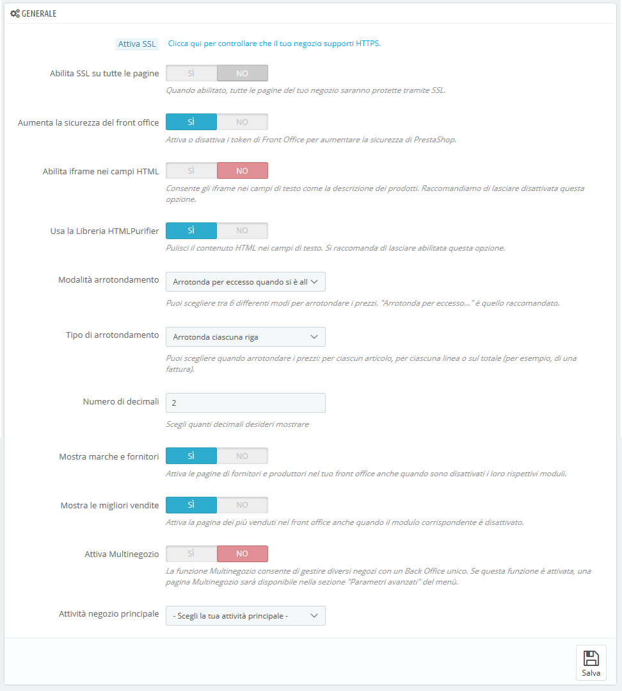

# Parametri generali

La pagina dei parametri "Generali" presenta una serie di impostazioni specifiche che non è possibile inserire da altri menu. Sono tuttavia indispensabili:

* **Abilita SSL**. SSL significa "Secure Sockets Layer" e comprende il TSL \("Transport Layer Security"\). Entrambi sono protocolli Internet crittografici che rendono sicure le comunicazioni Web. Puoi scoprire di più su questi protocolli su Wikipedia: [https://it.wikipedia.org/wiki/Transport\_Layer\_Security](https://it.wikipedia.org/wiki/Transport_Layer_Security). Fornire una connessione SSL al tuo negozio non è solo eccellente per qualsiasi comunicazione su Internet, ma è anche un ottimo modo per rassicurare i tuoi clienti sulla sicurezza dei propri dati \(autenticazione, carta di credito, ecc.\) forniti al tuo negozio dato che i browser moderni segnalano che la connessione è protetta. Se il tuo provider di hosting supporta SSL, accertati di attivare il supporto SSL di PrestaShop cliccando sul link. Ciò mostrerà un selettore, dove occorre scegliere "Sì". SSL sarà abilitato in tutte le pagine di conferma ordine e di pagamento.
* **Abilita SSL su tutte le pagine**. Questa opzione è disponibile solo se si ha abilitato SSL. Se attiva tutte le pagine del tuo negozio saranno potette dal protocollo SSL \(non solo la pagina di conferma ordine e la pagina dell’account\).
* **Aumenta la sicurezza del front office**. Aggiunge i token di sicurezza al tuo negozio al fine di migliorare la sua sicurezza. In effetti, ogni URL è specifico per la sessione di un cliente e non può essere utilizzato così com’è su un altro browser, proteggendo quindi le informazioni che potrebbero essere state memorizzate durante la sessione.
* **Consenti iframe nei campi HTML**. L'opzione consente di inserire iframe nei campi di testo, come ad esempio nella descrizione del prodotto. Gli iframe sono elementi HTML che consentono di caricare un contenuto esterno all’interno della pagina. Ti consigliamo di lasciare questa opzione disabilitata a meno che non sia necessario.
* **Usa la libreria HTMLPurifier**. I clienti possono inviare informazioni al tuo negozio utilizzando campi di testo \(ad esempio descrizioni dei prodotti o informazioni dei clienti\), ma gli hacker possono provare a utilizzare questi campi per inviare codice dannoso per tentare di hackerare il tuo negozio. Questa opzione accerta che tutti i dati inviati al tuo negozio siano sicuri. Dovresti disattivarlo solo se sai bene ciò che stai facendo.
* **Modalità arrotondamento**.  Una volta applicate tasse e sconti, un prezzo può contenere troppi decimali, come ad esempio € 42.333333333. L’opzione di arrotondamento viene utilizzata in tutto PrestaShop, nella visualizzazione dei prezzi nel front office e durante il processo di calcolo dei prezzi \(tasse, sconti, ecc.\). Incide poco sul modo in cui vengono calcolati i prezzi, ma l'impatto è molto più grande se si considera il totale della fattura, qualora molti elementi vengano aggiunti a tasse e sconti.  Sussistono sei modalità: 
  * **Arrotondamento lontano dallo zero, a metà.** È la modalità raccomandata: 42.55555555 diventa 42.56.
  * **Arrotondamento vicino allo zero, a metà**. 42.55555555 diventa 42.56.
  * **Arrotondamento verso il valore successivo**. 42.55555555 diventa 42.56.
  * **Arrotondamento verso il valore dispari successivo**. 42.55555555 diventa 42.56.
  * **Arrotondamento per eccesso al valore più vicino**. 42.55555555 diventa 42.56.
  * **Arrotondamento per difetto al valore più vicino**. 42.55555555 diventa 42.55.
* **Tipo arrotondamento**. Questa opzione consente di scegliere il tipo di arrotondamento che può influenzare notevolmente il calcolo del totale. Sono disponibili tre tipi, in ordine progressivo: 
  * **Arrotondamento su ogni articolo**. Ogni prezzo dell'articolo sarà arrotondato prima del calcolo del totale. Se è presente più volte lo stesso oggetto, ognuno di essi sarà arrotondato separatamente prima del calcolo.
  * **Arrotondamento su ogni riga.** Ogni riga di elementi sarà arrotondata prima del calcolo del totale. Se è presente più volte lo stesso oggetto, l'arrotondamento verrà effettuato sul valore totale.
  * **Arrotondamento sul totale**. L'arrotondamento sarà effettuato solo sul calcolo finale, dopo che i valori di tutti gli elementi sono stati aggiunti.
* **Numero di decimali**. È possibile scegliere il numero di decimali da arrotondare. Ad esempio, se scegli "3", 42.333333333 diventa 42.334.
* **Mostra marche e fornitori**.  Attiva le pagine dei fornitori e dei marchi sul proprio front office anche quando i rispettivi moduli sono disabilitati.
* **Mostra le migliori vendite.** Attiva le pagine dei prodotti più venduti sul tuo front office anche quando il modulo "Prodotti Best-seller" è disattivato.
* **Abilita Multinegozio**. Questa piccola opzione ha importanti implicazioni: trasforma l'installazione di PrestaShop di un singolo negozio in un'installazione di più negozi. Ciò consente di accedere alla nuova pagina "Multinegozio" nel menu "Parametri avanzati" e ogni pagina di amministrazione può essere contestualizzata per applicare le stesse impostazioni a tutti i negozi, a un gruppo specifico di negozi o a un singolo negozio. È possibile leggere di più sulla funzione multinegozio di PrestaShop leggendo il capitolo "Gestione di più negozi" di questa guida.
* **Attività negozio principale**. Se questa opzione è stata impostata in modo errato quando si ha installato PrestaShop, qui è possibile selezionare l'attività corretta.  

