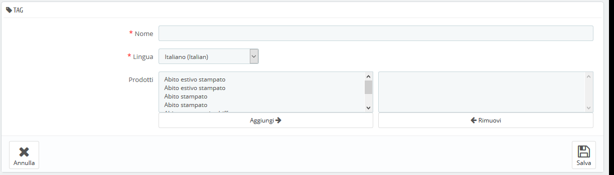

# Tag

La funzionalità di tagging consente di associare i tuoi prodotti alle parole chiave. I tuoi clienti possono utilizzare le parole chiave per trovare facilmente e rapidamente i prodotti che cercano.

Ad esempio, supponiamo che il cliente desideri trovare un tablet nel tuo negozio. Per trovare il prodotto corrispondente alla sua ricerca, deve esserci un tag che associ "tablet" a "iPad".

I tag di prodotto non sono identici alle parole chiave delle pagine: non hanno alcun impatto diretto sul posizionamento nei motori di ricerca.

Per lavorare sul posizionamento dei motori di ricerca, apri la scheda "SEO" del foglio di creazione di ciascun prodotto.

Hai due modi per impostare questa funzionalità.

## Prima Soluzione: Quando Crei un nuovo Prodotto 

Puoi associare più tag al tuo prodotto direttamente in PrestaShop quando lo crei, nel campo "Tag" nelle "Opzioni" del prodotto.

## Seconda Soluzione: Gestire i tag 

La pagina "Tag" nel menu "Ricerca" consente di creare nuovi tag e gestire i tag esistenti. Una volta che hai abbinato i tag ai tuoi prodotti, otterrai un elenco molto importante di tag. La pagina "Tag" ti aiuterà a gestirli tutti.

Per crearne un nuovo, clicca su "Aggiungi nuovo tag" e visualizzerai la pagina di creazione.

Questa interfaccia consente di aggiungere tag a uno o più prodotti.

* **Nome**. Dai un nome al tuo tag. Dovrebbe essere breve e diretto, in modo da aiutare i clienti a trovare i prodotti associati anziché impedirglielo.
* **Lingua**. Indica in quale lingua dovrebbe apparire il tag sul tuo negozio. PrestaShop è sufficientemente intuitivo da non mostrare le parole chiave in spagnolo ai clienti che hanno scelto di vedere la versione francese del sito, per esempio.
* **Prodotti**. Seleziona i prodotti dalla colonna a destra a cui desideri applicare il tag. Tieni premuto il tasto Ctrl sulla tastiera per selezionare più prodotti contemporaneamente.

Dopo aver salvato la pagina, il tag denominato verrà applicato a tutti i prodotti dell'elenco a destra.

Per aggiungere lo stesso tag a un'altra lingua, basta ripetere l'operazione, solo per questa volta, modifica la lingua. Dopo aver salvato il tag, si è reindirizzati all'elenco di tag, dove è possibile modificarli, eliminarli oppure eliminarli in modo blocco utilizzando il pulsante nella parte inferiore dell'elenco. Accanto alle icone di modifica e cestino, un numero indica quanti prodotti utilizzano quel tag.

D'ora in poi, quando i tuoi clienti effettuano una query di ricerca sul tuo sito, i risultati che riceveranno dipenderanno anche dai tag associati ai prodotti.

