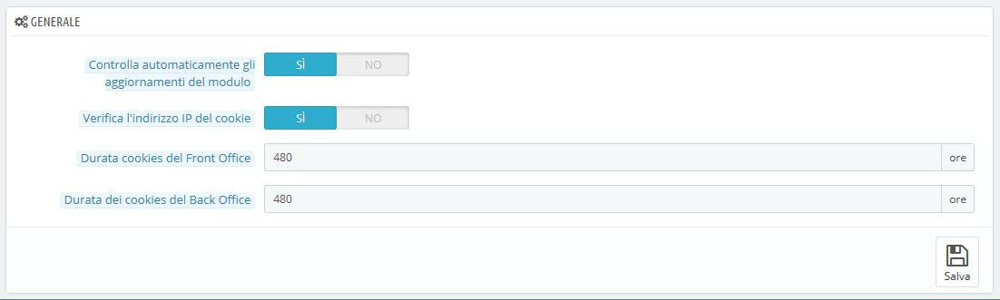
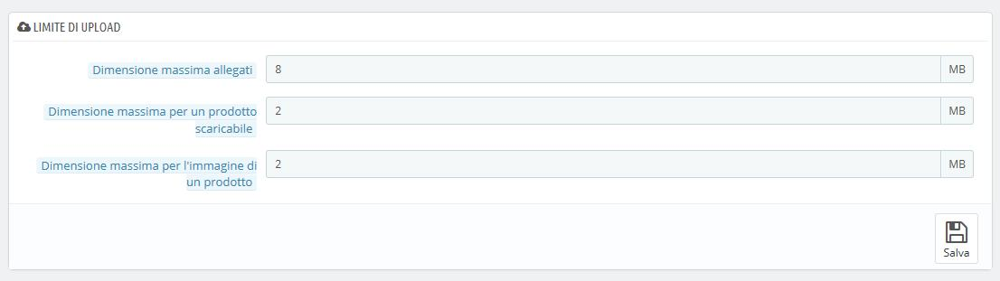
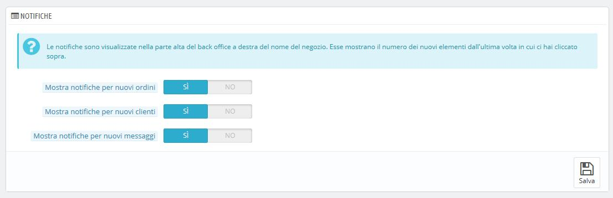

# Amministrazione

La pagina "Amministrazione" contiene le opzioni generiche e le impostazioni che riguardano le funzioni di PrestaShop. È composta da tre sezioni.

## Generiche 

È la sezione dedicate alle funzioni più generiche:

* **Controlla automaticamente gli aggiornamenti del modulo.** **Puoi attivare gli aggiornamenti automatici delle nuove versioni dei moduli disponibili dal sito Addons. Qualora disponibili, apparirà il bottone “Aggiorna” sui moduli installati nella pagina “Moduli”, proprio accanto al pulsante "Disinstalla".**
* **Verifica indirizzo IP del cookie. Si tratta di una misura di sicurezza aggiuntiva: puoi richiedere che Prestashop controlli che gli utenti provengano dall’indirizzo IP memorizzato nei propri cookies del browser.**
* **Durata cookie del Front Office**. Di default, la longevità dei cookie di PrestaShop è di 480 ore \(20 giorni\). È possibile ridurre la durata per eventuali motivi di sicurezza.
* **Durata cookie del Back Office**. Di default, la longevità dei cookie di PrestaShop è di 480 ore \(20 giorni\). È possibile ridurre la durata per eventuali motivi di sicurezza.

## Limite di upload 

Questa sezione serve a impostare la grandezza massima dei file che il tuo team può caricare – non riguarda i file dei tuoi clienti.

Sono disponibili tre opzioni, una generica e due più specifiche:

* **Dimensione massima allegati**. Il valore di default è direttamente preso dalle impostazioni del tuo server, ma è possibile diminuirlo se necessario.
* **Dimensione massima per prodotto scaricabile**. Se vendi prodotti virtuali \(servizi, prenotazioni e prodotti di cui si effettua il download\), questa impostazione serve a limitare la grandezza dei file che il tuo team può caricare – e quindi la dimensione del prodotto finale. Se impostata sin dal principio si eviterà che qualcuno del team resti bloccato.
* **Dimensione massima per l’immagine di un prodotto**. Allo stesso modo è possibile limitare la dimensione dell’immagine che il tuo team può caricare nel tuo negozio. Ciò può essere utile per ricordare ai membri del team di ridurre la dimensione di un'immagine, in quanto spesso non è utile caricare file maggiori di 600x600 px \(circa 200 kB se correttamente compressi\). Può essere utile consultare la pagina "Immagini" nel menu "Design" per sapere quali sono le dimensioni delle immagini che il tuo negozio è predisposto a utilizzare. Il vantaggio consiste nel risparmio dello spazio del server sull'ampiezza di larghezza di banda e sul potere del processore \(dal momento in cui PrestaShop ridimensiona l'immagine caricata per generare miniature e altro\).

## Notifiche 

Le notifiche si visualizzano nella parte più alta della pagina di amministrazione proprio accanto al nome del negozio. Indicano il numero dei nuovi articoli a partire dall’ultima volta in cui si ha cliccato su di esse.

Cliccando sull’icona del campanello, si aprirà una piccola tabella con i vari tipi di notifiche.

Puoi scegliere di non ricevere notifiche da alcuni tipi di contenuti:

* **Mostra notifiche per nuovi ordini**. Mostra numeri, importi e il nome del cliente dell’ultimo ordine effettuato sul tuo negozio. Da lì è possibile aprire la singola pagina di qualsiasi ordine o aprire la pagina "Ordini" per ottenere l'elenco completo.
* **Mostra notifiche per nuovi clienti.** **Mostra il nome dei clienti registrati dall’ultima volta.** **Da lì è possibile aprire la singola pagina di un cliente o aprire la pagina "Clienti" per ottenere l'elenco completo.**
* **Mostra notifiche per nuovi messaggi.** **Mostra l'email delle persone che hanno inviato un messaggio utilizzando il modulo di contatto del tuo negozio. Da lì è possibile aprire qualsiasi messaggio o aprire la pagina "Servizio clienti" per ottenere l'elenco completo.**

