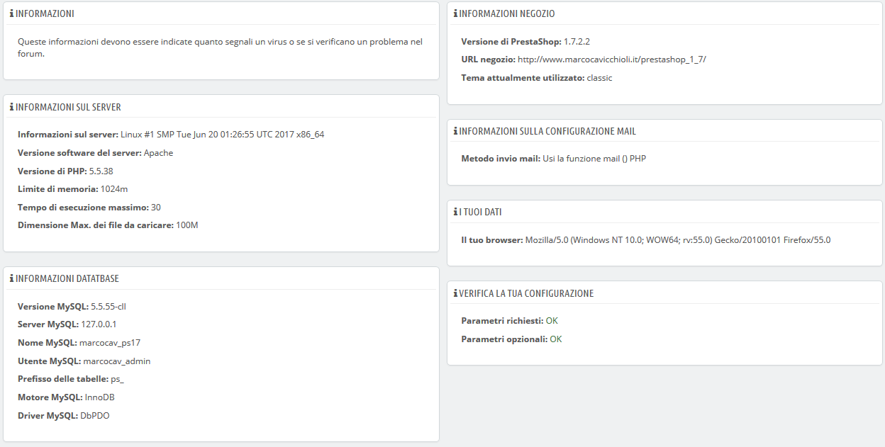

# Informazioni

Questa pagina serve come un pratico promemoria della tua configurazione di PrestaShop: versione, informazioni sul server, versione PHP, versione MySQL. Tutto ciò si dimostra veramente utile quando è necessario segnalare un problema agli sviluppatori di PrestaShop o semplicemente al tuo webmaster o hosting web.

C'è un'ultima sezione, intitolata "Elenco dei file modificati". Subito dopo aver installato PrestaShop, l'unica cosa che viene mostrata in questa sezione è "Nessun cambiamento è stato rilevato nei file".  
Ma dopo aver installato alcuni moduli, un paio di temi, apportato delle modifiche avanzate a qualche classe sovrascritta o eliminato dei file, questo elenco mostrerà la differenza tra l'installazione attuale di PrestaShop e quella originaria priva di modifiche. Ciò consente di vedere quali modifiche sono state apportate all'installazione... e quindi di cosa tener conto se si desidera aggiornare manualmente il proprio negozio o se si stanno spostando file su un nuovo server.

Anche con una nuova installazione, questa sezione potrebbe indicare come file mancanti "`.gitattributes`", "`.gitignore`", "[`CONTRIBUTING.md`](http://contributing.md/)", "[`CONTRIBUTORS.md`](http://contributors.md/)" or "[`README.md`](http://readme.md/)". Questi sono file specifici Git, PrestaShop non li utilizza, quindi non dovresti preoccupartene.

