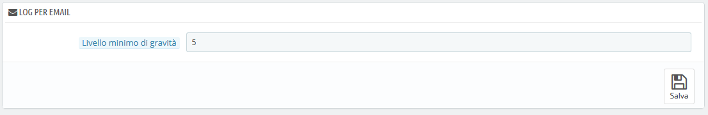

# Log

Gli errori capitano. Nella maggior parte dei casi non ne vieni a conoscenza perché PrestaShop li gestisce automaticamente senza notificartelo. Potresti però desiderare di venirne a conoscenza, per essere in grado di correggere quelli più ricorrenti e garantire una migliore stabilità al tuo negozio.

Nella pagina "Log" puoi dare un'occhiata a tutte le azioni eseguite nel negozio e trovare gli errori PHP che potrebbero peggiorare le prestazioni del tuo negozio. Li trovi elencati nella tabella centrale della pagina e sono presentati in 4 livelli:

* **1: Solo informativo**. Indica che lo script ha rilevato qualcosa che potrebbe causare un errore, ma potrebbe anche accadere durante la normale esecuzione di uno script.
* **2: Avviso**. Avvisi di esecuzione \(errori non fatali\). L'esecuzione dello script non viene interrotta.
* **3: Errore**.
* **4: Problema importante \(crash\)!**. Errore fatale di esecuzione. Si tratta di errori che non possono essere recuperati, ad esempio un problema di allocazione della memoria. L'esecuzione dello script viene interrotta.

Queste sono le spiegazioni ufficiali del manuale PHP. Scopri di più: [http://www.php.net/manual/en/errorfunc.constants.php](http://www.php.net/manual/en/errorfunc.constants.php).

## Log per email 

I livelli di errore servono anche come valori per la funzione "Log per email".

PrestaShop aggiunge un ultimo valore, 5, con il quale l'amministratore sceglie di non riceve alcuna notifica né per gli errori minori né per quelli maggiori.

Lo strumento di registrazione degli errori consente di ricevere una notifica tramite email quando si verifica un errore. Le notifiche vengono inviate all'indirizzo email del proprietario del negozio, puoi configurare il grado di importanza dal quale vuoi ricevere le email:

* "1" se vuoi sapere tutto, anche le informazioni meno rilevanti.
* "3" se desideri conoscere solo i problemi \(errori e problemi principali\).
* "4" se desideri solo conoscere i principali problemi.
* "5" è il valore predefinito che significa che non viene inviata nessuna notifica.

