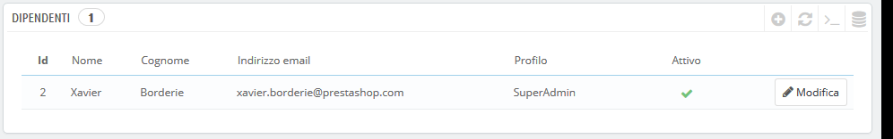
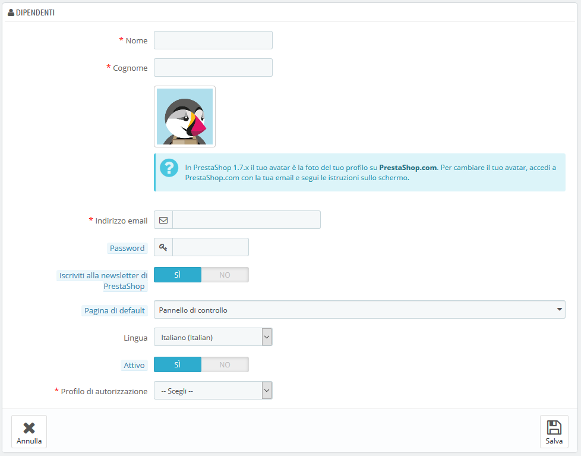
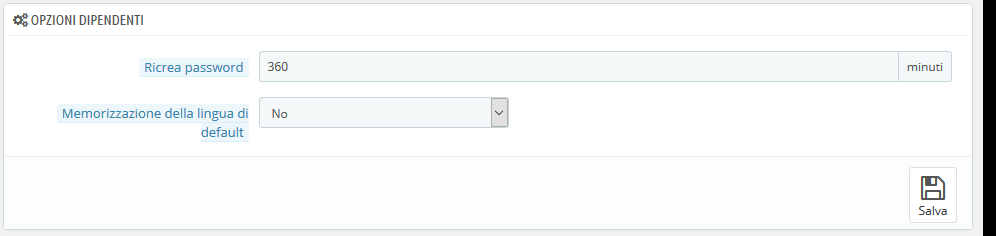

# Dipendenti

La pagina di amministrazione "Dipendenti” elenca tutti gli account utente che hanno accesso al back office del negozio. Per impostazione predefinita troverai l'account creato durante l'installazione del negozio, impostato automaticamente come SuperAdmin. Il SuperAdmin ha accesso a tutte le funzioni di PrestaShop senza restrizioni.

Dovresti assicurarti di creare un nuovo account dipendente per ogni dipendente effettivo che ha qualcosa a che fare con il tuo business online. Ciò significa che non si dovrebbe mai avere un account di uso generale che tutti possono utilizzare, perché è necessario tenere traccia di chi ha svolto le diverse operazioni nel tuo negozio. I dipendenti possono modificare gli ordini, accettare pagamenti e rimborsare i clienti ed è bene sapere chi fa cosa. Avere un account di amministrazione personale per ogni dipendente è un buon modo per far sì che il tuo team gestisca il tuo negozio in modo responsabile.

## Aggiungere un nuovo dipendente 

Il pulsante "Aggiungi nuovo dipendente” ti porta al modulo di creazione dipendente.

Presenta le seguenti impostazioni:

* **Nome** e **Cognome**. Il nome non è visibile dai, ma è molto utile quando è necessario sapere chi ha fatto cosa nel tuo negozio.
* **Indirizzo email**. Se consentito, il dipendente riceverà le email del cliente e le notifiche di PrestaShop su questo indirizzo. Viene inoltre utilizzato come identificatore di accesso dell'account.
* **Password**. Non deve essere ovvia. È bene evitare che un account dipendente venga utilizzato da persone sconosciute.
* **Iscriviti alla newsletter di PrestaShop**. Iscriviti alla newsletter di PrestaShop per ricevere suggerimenti e notizie sull’e-commerce dal team PrestaShop.
* **Pagina di default**. Puoi decidere quale pagina apparirà all'utente subito dopo l'accesso. Potrebbe essere la pagina Statistiche per i SuperAdmin o la pagina Ordini per i venditori.
* **Lingua**. La lingua predefinita dell’account in quanto i tuoi dipendenti potrebbero provenire da un altro Paese. Assicurati di aggiungere le lingue necessarie, usando la pagina "Traduzioni" sotto il menu "Internazionale".
* **Attivo**. È possibile disattivare temporaneamente e definitivamente un account. Ciò consente di creare account temporanei, ad esempio quando hai bisogno di aiuto durante le vacanze o durante i saldi.
* **Profilo di autorizzazione**. È molto importante assegnare un profilo corretto a ogni account dipendente. Un profilo è legato a un insieme di autorizzazioni e diritti di accesso, si dovrebbe sapere quali sono quelli esistenti che sono elencati nella pagina "Profili". Il profilo determina a quale parte del back office del tuo negozio il dipendente ha accesso; accedendo visualizzerà solo le pagine / i menu che sono stati configurati come accessibili dal suo profilo. Si tratta di un’impostazione molto importante. 

L'avatar del profilo \(l'immagine che ti rappresenta nel back office\) è legata all'account dell'utente sul forum di PrestaShop. Pertanto, se si desidera personalizzare questa immagine, è necessario creare un account nel forum: [http://www.prestashop.com/forums/](http://www.prestashop.com/forums/)

## Opzioni dipendenti 

La sezione al fondo della pagina "Impiegati", proprio sotto l'elenco dei dipendenti, presenta due opzioni disponibili:

* **Rigenerazione della password**. Per impostare la frequenza in cui il dipendente può modificare la propria password
* **Memorizza la lingua usata nel form del pannello di amministrazione**. Se "Sì", consente ai dipendenti di salvare la propria lingua predefinita per il form.

