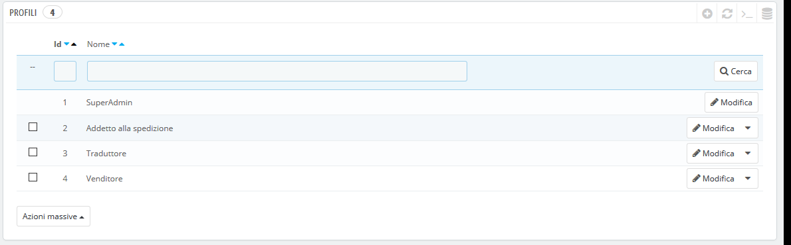
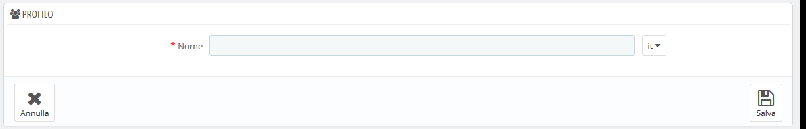

# Profili

PrestaShop ti consente di assegnare funzioni e diritti specifici d ogni dipendente che ti aiuta a gestire il negozio online. Ad esempio, l'amministratore avrà accesso all'intero negozio senza restrizioni, mentre un dipendente potrà accedere solo al catalogo o agli ordini.

Per impostazione predefinita, PrestaShop dispone di 4 profili pronti per l'uso:

* **SuperAdmin**. Il rango più alto. Ha tutti i diritti e può accedere a tutta l'installazione di PrestaShop.
* **Logista**. Si tratta di chi è responsabile dell'imballaggio e dell'invio degli ordini. Può accedere solo alle pagine degli ordini, di spedizione e di gestione del magazzino, al catalogo e al cliente.
* **Traduttore**. Chi è incaricato di tradurre il contenuto testuale del tuo negozio. Può accedere a prodotti e categorie, alle pagine dei contenuti e alla pagina "Traduzioni".
* **Venditore**. I tuo venditore, se esiste. Oltre ad avere gli stessi diritti di accesso del traduttore, può accedere anche alle pagine dei clienti, ai moduli, al webservice e ad alcune statistiche.

Puoi vedere i dettagli dei diritti di accesso esaminando ogni profilo nella pagina "Autorizzazioni".

Il profilo SuperAdmin non può essere eliminato, solo rinominato.

Dovrebbe esserci almeno un dipendente con un profilo SuperAdmin.

## Aggiungere un nuovo profilo 

Puoi aggiungere tutti quanti i profili che ti occorrono. 

L'aggiunta di un nuovo profilo è abbastanza semplice: basta cliccare sul pulsante "Aggiungi nuovo profilo", immettere un nome univoco per il nuovo profilo e salvare.

La parte più complessa si ottiene quando si impostano i diritti di accesso dei nuovi profili. Ciò avviene nella pagina "Autorizzazioni".

