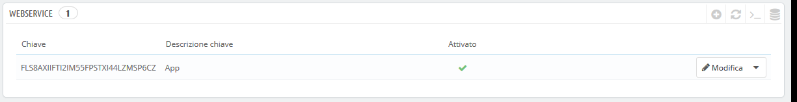
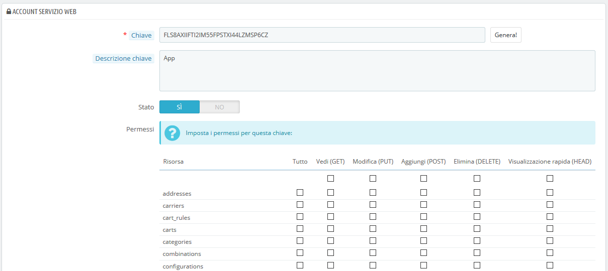
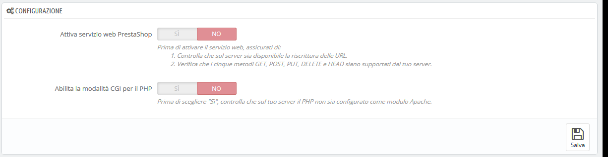

# Webservice \(Servizio Web\)

In questa pagina puoi abilitare il webservice del tuo negozio in modo che strumenti di terze parti possano accedere ai tuoi dati. Ciò consente potenzialmente agli strumenti interessanti di aiutarti o ai tuoi clienti di utilizzare meglio il tuo negozio \(ad esempio con le applicazioni mobili\).

Un servizio web è un metodo di comunicazione tra due dispositivi elettronici su una rete. Si basa su un insieme noto di metodi, formati e diritti di accesso, per poter utilizzare il contenuto del webservice su qualsiasi altro strumento autorizzato basandosi sul contenuto originale. Puoi saperne di più su Wikipedia: [https://it.wikipedia.org/wiki/Web\_service](https://it.wikipedia.org/wiki/Web_service).

La pagina inizia con l'elenco in una tabella delle chiavi dei servizi web esistenti, se presenti. Una chiave di un servizio web è un accesso univoco concesso a uno sviluppatore che può essere utilizzato per collegare uno strumento al tuo negozio. Condividilo con parsimonia, in quanto non tutti devono accedere ai tuoi dati.

Non tutte le applicazioni possono accedere al tuo negozio attraverso il servizio web di PrestaShop: decidi quali e cosa possono fare. Ogni applicazione dispone di una chiave di connessione univoca, con specifici diritti di accesso.

## Aggiungere una nuova chiave 

Il pulsante "Aggiungi nuova chiave webservice" consente di accedere al form di creazione della chiave:

* **Chiave**. Deve essere univoca. Puoi crearla direttamente tu oppure scegliere di farla generare dal sistemale, cliccando sul pulsante "Genera!" o utilizzando qualsiasi generatore di chiavi online. Le chiavi generate sono più sicure nella maggior parte dei casi perché sono difficili da indovinare.
* **Descrizione chiave**. Un promemoria su ciò a cui dà accesso la chiave e a quale strumento.
* **Stato**. Puoi disattivare una chiave in qualsiasi momento. Puoi concedere temporaneamente l'accesso ai dati a una determinata chiave.
* **Permessi**. Non devi condividere TUTTI i tuoi dati con ogni chiave. Puoi scegliere tra una vasta gamma di autorizzazioni, per sezione o per tipo di accesso. Alcune applicazioni magari possono mostrare solo alcuni elementi, mentre altre \(ad esempio, quelle per gestire in modo remoto il negozio\) dovrebbero essere in grado di modificare e cancellare quasi tutto. Scegli saggiamente.

Clicca su "Salva" quando la chiave è pronta.

## Configurazione 

Per motivi di sicurezza, accertati che il server tuo negozio supporti la connessione protetta SSL!

La configurazione del webservice è abbastanza semplice:

* **Attiva servizio web PrestaShop**. Se non desideri che qualcuno acceda al tuo negozio tramite strumenti e applicazioni di terze parti, è sufficiente disattivarlo.
* **Abilita la modalità CGI per il PHP**. La modalità CGI è un'impostazione speciale per il server Apache, dove si sceglie di utilizzare PHP come script CGI piuttosto che un modulo Apache. Anche se si sostiene che la modalità CGI è più sicura, è stato trovato un difetto di sicurezza poco prima di maggio 2012. Chiedi al tuo host web per i consigli.

