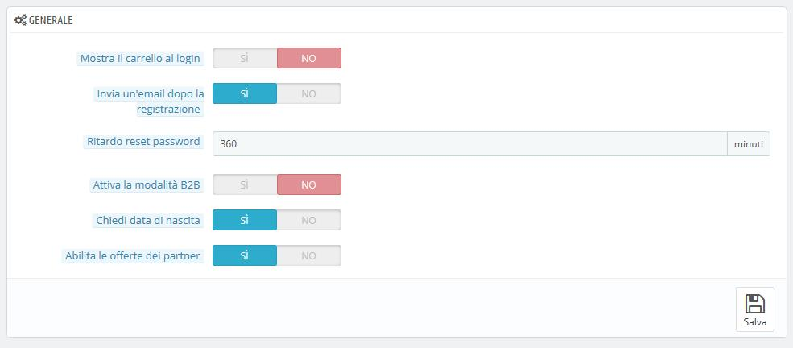

# Preferenze clienti

La pagina "Clienti" contiene opzioni specifiche dedicate ai clienti, riguardo soprattutto al B2B \(business to business, ossia vendita da azienda a azienda\).

* **Mostra il carrello al login**. Se il cliente ha un carrello per il quale non ha ancora effettuato il check-out lo visualizza effettuando l’accesso. 
* **Invia un’email dopo la registrazione**. Puoi far sì che PrestaShop invii un’e-mail al nuovo cliente appena registrato con un riepilogo delle informazioni del suo account \(e-mail, password\), subito dopo la registrazione.
* **Ritardo reset password**. Puoi stabilire il limite di frequenza con cui un cliente può generare nuove password per il suo account. Per impostazione predefinita è di 360 minuti \(6 ore\).
* **Abilita la modalità B2B**. La modalità B2B ti aiuta distingue i clienti persone fisiche da quelle giuridiche. Per cui, slezionandola, appariranno queste nuove funzioni:  
  * Il profilo cliente presenterà nuovi campi relativi alle informazioni professionali \(partita IVA in Italia, numero di Duns negli USA, numero SIRET in Francia, numero CNPJ in Brasile, ecc.\),
  * I prezzi potranno essere nascosti a gruppi specifici,
  * I prezzi potranno essere gestiti in base al cliente per l’intero catalogo o per categoria,
  * Le fatture potranno essere generate manualmente,
  * Ecc.
* **Chiedi data di nascita**. Puoi scegliere se richiedere la data di nascita in fase di registrazione o no. Se scegli di richiederla è un ottimo modo per poter inviare sconti o omaggi il giorno del compleanno, per esempio. 
* **Abilita le offerte dei partner**. Potresti definire accordi con uno o più partner commerciali per suggerire ai tuoi clienti l'iscrizione anche alla loro newsletter. Se questo è il tuo caso è necessario abilitare questa opzione. Al momento della registrazione, apparirà una casella: "Ricevi le offerte dei nostri partner".

