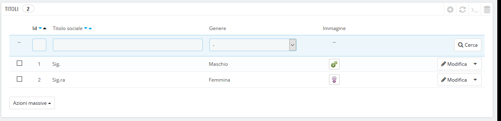
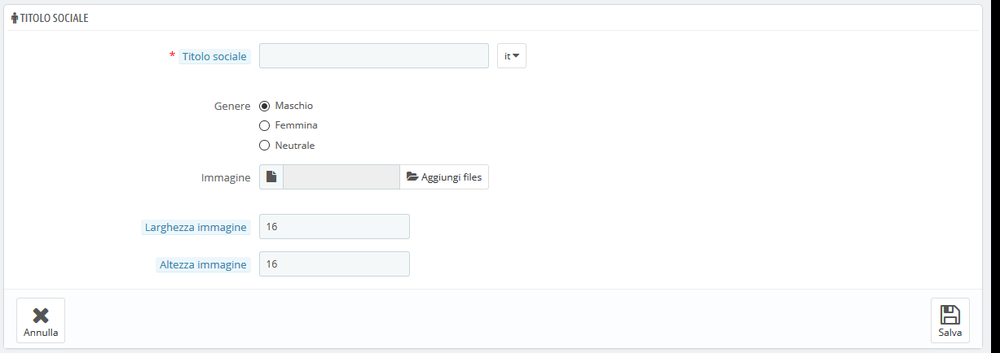

# Titoli

Lo strumento del titolo sociale ti aiuta a definire meglio i tuoi clienti: nell'elenco clienti, puoi scegliere di visualizzare solo i clienti che hanno un determinato titolo sociale. I moduli possono anche essere basati su titoli sociali per determinate funzionalità.

Cliccando sul pulsante "Aggiungi nuovo titolo sociale" si aprirà un modulo:

* **Titolo sociale**. Puoi scegliere qualsiasi cosa, dal più comune \("Signore", "Signora", "Egregio", ecc.\) al più insolito \("Illustre", "Magnifico", "Onorevole"...\). La cosa importante quando ci si allontana dai titoli comunemente accettati è riflettere sulla vera identità del tuo negozio.
* **Genere**. Alcuni titoli possono essere applicati sia ai clienti maschi sia alle femmine, o a nessuno. In quest'ultimo caso, assicuratevi quindi di impostare questa opzione su "Neutrale".
* **Immagine**. Un file di immagini 16x16 che rappresenta il titolo. I simboli classici di genere sono Marte e Venere \(♂ e ♀\), ma ci sono molte altre possibilità. PrestaShop ti permette di caratterizzarli un'immagine univoca.
* **Larghezza immagine e altezza immagine**. PrestaShop funziona meglio con l'immagini 16x16 e se è più grande ridimensionerà l'immagine. Tuttavia, potrebbe ritenere necessario utilizzare immagini più grandi e queste due opzioni consentono di impostare la dimensione esatta richiesta dall'immagine. Se si inserisce "0", PrestaShop utilizzerà semplicemente la dimensione originale dell'immagine.

