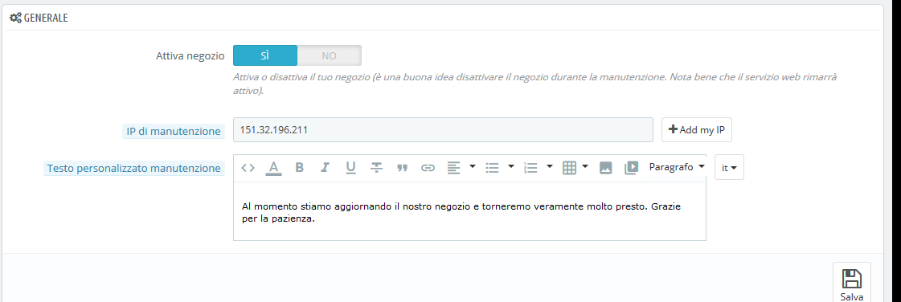

# Manutenzione

Questa semplice pagina di preferenze è preziosa quando desideri apportare modifiche al tuo negozio senza mostrarlo i tuoi clienti. Ad esempio, quando si aggiungono diversi nuovi prodotti contemporaneamente, oppure quando desideri modificare il tema e effettuare diversi test prima di renderlo disponibile al mondo.

Questa pagina presenta solo tre opzioni:

* **Attiva negozio.** È possibile utilizzare questa opzione per disattivare temporaneamente il negozio, ad esempio quando è necessario eseguire la manutenzione.

  Il servizio web sarà ancora attivo, pertanto i tuoi dati saranno ancora disponibili a coloro che hanno accesso. Se desideri disattivare il servizio web, devi andare alla pagina di preferenza "Webservice", nel menu "Parametri avanzati".

* I**P di Manutenzione.** L'IP di manutenzione consente alle persone con quell’IP di accedere al negozio anche se è disabilitato. Ciò significa che è possibile impedire a tutti gli utenti di accedere al tuo negozio, consentendo però l'accesso ai computer utilizzati dei membri del team e da te. Per scoprire l'indirizzo IP di un computer, visita [http://www.whatismyip.com/](http://www.whatismyip.com/) da quel computer. Clicca su "Aggiungi il mio IP" se vuoi solo aggiungere l'IP del tuo computer. Se si desideri aggiungere più indirizzi IP, separarli con le virgole ",".
* **Testo personalizzato manutenzione**. _Novità in PrestaShop 1.7_. Puoi far visualizzare un messaggio a tua scelta nella pagina di manutenzione per far sapere ai tuoi clienti perché sei in manutenzione e soprattutto quando il tuo negozio tornerà online.

