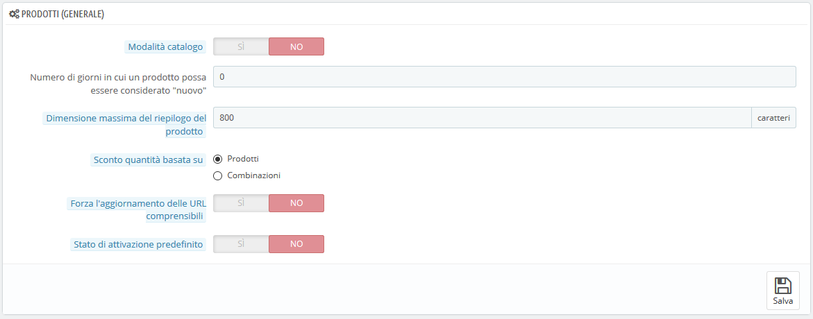
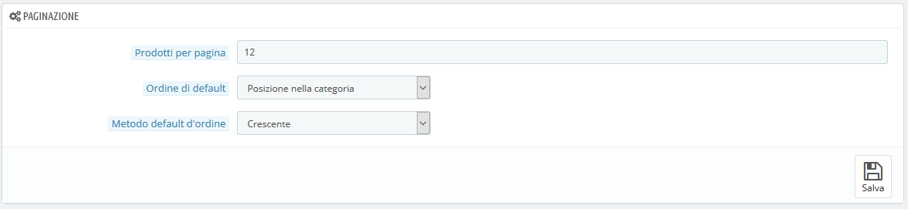
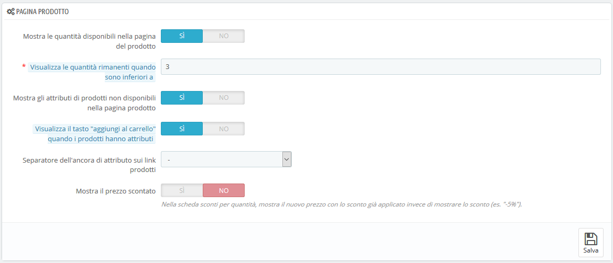
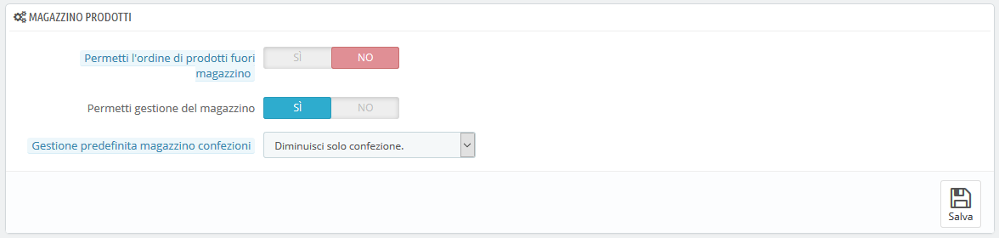

# Impostazioni Prodotto

Questa pagina contiene le preferenze relative al modo in cui i tuoi prodotti devono essere trattati e mostrati da PrestaShop.

## Preferenze Generali 

* **Modalità catalogo.** L'abilitazione della modalità catalogo rende il tuo negozio una semplice galleria di prodotti, senza alcuna possibilità di acquistare gli oggetti in alcun modo.
* **Numero di giorni in cui il prodotto possa essere considerato "nuovo".** Quando aggiungi un prodotto al tuo negozio è considerato nuovo e reso disponibile nella pagina "Nuovi prodotti". Il campo consente di specificare quanti giorni il prodotto rimarrà visibile in questa pagina. Con questa funzione scegli come mostrare e aggiornare le novità del tuo negozio. La pagina "Nuovi prodotti" è di solito la più frequentata dai tuoi clienti abituali.
* **Dimensione massima del riepilogo del prodotto.** Il prodotto ha due descrizioni: un "riepilogo" e una descrizione regolare. Il riepilogo, visualizzato nei motori di ricerca e nella descrizione di categoria del prodotto, è limitato a 400 caratteri per impostazione predefinita, ma questa opzione consente di modificare tale limite. 0 significa che non esiste alcun limite.
* **Sconto quantità basato su.** Questa impostazione indica su cosa PrestaShop si dovrebbe basare per gli sconti: per prodotto o per combinazione \(che possono includere più prodotti\).
* **Forza l'aggiornamento dei Friendly URL.** Per impostazione predefinita, il friendly URL di una pagina di prodotto viene generato dal titolo del prodotto e rimane lo stesso anche se il titolo del prodotto cambia, perché per essere affidabili, i tuoi URL devono essere stabili. Attivando questa opzione, PrestaShop aggiorna l'URL ogni volta che si modifica il nome del prodotto o il titolo della pagina.
* **Stato di attivazione predefinito.** Se abiliti questa opzione, i nuovi prodotti verranno attivati automaticamente quando li crei.

## Preferenze di Paginazione 

* **Prodotti per pagina**. Indica quanti prodotti vengono mostrati nelle pagine delle tue categorie.
* **Ordine di default**. Indica l'ordine dei prodotti nelle categorie del tuo negozio. Sono disponibili 6 opzioni:
  * **Nome del prodotto**. Mostra i tuoi prodotti in ordine alfabetico.
  * **Prezzo del prodotto**. Mostra i tuoi prodotti secondo i prezzi.
  * **Data di aggiunta del prodotto.** Mostra i tuoi prodotti in base alla data in cui sono stati aggiunti al tuo negozio.
  * **Data modificata del prodotto**. Quando si modifica un prodotto, viene modificata la data. Questa opzione li mostra nell'ordine della data di modifica.
  * **Posizione all'interno della categoria**. Mostra i tuoi prodotti come sono posizionati nelle categorie nel tuo catalogo. La posizione dei prodotti può essere modificata direttamente nel catalogo del tuo negozio utilizzando le frecce di posizione. In questo modo disponi i tuoi prodotti nel modo più attraente per i tuoi clienti.
  * **Marca**. Mostra i tuoi prodotti in ordine alfabetico in base ai nomi dei marchi.
  * **Quantità del prodotto**. Mostra i tuoi prodotti in base alla quantità disponibile.
  * **Riferimento del prodotto**. Mostra i tuoi prodotti in base al numero di riferimento.
* **Metodo di ordine predefinito.** Le opzioni di cui sopra possono essere ordinate per ordine ascendente o decrescente.

## Preferenze pagina prodotto 

* **Mostra le quantità disponibili nella pagina del prodotto**. Attivando questa funzione i visitatori possono vedere le quantità di ciascun prodotto disponibile in magazzino. La visualizzazione di queste informazioni può essere usata per stimolare le vendite nel caso in cui la quantità in magazzino sia bassa. Le quantità visualizzate sono gli attributi e le combinazioni selezionate.
* **Visualizza le quantità rimanenti quando sono inferiori a**. Puoi scegliere di mostrare un avviso quando il rimanente stock disponibile per un prodotto scende al di sotto di un certo livello. Questa opzione è particolarmente utile per promuovere gli acquisti. Il testo e il posizionamento dell'avviso dipendono dal tema; nel tema predefinito, è "Ultimi articoli in magazzino" e viene mostrato accanto al pulsante "Aggiungi al carrello".
* **Mostra gli attributi dei prodotti non disponibili sulla pagina del prodotto**. I tuoi prodotti possono essere composti da diverse combinazioni o attributi: colore, dimensione, capacità, ecc. Gli attributi possono essere modificati nella pagina "Attributi" del menu "Catalogo". Quando uno o più attributi non sono più disponibili, hai due possibilità:
  * Prima possibilità: lasciare questa preferenza attiva. Esempio: "iPod Shuffle" non è più disponibile in "Blu" nel nostro negozio. Tenendo questa opzione abilitata, la combinazione del prodotto rimarrà visibile nel negozio. Un messaggio indica che il prodotto non è più disponibile nell'opzione scelta e invita i clienti a scegliere un'altra combinazione. Se hai abilitato l'opzione "Consenti ordini di prodotti fuori produzione" \(vedi sotto\), potranno aggiungere la combinazione non disponibile ai propri carrelli.
  * Seconda possibilità: disabilitare questa preferenza. Se la combinazione "blu" del prodotto "iPod Shuffle" non è più disponibile, la selezione non viene visualizzata nel front office e il cliente non può selezionarlo. Questa funzione consente di visualizzare chiaramente la disponibilità dei prodotti.
* **Visualizza il tasto "aggiungi al carrello" quando i prodotti hanno attributi**. Questa opzione impedisce ai clienti di aggiungere un prodotto al proprio carrello direttamente dalla pagina delle categorie, se il prodotto ha combinazioni. Ciò obbliga i clienti a visitare la pagina del prodotto e scegliere una combinazione, invece di aggiungere solo quella predefinita al carrello. Tieni presente che i prodotti senza combinazione avranno ancora un pulsante "Aggiungi al carrello" nella categorie.
* **Separatore dell'ancora di attributo sul link prodotti**. Scegli il separatore tra "," e "-".
* **Mostra il prezzo scontato**. Quando si utilizza lo sconto sul volume, mostra il prezzo scontato piuttosto che la percentuale di sconto.

## Preferenze magazzino prodotti 

* **Permetti l'ordine di prodotti fuori magazzino**. Se un prodotto non è più in stock, il cliente lo può ancora ordinare.
* **Permetti gestione del magazzino**. Questa opzione consente di accedere alle opzioni di base per la gestione delle scorte e delle funzioni: è possibile inserire la quantità di prodotto effettivamente disponibile, quindi far sì che PrestaShop la riduca per ogni ordine e la "ripristini" in caso di ordini annullati o restituiti. Per impostazione predefinita è necessario lasciare questa funzionalità abilitata, poiché la disattivazione influenza l'intera gestione del tuo inventario. Solo se non si dispone di un inventario fisico è necessario disattivarlo - per esempio, se si dispone solo di prodotti virtuali.
* **Gestione predefinita magazzino confezione**. Quando vendi confezioni di prodotti, il modo in cui viene aggiornato il tuo stock dipende da questa opzione. Hai tre possibilità:
  * Diminuisci solo confezione. Quando viene venduto un pacchetto, verrà influenzato solo lo stock del pacco.
  * Diminuisci solo i prodotti in confezione. Quando viene venduto un pacchetto, sarà influenzato solo lo stock di ogni prodotto.
  * Diminuiscili entrambi. Quando viene venduto un pacchetto, saranno influenzati sia lo stock del pacco sia lo stock di ogni prodotto.

Questa impostazione può essere modificata per ciascuna delle confezioni nella sua pagina di prodotto, nella scheda "Quantità".

