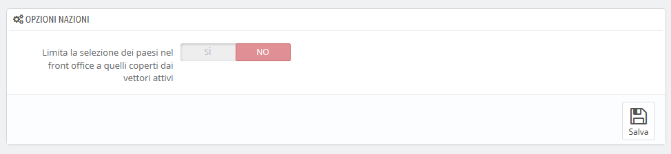
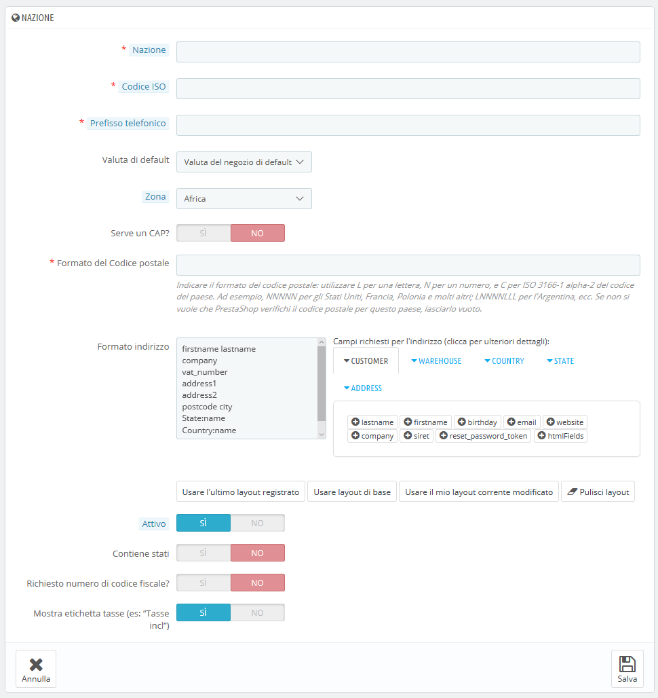

# Nazioni

La tua installazione di PrestaShop elenca tutti i Paesi esistenti affinché i tuoi clienti indichino chiaramente la nazione in cui vivono.

Ci sono circa 200 Paesi nel mondo, ma PrestaShop ne ha registrati 244. Questo perché alcuni Paesi includono regioni d'oltremare come parte del proprio Paese.

Ad esempio, i dipartimenti francesi precedentemente conosciuti come DOM \(Guadalupa, Martinica, Mayotte, Reunion e Guyana francese\) oggi hanno lo stesso status della regione metropolitana francese. Allo stesso modo, per quanto riguarda gli Stati Uniti, Alaska e Hawaii.

Inoltre, inviare una spedizione in Guadalupa è completamente differente da inviarla in Francia, già solo per le spese di spedizione. Pertanto, l'elenco dei Paesi in PrestaShop considera a sé i Paesi d’oltremare rispetto a quelli dalla terraferma.

Per impostazione predefinita, solo il tuo Paese è abilitato a essere selezionato nell'elenco dei Paesi. Qualora necessario, dovresti abilitarne ulteriori, uno ad uno, in base alla provenienza dei tuoi clienti. Per scoprire quali attivare, controlla le statistiche e visualizza i Paesi da cui provengono la maggior parte dei visitatori.

Nella parte inferiore dell'elenco, la sezione "Opzioni Nazioni" consente di visualizzare sul proprio front office i corrieri in base ai Paesi. Ti consigliamo di abilitare questa impostazione, in quanto evita che i clienti debbano scorrere tutti i nomi dei Paesi per trovare il proprio.

## Aggiungere una nuova Nazione 

Normalmente, PrestaShop viene fornito con tutti i Paesi aggiornati nel database. Ma nel caso ne venissero creati nuovi, dovresti aggiungere un nuovo Paese.

* **Nazione**. Il nome ufficiale della nazione da aggiungere, in tutte le lingue supportate. Controlla la pagina della nazione su Wikipedia per accertarti che il nome sia corretto. 
* **Codice ISO**. Il codice ISO-3166 della nazione che puoi trovare nella pagina ufficiale ISO: [https://www.iso.org/home.html](https://www.iso.org/home.html)
* **Prefisso Telefonico**. È il prefisso per le chiamate internazionali che trovi nella pagina di Wikipedia: [https://it.wikipedia.org/wiki/Prefissi\_telefonici\_internazionali](https://it.wikipedia.org/wiki/Prefissi_telefonici_internazionali)
* **Valuta di default**. Puoi usare la valuta predefinita del tuo Paese \(come impostato nella pagina "Localizzazione", sotto il menu "Localizzazione"\), oppure una tra le altre valute installate. Ricorda che, se necessario, puoi aggiungere una nuova valuta attraverso la pagina “Valuta”.
* **Zona**. La sotto regione del mondo a cui questo Paese è collegato. Se necessario, è possibile aggiungere nuove zone utilizzando la pagina "Zone", nel menu "Localizzazione".
* **Serve un cap?** Indica se un utente che vive in questa nazione deve fornire un cap oppure no durante la fase di registrazione al tuo negozio. 
* **Formato del cap**. Puoi anche dare maggiori dettagli sul formato del codice postale. Se non inserisci nulla, PrestaShop non verificherà la validità del codice postale quando viene fornito un nuovo indirizzo per questo Paese. Per il codice postale utilizzare: "L" per una lettera, "N" per un numero e "C" per il codice ISO del Paese \(quello immesso nel campo ISO sopra\). Se non conosci il formato del codice postale del Paese, puoi consultare la pagina di Wikipedia [http://en.wikipedia.org/wiki/List\_of\_postal\_codes](http://en.wikipedia.org/wiki/List_of_postal_codes). Accertati di NON copiare/incollare direttamente da Wikipedia ma adatta il codice! Per esempio, Wikipedia indica "AAA 9999 \*" per Malta, quindi il codice per PrestaShop diventa "LLL NNNN" \(senza il finale \*\).
* **Formato indirizzo**. Dà dettagli sul layout dell'indirizzo, mostrandolo ai clienti. Puoi cliccare sui vari link di supporto sul lato del campo di testo per aggiungere altri campi. In corso di utilizzo, vengono sostituiti automaticamente da PrestaShop con i dati dall'account del cliente. Le modifiche vengono salvate solo quando si salva l'intera pagina. Se hai commesso un errore, puoi utilizzare uno dei quattro pulsanti di supporto nella parte inferiore del modulo, a seconda della tua situazione.
* **Attivo**. Un Paese disabilitato non verrà proposto tra le opzioni quando un visitatore desidera registrarsi e creare un nuovo account.
* **Continente Stati**. Indica se il Paese ha uno "Stato" o no. Questa opzione aggiunge un nuovo campo al modulo di indirizzi PrestaShop. Si noti che "Stati" possono essere regioni, province, dipartimenti ... tutto ciò che ha senso per il servizio postale di quel Paese.
* **Richiesto numero di codice fiscale?**. Il numero di identificazione fiscale è il numero di identificazione utilizzato dal servizio fiscale del Paese dall'amministrazione. Non tutti i Paesi ne hanno uno, talvolta nemmeno le persone giuridiche in alcune nazioni sono tenute a possederne uno. Su questo è possibile informarsi tramite il servizio fiscale del Paese.
* **Mostra etichette tasse \(es. "Tasse** incl**."\)**. ****Scegli se lo status fiscale \(incluso o escluso\) deve essere visualizzato accanto ai prezzi o meno.
* **Associazione negozio**. Puoi rendere il Paese disponibile solo per una selezione di negozi, ad esempio quelli che puntano a un mercato locale specifico.

