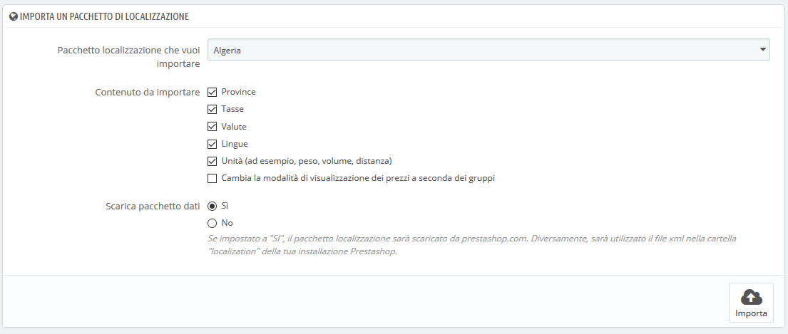
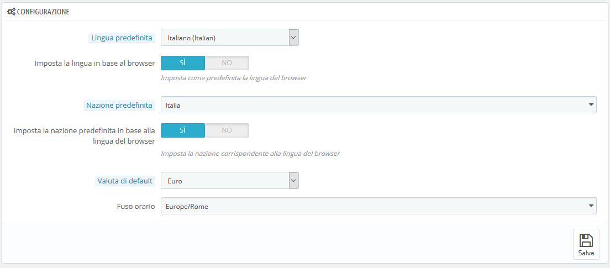
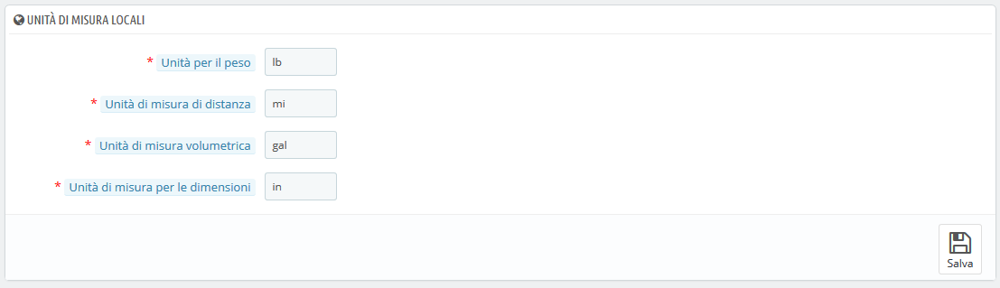
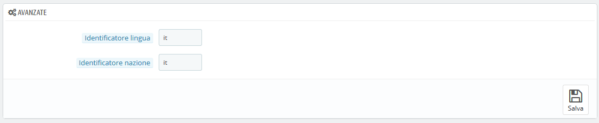

# Impostazioni di Localizzazione

La pagina principale nel menu "Localizzazione" ti consente di configurare le unità usate per i tuoi prodotti.

## Importa un Pacchetto Localizzazione 

Questa sezione ti fornisce un elenco completo di pacchetti di localizzazione esistenti che è possibile importare. Non solo imposta l'installazione di PrestaShop con le relative unità locali, ma aggiunge anche molti altri dati:

* **Stati**. Quando trasporti un prodotto in un Paese è importante conoscere l’impatto sulle usanze e sulle tasse locali. Gli Stati aggiunti possono essere visualizzati e modificati nella pagina "Stati" nel menu "Località".
* **Imposte**. La cosa più importante della localizzazione sono le imposte locali che possono essere numerose e variabili a seconda del Paese o dello Stato. PrestaShop ti fornisce un supporto fondamentale per le principali imposte e per le regole fiscali. Le imposte aggiunte e le regole delle imposte possono essere visualizzate e modificate nelle pagine "Tasse" e "Regole Imposte" nel menu "Tasse".
* **Valute**. I clienti stranieri apprezzeranno poter convertire i prezzi del tuo negozio nella propria valuta. Dovresti indicare almeno gli importi in dollari statunitensi ed euro oltre alla valuta del tuo Paese \(se non è una di queste due\). Una volta aggiunta, è necessario attivarla utilizzando la pagina "Valute" nel menu "Localizzazione" e assicurarsi che il tasso di conversione sia corretto. Le valute aggiunte possono essere visualizzate e modificate nella pagina "Valute". Assicurati inoltre di impostare i metodi di pagamento con queste nuove valute.
* **Lingue**. Tutti i campi pubblici del tuo negozio possono essere creati in più lingue ed è importante farlo almeno per il nome e per la descrizione dei prodotti. Nota che l'importazione di una lingua importa anche il relativo formato della data \(g/m/a, m/g/a, g.m.A, ecc.\). Le lingue aggiunte possono essere visualizzate e modificate nella pagina "Lingue" sotto il menu "Localizzazione".

  Puoi aggiungere una sola lingua, senza la valuta, senza le imposte e senza altri dati a seconda del Paese, grazie alla pagina "Traduzioni".

* **Unità**. Peso, dimensione, volume, distanza: queste unità sono essenziali per descrivere correttamente un prodotto al cliente e per le informazioni sull'imballaggio. Possono essere visualizzate e modificate in questa stessa pagina, nella sezione "Unità locali".
* **Modificare il comportamento delle imposte visualizzate nei gruppi**. Non si tratta di dati da importare, ma di un'impostazione che puoi modificare durante l'importazione. Sostituirà il metodo di visualizzazione dei prezzi per i gruppi di clienti \(ad esempio, potranno visualizzare il prezzo con tasse incluse o meno in base a ciascun gruppo di clienti come impostato nei parametri del negozio&gt; Impostazioni clienti&gt; Gruppi, durante la modifica o creazione di un gruppo\) e attivare invece il comportamento fiscale generalmente applicabile nel Paese, per tutti i gruppi e tutti i Paesi. Ad esempio, se si importa il pacchetto di localizzazione per gli Stati Uniti e si seleziona questa opzione, i prezzi verranno visualizzati con imposte escluse.

  Devi selezionare questa opzione solo se stai importando un pacchetto di localizzazione per il Paese predefinito del tuo negozio, in quanto potrebbe cambiare i metodi di visualizzazione fiscale per tutti i gruppi e tutti i Paesi.

  

Come puoi vedere, questi dati aggiuntivi sono facoltativi: puoi scegliere di importare la valuta e la lingua per un determinato Paese, ma non le sue imposte, ad esempio.

È bene non aggiungere troppi dati locali per evitare di creare confusione sia per te stesso che per i tuoi clienti, bensì è utile importare il pacchetto di localizzazione i tuoi Paesi che più visitano il tuo negozio \(a seconda delle tue statistiche\).

A parte le unità predefinite, **non è possibile rimuovere automaticamente tutti i dati di un determinato Paese**; se hai bisogno di rimuovere i dati, dovrai farlo manualmente, nelle rispettive pagine sotto il menu "Localizzazione".

## Configurazione 

Questa sezione raggruppa quattro impostazioni locali predefinite di primaria importanza:

* **Lingua predefinita**. È la lingua principale del tuo negozio. Questa impostazione influenzerà la lingua del tuo back office \(inclusa la lingua principale dei tuoi prodotti\), nonché il front office. Nota che la lingua del front office potrebbe adattarsi all'impostazione del browser del cliente.
* **Nazione predefinita**. La posizione della tua attività. Se hai sedi in diversi Paesi, utilizza il tuo Paese principale o originario.
* **Valuta di default**. La valuta in cui i prezzi del tuo prodotto sono impostati sin dalla prima volta. Le valute vengono aggiunte importando e attivando la valuta di un Paese. Nota che se cambi valuta dopo aver impostato alcuni prezzi dei prodotti è necessario aggiornare manualmente tutti i prezzi esistenti. Assicurati di impostare tale valore in modo definitivo. 
* **Fuso orario**. Il proprio fuso orario. È molto utile, ad esempio, per impostare sconti giornalieri: sai esattamente quando inizia e termina. 

Le impostazioni "Lingua predefinita" e "Nazione predefinita" offrono ulteriori opzioni:

* Per " Lingua predefinita ": **Imposta la lingua in base al browser**. PrestaShop imposterà la lingua del negozio in base al codice locale del browser del visitatore \(per esempio: fr\_CA indica Francese\)
* Per "v": **Imposta la nazione predefinita in base alla lingua del browser**. PrestaShop imposterà il Paese in base al codice territoriale fornito dal browser del visitatore \(per esempio, fr\_CA indica Canada\).

## Unità locali 

Le unità fisiche presentate in questa sezione \(peso, distanza, volume, dimensione\) vengono utilizzate sia nelle schede tecniche che per l’imballaggio – e sono essenziali per le relazioni con i corrieri.

Questi valori possono essere impostati quando si importa il pacchetto di localizzazione per un Paese, ma è possibile modificarli manualmente anche in seguito. Ad esempio, se si preferisce avere centilitri invece di litri per l'unità di volume, modifica l'impostazione predefinita "L" a "cl".

I valori dovrebbero essere i simboli unitari del Sistema Internazionale delle Unità di Misura \([https://it.wikipedia.org/wiki/Sistema\_internazionale\_di\_unità\_di\_misura](https://it.wikipedia.org/wiki/Sistema_internazionale_di_unit%C3%A0_di_misura)\)

## Avanzate 

L’ultima sezione richiede di impostare la lingua e la nazione del server locale, con codice ISO:

* Per la lingua: codici ISO 639-1 \([https://it.wikipedia.org/wiki/ISO\_3166-1](https://it.wikipedia.org/wiki/ISO_3166-1)\).
* Per la nazione: codici ISO 3166-1 Alpha 2 \([https://it.wikipedia.org/wiki/ISO\_3166-1\_alpha-2](https://it.wikipedia.org/wiki/ISO_3166-1_alpha-2)\).

Questi valori possono essere impostati quando si importa il pacchetto di localizzazione per un Paese, ma è possibile modificarli manualmente in qualsiasi momento.

