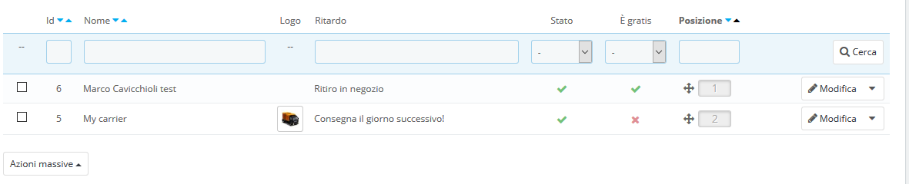
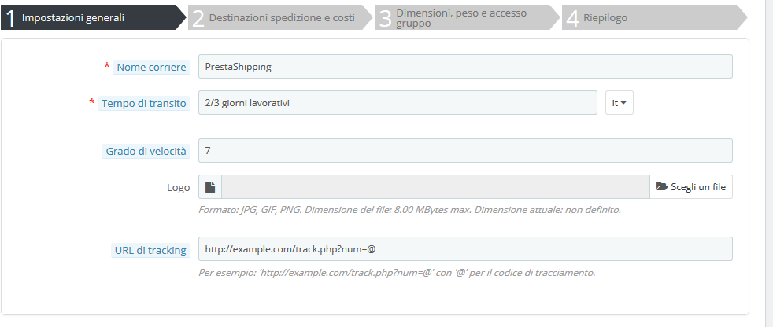
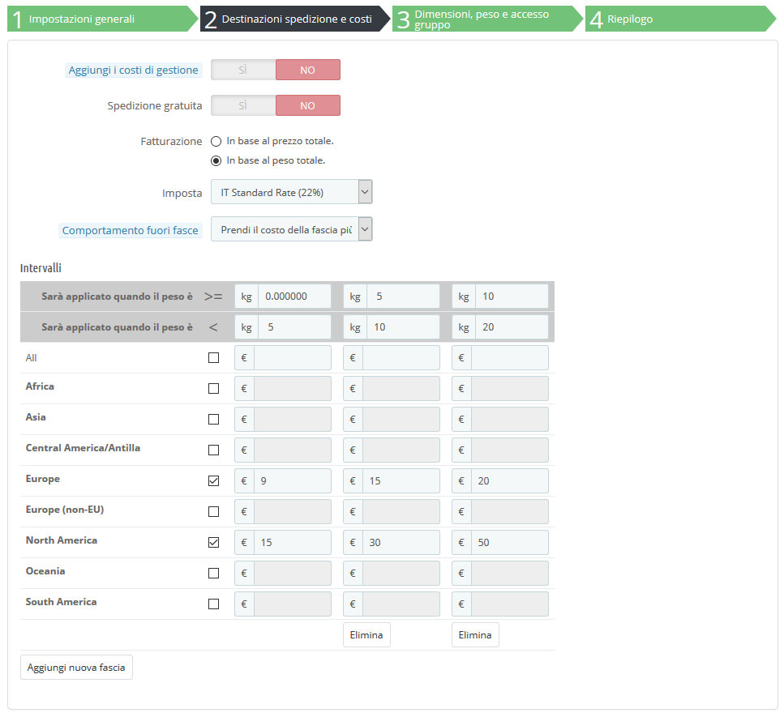
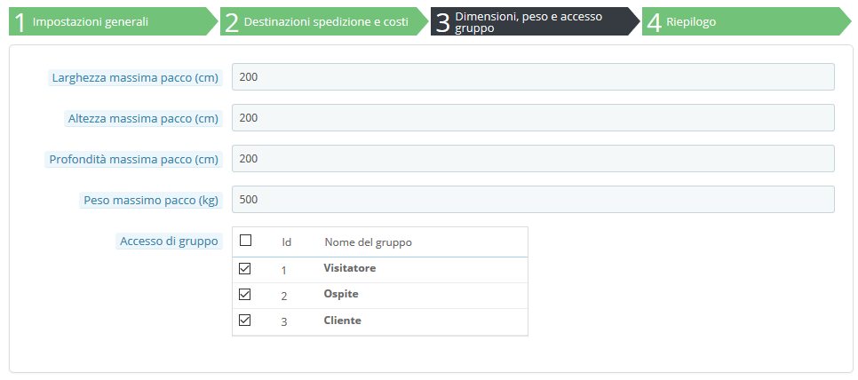
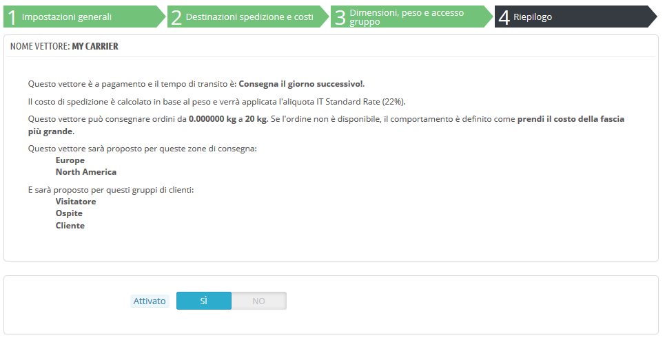

# Corrieri

È necessario disporre di corrieri, ossia indicare chiaramente chi consegnerà i tuoi prodotti. Puoi indicare te stesso o il tuo negozio \(ad esempio se vendi prodotti scaricabili o ti rivolgi solo alla clientela locale\), ma non appena invierai pacchetti anche solo via posta o tramite un corriere di terze parti come FedEx, UPS e simili, allora devi aggiungere questi dettagli al database del tuo negozio. Ciò consentirà ai clienti di scegliere meglio quale corriere utilizzare, in base alla distribuzione, alle tasse e alle date di consegna...

La pagina "Corrieri" presenta un elenco di tutti i corrieri disponibili. Da lì, è possibile modificare direttamente il loro stato, indicare se la spedizione è gratuita o meno e tracciare la posizione per i clienti.

Per impostazione predefinita, hai due corrieri nel database:

* Il tuo negozio: rappresenta il tuo negozio fisico in cui i clienti possono presumibilmente venire e prendere qui i loro stessi prodotti. Non vi sono impostati prezzi né pesi.
* "Il mio corriere": questo è un corriere campione e non deve essere utilizzato nella realtà. Ha fasce di prezzo \(da € 0 a € 10.000\) e fasce di peso \(da 0 kg a 10.000 kg\).

Sta a te rimuovere questi corrieri predefiniti e aggiungerne nuovi per i clienti. Dovresti almeno modificare il corriere "Il mio corriere" e sostituirlo con quello di un corriere reale: nome, dettagli e fasce. Ti consigliamo di eliminare il corriere "Il mio corriere" e di utilizzare un modulo corriere esistente per registrare partner di spedizione in PrestaShop.

Video - 6 suggerimenti per creare una politica di consegna che attrae i clienti e costruisce lealtà

## Aggiungere un Corriere usando il modulo Corriere raccomandato 

PrestaShop è dotato di diversi moduli gratuiti, tra i quali è possibile trovarne una serie sui corrieri che è possibile installare subito, per i principali corrieri nazionali e mondiali.

I corrieri disponibili dipendono dalle impostazioni iniziali del tuo negozio: se hai impostato il tuo negozio in Francia non riceverai gli stessi moduli di un negozio impostato negli Stati Uniti!

Nella pagina "Corrieri" è possibile scegliere tra la creazione di un corriere utilizzando la Creazione guidata oppure utilizzando uno dei moduli corrieri consigliati. Si raccomanda di registrare i corrieri installando un modulo corriere: questo renderà il processo molto più veloce e le impostazioni saranno molto più accurate.

A seconda del modulo, è possibile cliccare sul pulsante "Installa" e lasciare che PrestaShop termini l’installazione o cliccare sul pulsante carrello. In questo secondo caso, sarai portato nel marketplace Addons, dove potrai acquistare il modulo. Una volta acquistato, è possibile installarlo e configurarlo.

## Aggiungere un nuovo corriere utilizzando la creazione guidata 

Se non riesci a trovare un modulo per il tuo partner di spedizione nei moduli nativi o nel marketplace PrestaShop Addons, allora devi registrare il tuo corriere utilizzando la creazione guidata: clicca su "Aggiungi nuovo corriere" per aprire questo strumento.

In questa sezione creeremo un corriere completo, dalla A alla Z, utilizzando la Creazione guidata. È possibile creare tutti i corrieri che desideri.

Se un corriere ha diversi servizi di spedizione, è necessario creali tutti in PrestaShop e distinguerli con i propri nomi.

Molti dei dettagli richiesti dai moduli di PrestaShop dovrebbero essere forniti dai tuoi corrieri una volta che hai creato un account o sei direttamente in contratto con loro. Controlla con loro per assicurarti che tutto sia configurato correttamente.

Per creare un nuovo corriere, clicca sul pulsante "Aggiungi nuovo" nella pagina "corrieri: si aprirà la creazione guidata sul primo dei quattro pannelli.

### Panello 1: Impostazioni Generali 

Qui descrivi il corriere, fornendo informazioni di cui il cliente avrà bisogno per riconoscere e scegliere il corriere che preferisce.

Esaminiamo tutte le informazioni necessarie:

* **Nome corriere**. Il nome è pubblico, perciò dovresti usare il nome ufficiale. Se hai creato un corriere PrestaShop per servizi di spedizione da un singolo corriere, il nome ti aiuterà a differenziarlo. È inoltre possibile aggiungere una descrizione del servizio. Ad esempio, è possibile riempire "PrestaShipping - oltre 500 kg".
* **Tempo di transito**. Il tempo stimato che richiede questo corriere per consegnare i tuoi prodotti, scritto in modo semplice. Viene mostrato ai clienti durante il checkout. Aiuterà a scegliere il corriere in base al lasso di tempo che si è disposti ad aspettare per ricevere la spedizione. I clienti accettano spesso di pagare di più per un corriere più veloce. Devi compilare questo campo in tutte le lingue disponibili, in particolare quelle predefinite.
* **Grado di velocità**. Poiché il campo "Tempo di transito" può contenere qualsiasi testo, non può essere utilizzato per confrontare i tempi di transito dei corrieri. L'impostazione "Velocità" consente di dare al corriere un grado, da 0 \(molto lento\) a 9 \(molto veloce\). Questo viene poi utilizzato per ordinare i corrieri in base al loro grado di velocità e aiuta i clienti a scegliere quello che preferiscono.
* **Logo**. Avere un logo aiuta i clienti a scegliere più facilmente tra corrieri diversi. PrestaShop ridimensionerà la tua immagine per adattarla alla pagina di pagamento. Il logo verrà visualizzato in ogni pannello della creazione guidata, come un promemoria di quale corriere stai modificando/creando.
* **URL di tracciamento**. Questo campo deve essere compilato con l'URL di tracciamento fornito dal corriere \(se ne esiste uno\). "@" indica dove apparirà il numero di tracciamento. Ad esempio, il servizio postale francese \(La Poste\) offre questo URL: [http://www.colissimo.fr/portail\_colissimo/suivreResultat.do?parcelnumber=@](http://www.colissimo.fr/portail_colissimo/suivreResultat.do?parcelnumber=@). Quando i clienti specificano l’acquisto, riceveranno questo URL con "@" sostituito dal numero di tracciamento fornito dal corriere, che, in fase di consegna, consente di cliccare su quel collegamento e vedere dove è.

Clicca su "Avanti" per raggiungere il secondo pannello.

### Panello 2: destinazioni spedizione e costi 

In primo luogo, questo pannello presenta una serie di impostazioni:

* **Aggiungi i costi di gestione**. Includi o escludi i costi di spedizione e di gestione in questo prezzo del corriere, come specificato nella pagina "Preferenze" \("Spese di gestione"\).
* **Spedizione gratuita**. Se abilitato, non sarà possibile indicare i prezzi di spedizione. Se disattivato, potrai modificare le fasce e i costi per Paese nel modulo sotto.
* **Fatturazione**. Quando fai una fattura al cliente, PrestaShop può applicare uno dei due comportamenti a seconda del modo in cui il tuo corriere gestisce la fatturazione \(pertanto verifica la documentazione in merito\):
  * **Secondo il prezzo totale**. La fatturazione dipende dal prezzo totale dell'ordine.
  * **Secondo il peso totale**. La fatturazione dipende dal peso totale dell'ordine.
* **Imposta**. Indica se questo corriere richiede un'imposta locale per consegnare, e in caso affermativo, quale. La tassa deve già esistere in PrestaShop \(che può essere creata nella pagina "Imposte" del menu "Internazionale"\).
* **Comportamento fuori fasce**. Nel caso in cui il corriere scelto non abbia fissato alcun costo di spedizione per la zona o il peso richiesti, è possibile indicare come PrestaShop debba reagire. Hai due opzioni:
  * **Prendi il costo della fascia più alta**. PrestaShop prenderà la fascia più costosa e applicherà le sue condizioni.
  * **Disattiva il corriere**. PrestaShop non propone questo corriere, in quanto probabilmente non è in grado di fornire questo ordine.

Poi arriva la parte importante: la creazione delle fasce del corriere. Questo è un passo molto importante, poiché PrestaShop ha bisogno di queste informazioni per presentare al cliente i corrieri che possono effettivamente consegnare il pacchetto ordinato. Infatti, a seconda del prezzo totale o del peso totale dell'ordine, alcuni corrieri non saranno disponibili, mentre altri saranno visualizzati solo con un certo valore. Devi essere molto preciso quando riempi questi valori e usare, preferibilmente, quelli suggeriti dalla documentazione di ciascun corriere.

È qui che prende il nome la creazione guidata del corriere. Qui puoi costruire i prezzi del tuo carriere e gli intervalli di peso \(a seconda della tua scelta per l'opzione "Fatturazione" sopra\), una fascia dopo l'altra, applicando i tuoi prezzi per ogni zona lungo il percorso.

Le zone devono essere state definite in precedenza. Per questo, vai alla pagina "Località" nel menu "Internazionale".

Per ogni fascia, hai bisogno di giusto un paio di passaggi:

1. **Fissa i limiti inferiori e superiori dell'intervallo che stai creando**. A seconda della scelta "Fatturazione", verrà mostrato "Sarà applicato quando il prezzo è" o "Sarà applicato quando il peso è" per il limite inferiore e "Sarà applicato quando il prezzo è" o "Sarà applicato quando il peso è" per il limite superiore. 

   Si noti che il limite inferiore è compreso \(&gt; =\) mentre il limite superiore è escluso \(&lt;\). Ciò significa che il limite superiore di un intervallo può avere lo stesso valore del valore più basso del campo successivo, poiché i due non si sovrappongono.

2. **Riempi i prezzi**. Non appena i limiti inferiori e superiori sono pieni, PrestaShop rende disponibile il campo "Tutto" per la modifica. Questo è un campo speciale: qualsiasi valore inserito sarà copiato nel campo per tutte le zone geografiche disponibili, senza alcuna azione da parte tua. Per modificarlo, seleziona la casella e inserisci il valore. È quindi possibile modificare separatamente i valori di ciascun campo di zona. Controlla la casella di ciascuna zona che il corriere fornisce a questa fascia. Se questo corriere non effettua consegne in una determinata area geografica per questa gamma corrente, assicurati di deselezionare la relativa casella.
3. **Crea l'intervallo**. Per creare un altro campo, clicca sul pulsante "Aggiungi nuova fascia". PrestaShop aggiunge una nuova colonna di campi di destinazione. Riprendi nuovamente a fissare i limiti inferiori e superiori di questa gamma, quindi riempi i prezzi per destinazione.

Le unità di peso e di prezzo sono quelle predefinite dall'installazione di PrestaShop e quelle utilizzate dai tuoi prodotti. È possibile modificare queste unità nella pagina "Localizzazione" del menu "Internazionale".

Clicca su "Avanti" per raggiungere il terzo pannello.

### Panello 3: Dimensioni, peso e accesso di gruppo 

Questo pannello presenta due serie di opzioni:

* **Altezza/larghezza/profondità/peso massimo pacco**. Ora puoi indicare l'altezza e il peso minimi e massimi del pacco, che sono una parte essenziale per la scelta di un corriere. Il valore è quello delle unità predefinite di peso e dimensioni, come specificato nella pagina "Localizzazione" del menu "Internazionale".
* **Accesso di gruppo**. È possibile che solo alcuni gruppi di utenti possano utilizzare un corriere. Questa opzione serve a questo scopo.

Clicca su "Avanti" per raggiungere il quarto e ultimo pannello.

### Panello 4: Riepilogo 

Questo ultimo pannello fornisce una panoramica delle impostazioni di questo corriere.

Se alcune impostazioni non sono corrette, puoi tornare in qualsiasi pannello precedente usando il pulsante "Precedente" oppure cliccando direttamente sulla scheda del pannello.  
Se per ora vuoi salvare come bozza questo corriere per tornarci in seguito, disattivalo utilizzando l'opzione "Attivato" nella parte inferiore di questo pannello finale.

In entrambi i casi, clicca sul pulsante "Fine" per salvare il lavoro e creare il corriere.

Quando si utilizza PrestaShop in modalità multinegozio, è disponibile un altro pannello e l'ordine del pannello si modifica leggermente:

1. Impostazioni generali
2. **Multinegozio**
3. Spedizione e costi
4. Dimensione, peso e accesso di gruppo
5. Riepilogo

Tutti i pannelli restano come sopra descritti. Il nuovo, "Multinegozio", consente di limitare il corriere a una selezione di negozi.

