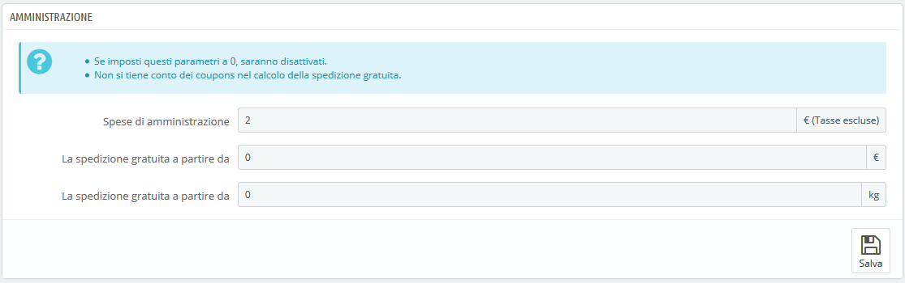
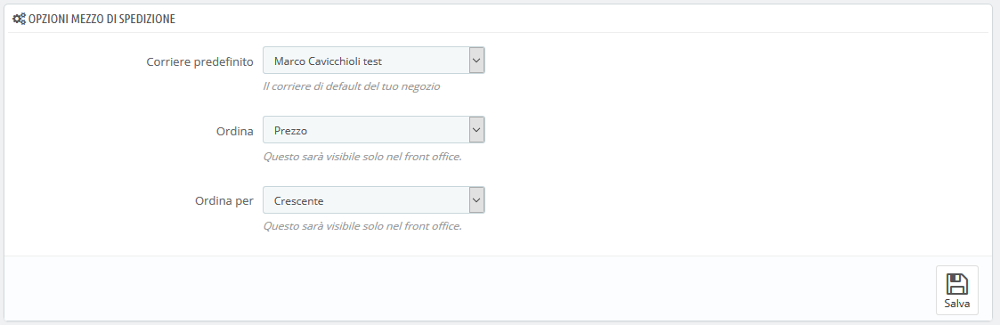

# Preferenze di Spedizione

Le impostazioni più generali della configurazione delle spedizioni del tuo negozio si trovano nella pagina "Preferenze", sotto il menu "Spedizione".

Questa pagina consente di impostare i costi di spedizione:

* **Spese di amministrazione**. Inserisci le spese di gestione per ordine che verranno aggiunte al prezzo finale di acquisto. Sono separate dai costi di spedizione: si riferiscono al tuo costo o a quello di un tuo dipendente per recuperare i prodotti, imballarli e spedirli. Se non sussiste un costo del genere, lascia 0.
* **Spedizione gratuita a partire da \(prezzo\)** e **Spedizione gratuita a partire da \(peso\)**. Inserisci il prezzo o il peso dopo i quali i tuoi clienti riceveranno la spedizione gratuita. Ad esempio, puoi scegliere di offrire la spedizione gratuita quando l'ordine supera € 250. Verrà mostrato un messaggio ai tuoi clienti per indicare quanto manca all’ammontare dell’ordine per ricevere la spedizione gratuita. Se non desideri offrire la spedizione gratuita e non desideri che questo messaggio venga mostrato, lascia questi valori a 0.

La sezione "Opzioni mezzo di spedizione" consente di accedere a 3 impostazioni che influenzano il front office per aiutare il cliente a scegliere:

* **Corriere predefinito.** Se hai più di un corriere nel tuo sistema, puoi proporne uno in particolare ai tuoi clienti. Oltre ai corrieri stessi, questa lista a discesa ha due opzioni contestuali:
  * **Miglior prezzo.** A seconda della quantità dell'ordine, del peso e della zona di consegna, PrestaShop sceglierà il prezzo più economico per il cliente.
  * **Migliore grado.** I gradi di velocità rendono più facile identificare i corrieri veloci. PrestaShop mostrerà il corriere che, nel contesto dell'ordine, consegnerà nel minor tempo.
* **Ordina.** Quando ai clienti viene presentata una scelta di corrieri, è possibile scegliere di ordinare l'elenco per prezzo di spedizione o per posizione, come indicato nell'elenco corrieri nella pagina "Corrieri".
* **Ordina per.** Ciò consente di impostare l'ordine dei corrieri:
  * Se ordinati per tassa di spedizione e con ordine crescente, i corrieri saranno mostrati dal più economico al più costoso.
  * Se ordinati per posizione e con ordine decrescente, i corrieri verranno mostrati dalla posizione più alta dell'elenco, fino alla posizione più bassa.

