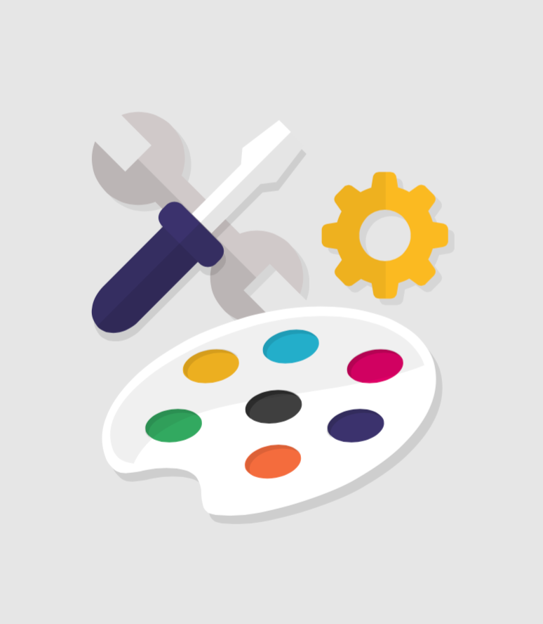

# Personalizzare il Design del tuo Negozio

Il modo in cui il tuo negozio sembra giocare un ruolo importante nella definizione dell'identità del tuo brand è fondamentale per l'esperienza dei tuoi clienti. Più che semplici forme, caratteri e colori, il design del tuo negozio online si basa anche sui contenuti che offri e su come è tutto organizzato.

Questo capitolo contiene le seguenti sezioni: 

* [Tema e Logo](tema-e-logo.md)
* [Catalogo Temi](catalogo-temi.md)
* [Pagine - Gestione Contenuti Statici](pagine-gestione-contenuti-statici.md)
* [Posizioni](posizioni.md)
* [Impostazioni Immagine](impostazioni-immagine.md)
* [Link Widget \(Widget di collegamento\)](link-widget-widget-di-collegamento.md)

