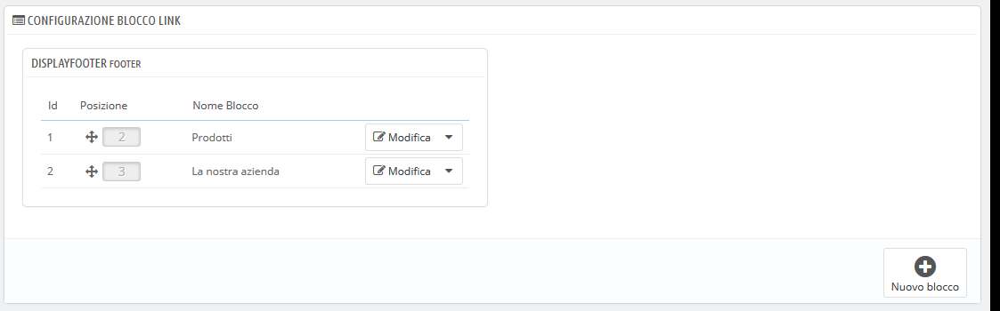
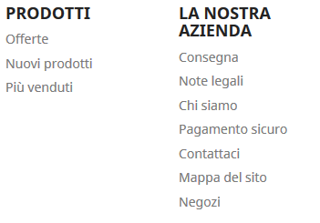

# Link Widget \(Widget di collegamento\)

Questa pagina è legata al modulo "Lista Link", che consente di gestire i vari link e i blocchi di link disponibili nel tuo negozio. Funziona con blocchi di collegamenti alle pagine statiche \(dalla sezione "Pagine"\).

Questa pagina è strettamente legata ai collegamenti, quindi è consigliabile essere a proprio agio con essi prima di tentare qualsiasi modifica 

Per impostazione predefinita e se ancora utilizzi il tema predefinito Classic, hai un blocco per il footer:

Ci sono due blocchi figli nel blocco del footer: "Prodotti" e "La nostra azienda" che rappresentano le prime due colonne di link visualizzati nel footer del tuo negozio. I nomi dei blocchi sono i titoli di queste due colonne.

## Gestire I blocchi 

Con un blocco genitore sono possibili diverse azioni:

* **Ordina blocco**. È possibile modificare la posizione di un blocco: semplicemente trascinando e rilasciando la sua riga.
* **Modifica blocco**. Se clicchi su "Modifica" si aprirà una nuova schermata e vedrai quali sono i link di pagina attivi per ogni blocco \(selezionati con una spunta\) e dove sono collegati.
* **Cancella blocco**. Il pulsante di azione a destra della riga consente anche di eliminare un blocco.

## Creare un nuovo blocco 

Se hai bisogno di un nuovo set di link all'interno del tuo negozio, clicca su "Nuovo blocco" per crearne uno. Si aprirà un form da compilare.

* **Nome del blocco del link**. Questo è il titolo del tuo blocco di link, così come apparirà sul tuo negozio. Rendilo semplice e chiaro.
* **Collegamento**. Seleziona qual è il collegamento da inserire nel blocco. Tutti i collegamenti disponibili verranno visualizzati.
* **Link di pagina**. Qui ci sono diverse sezioni con tutte le pagine disponibili per le quali è possibile creare collegamenti. Selezionare ciascuna pagina singolarmente oppure selezionare un gruppo di pagine attraverso la casella nella parte superiore della sezione \(accanto a "Nome"\). Per impostazione predefinita esistono tre sezioni:

  * Pagine contenuti - Home. Tutte le pagine esistenti sotto la categoria home page.
  * Pagine prodotti. Pagine che mostrano nuovi prodotti o prodotti scontati.
  * Contenuti statici. Contenuti statici collegati al tuo tema.

  Se disponi di altre categorie di pagine verranno visualizzate di conseguenza, con le pagine che contengono.

Al termine della selezione della tua pagina, clicca su "Salva".

Un nuovo blocco apparirà nella pagina principale.

