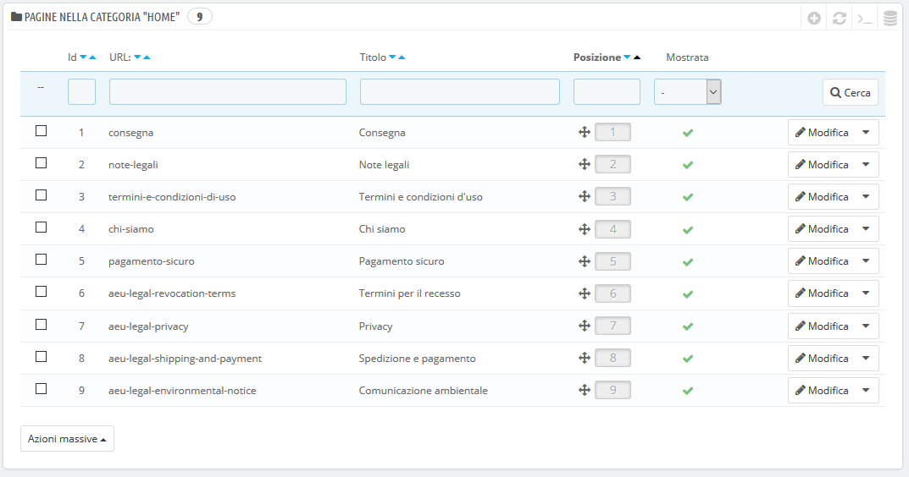
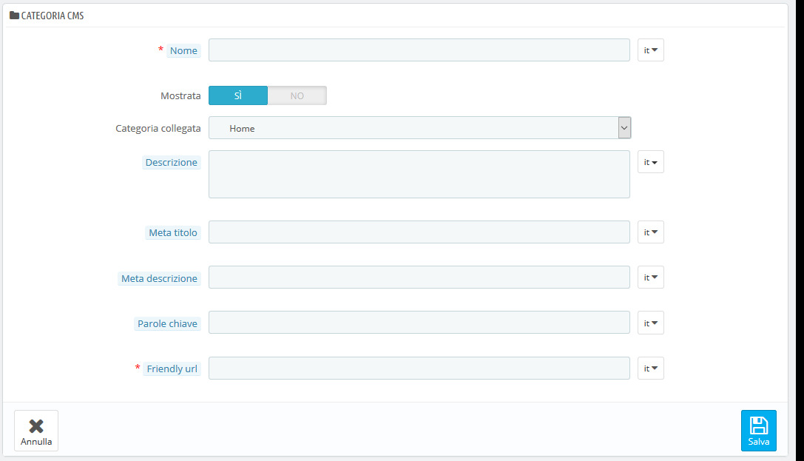

# Pagine - Gestione Contenuti Statici

PrestaShop consente di creare con facilità pagine di contenuti allo stesso modo di come si creano le pagine di prodotto. È possibile aggiungere pagine statiche nel menu principale utilizzando il modulo "Menu principale" \(configurabile dalla pagina "Moduli"\) e ovunque con il modulo "Link Widget".

Se usi le versioni precedenti di PrestaShop, le pagine e il contenuto statico sono ciò che veniva chiamato CMS \(Content Management System\).

Questa pagina presenta tutte le pagine di contenuti precedentemente create nel tuo negozio, per la categoria di pagina selezionata \(per impostazione predefinita, la home page è l'unica categoria\).

Non dimenticare di tradurre ogni pagina per ciascuna delle tue lingue supportate! Come sempre, per cambiare la lingua, puoi cliccare sul selettore di lingua su ogni campo.

**Creazione di una nuova categoria di una pagina**

Clicca sulla categoria "Aggiungi nuova pagina" per creare una categoria di pagina – che, in realtà, è una sottocategoria della categoria radice, "Home". Puoi creare tante categorie quante necessarie.

Il form è abbastanza basico:

* **Nome.** Assicurati di usare una parola breve e diretta.
* **Mostrata**. Se la categoria e le sue pagine sono a disposizione del pubblico o nascoste.
* **Categoria collegata**. La categoria in cui è inserita questa sottocategoria. Per impostazione predefinita è "Home". Puoi avere un numero illimitato di livelli di sottocategorie.
* **Descrizione**. Compila questo campo in tutte le lingue, in quanto alcuni temi possono mostrare tali informazioni ai clienti.
* **Meta Titolo**. Il nome della categoria, come visualizzato nel browser.
* **Meta Descrizione**. Utilizzata per descrivere il contenuto di questa categoria per i motori di ricerca.
* **Parole chiave**. Utilizzate dai motori di ricerca per capire da quale tipo di informazioni la categoria è composta.
* **Friendly URL**. Facilita i motori di ricerca a indicizzare i tuoi contenuti e aiuta i visitatori a capire cosa troveranno nella categoria. Questo campo viene compilato automaticamente inserendo il nome della categoria, ma è comunque possibile modificarlo manualmente. 

Quando salvi la categoria, PrestaShop ti riporta alle schede, questa volta utilizzando la categoria appena creata come base. Pertanto qui non si vedrà alcuna sottocategoria o sottopagina se non se ne crea alcuna.

Per tornare alla categoria principale, clicca su "Home" in alto a sinistra. Puoi quindi modificare ogni pagina dalla categoria principale e spostarle nella nuova categoria se ti è utile, oppure crea una nuova pagina per andare alla tua nuova categoria.

Per creare sottocategorie, è sufficiente modificare l'opzione "Categoria collegata" da "Home" alla categoria genitore desiderata per quella che si sta creando.

## Creare una nuova pagina 

Clicca sul bottone "Aggiungi Nuova pagina" per giungere al form di creazione:

* **Pagina Categoria**. La categoria predefinita è la home page del tuo negozio. Se vuoi inserire questa pagina in un'altra categoria, devi prima crearla.
* **Meta titolo**. Il nome della pagina, come visualizzato nel browser.
* **Meta descrizione**. Utilizzata per descrivere il contenuto di questa pagina per i motori di ricerca.
* **Parole chiave**. Utilizzate dai motori di ricerca per capire da quale tipo di informazioni la pagina è composta.
* **Friendly URL**. Facilita i motori di ricerca a indicizzare i tuoi contenuti e aiuta i visitatori a capire cosa troveranno nella categoria. Questo campo viene compilato automaticamente inserendo il nome della categoria, ma è comunque possibile modificarlo manualmente.
* **Contenuto pagina**. Questo è il contenuto principale della tua pagina. In questo editor WYSIWYG, puoi inserire il testo necessario, anche immagini o video utilizzando l'opzione "Inserisci immagine" o "Inserisci video".
* **Indicizzazione da motori di ricerca**. Indica se i motori di ricerca devono registrare questa pagina o meno.
* **Mostrata**. Puoi scegliere se pubblicare la tua pagina solo dopo aver completato la bozza che non viene mostrata al pubblico finché non verrà pubblicata.  

Una volta compilati tutti i campi, clicca su "Salva". Se attivato, puoi visualizzare il risultato direttamente sul tuo negozio online.

