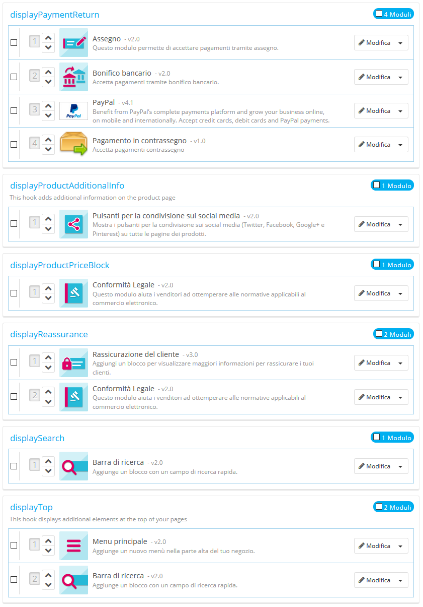
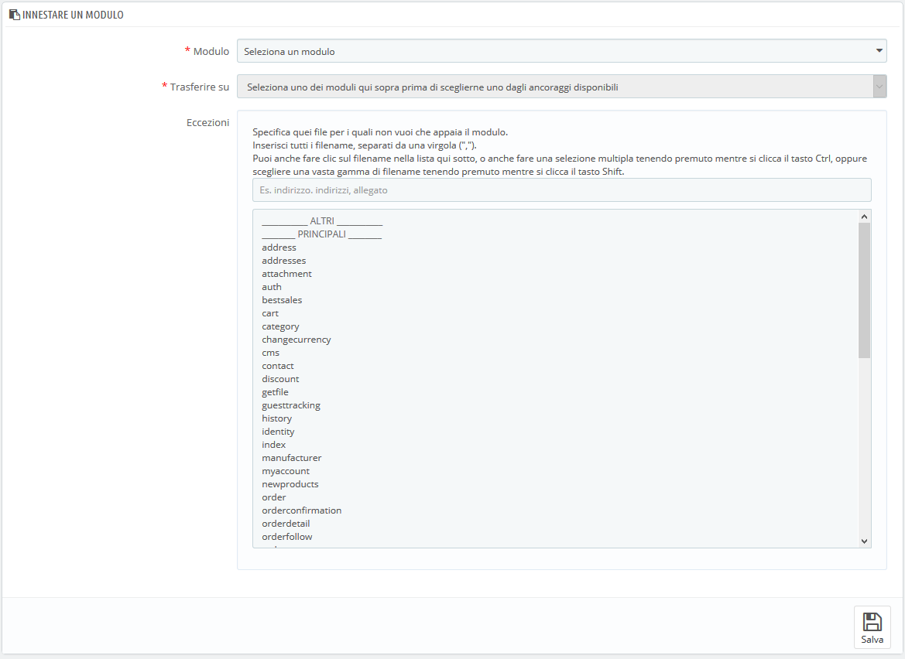
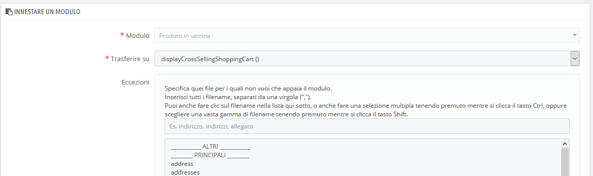

# Posizioni

* [Posizioni del Front office](posizioni.md#Posizioni-PosizionidelFrontoffice)
  * [Spostare un modulo attraverso un hook](posizioni.md#Posizioni-Spostareunmoduloattraversounhook)
  * [Attaccare un modulo a un hook: Trapianto](posizioni.md#Posizioni-Attaccareunmoduloaunhook:Trapianto)
  * [Modificare un modulo collegato](posizioni.md#Posizioni-Modificareunmodulocollegato)
  * [Rimuovere un modulo da un hook](posizioni.md#Posizioni-Rimuovereunmodulodaunhook)
  * [Trasferire un modulo modificando il suo codice ](posizioni.md#Posizioni-Trasferireunmodulomodificandoilsuocodice)
    * [Widgets](posizioni.md#Posizioni-Widgets)

Un modulo può avere due viste: una sul back office \(le sue opzioni, o anche una schermata di configurazione\) e una sul front office. La vista front office è come e dove il modulo viene visualizzato all'interno del tema del negozio.

La posizione di un modulo nel tuo tema può essere modificata, potrebbe essere necessario che un blocco di un modulo venga collocato molto più in alto \(o in basso\) nella pagina rispetto agli altri. Nel linguaggio di PrestaShop, questo viene chiamato "Trapianto" e viene fatto utilizzando lo strumento disponibile nella pagina "Posizioni", sotto il menu "Design". In effetti, permette di collegare un modulo a uno dei molti hook disponibili nel tema attuale, senza scrivere alcun codice.

La pagina "Posizioni" visualizza tutti gli hook disponibili e i relativi moduli collegati. Molti, per impostazione predefinita, sono vuoti, ma alcuni dei più utili possono avere una dozzina di moduli.



Nella parte superiore della pagina, un menu a discesa consente di visualizzare solo il modulo a cui sei interessato. In alternativa,è anche possibile cercare un hook \(gancio\) specifico.

Per impostazione predefinita, questa pagina mostra solo gli hook su cui è possibile posizionare le funzioni. La casella successiva "Visualizza hook non posizionabili" mostra tutti i ganci, anche quelli invisibili, che sono collegati ad un'azione per esempio.

L'intestazione della tabella per ciascun hook visualizza il nome dell’hook, una rapida descrizione \(se disponibile\) e il numero di moduli collegati. La tabella elenca i moduli che sono collegati a quell’hook.

I moduli vengono visualizzati nell'ordine in cui appaiono nell’hook.

## Spostare un modulo attraverso un hook <a id="Posizioni-Spostareunmoduloattraversounhook"></a>

Vi sono due modi per cambiare la posizione di un modulo all'interno di un hook:

* Clicca sulla freccia su o giù. La pagina ricarica e visualizza il nuovo ordinamento.
* Trascina e rilascia la riga del modulo stesso: 
  1. Posiziona il cursore del mouse sul numero di posizione per trasformarlo in un cursore di "movimento elemento".
  2. Clicca e tieni premuto mentre sposti il cursore sulla riga/posizione in cui desideri che compaia il modulo: la riga del modulo cambierà di conseguenza la posizione.
  3. Rilascia il pulsante del mouse: la nuova posizione del modulo viene salvata.

Per la maggior parte dei moduli, il trapianto può essere fatto facilmente direttamente dal back office. Alcuni moduli richiedono di modificare il codice per il trapianto.

## Attaccare un modulo a un hook: Trapianto <a id="Posizioni-Attaccareunmoduloaunhook:Trapianto"></a>

In PrestaShop, "il trapianto" è l'azione che consente di collegare un modulo a un gancio. È possibile aggiungere un modulo a più di un gancio.

Due cose da sapere prima del trapianto di un modulo:

* Alcuni moduli sono scritti per essere collegati solo ad un determinato insieme di ganci
* Alcuni ganci sono scritti per non accettare alcuni specifici tipi di moduli.

Pertanto, sii consapevole che non è sempre possibile il trapianto di qualsiasi modulo su qualsiasi gancio.

Assicurati di disattivare la cache durante la verifica dell'effetto di un nuovo modulo sul front end. Puoi farlo nella pagina "Performance", nel menu "Parametri avanzati".

Il processo di trapianto ha una propria interfaccia:

1. Vai nel menu "Design" e nella relativa pagina "Posizioni".
2.  Clicca sul pulsante "Trasforma un modulo" in alto a destra. Viene mostrata l'interfaccia che consente il trapianto.
3.  Nell'elenco a discesa "Modulo", seleziona il modulo che desideri trapiantare.
4.  Nell'elenco a discesa "Trasferire su", seleziona dove desideri il trapianto del modulo. Ci sono molti hook disponibili. È possibile modificare le impostazioni successive se necessario.
5.  Nel campo "Eccezioni" digita il nome dei file delle pagine in cui non desideri che il modulo venga visualizzato. È possibile eseguire più selezioni semplicemente cliccando sui nomi di file mantenendo premuto il tasto Ctrl. È possibile deselezionare i file nello stesso modo: Ctrl + clic.
6.  Non dimenticare di salvare le modifiche.



Il menu a discesa "Trasferire su" vi offre una buona idea di dove i moduli possono essere posizionati.

Anche se l'elenco a discesa " Trasferire su" fornisce una panoramica completa degli hook disponibili, potrebbe non essere sempre chiaro qual è quello a cui si desidera allegare il modulo. Non esitare a provare un altro hook se il risultato della tua selezione se non quello che ti aspetti.

L'elenco fornisce alcuni dettagli: qualche hook è dotato di una descrizione dopo il nome, ad esempio "Aggiungi campi al form del valore di un attributo" per `displayAttributeForm`. Esaminali tutti per scegliere il tuo hook correttamente.

## Modificare un modulo collegato <a id="Posizioni-Modificareunmodulocollegato"></a>

Ogni modulo ha un pulsante di azione sul lato destro della sua riga, con due possibili opzioni: una per modificarne le impostazioni, l'altra per eliminare il modulo.

La modifica dell'impostazione di un modulo utilizza la stessa interfaccia del trapianto di un modulo. L'unica differenza è che non è possibile modificare il campo "Modulo", in quanto è disabilitato e quindi disattivato. È possibile modificare sia l'impostazione "Trasferire su" che le eccezioni e funziona come descritto nel metodo "Collegamento di un modulo a un hook" di cui sopra.



Controlla sempre il tuo front office per assicurarti che il modulo sia effettivamente dove desideri che sia.

## Rimuovere un modulo da un hook <a id="Posizioni-Rimuovereunmodulodaunhook"></a>

Ci sono due modi per rimuovere un modulo da un hook:

* Rimozione di un singolo modulo: clicca sull'icona del cestino a destra della riga del modulo.
* Rimozione di un lotto di moduli: seleziona i moduli tramite la casella a sinistra della rispettiva riga e quindi clicca sul pulsante "Sgancia la selezione", che si trova in alto e in basso nell'elenco degli hook.

## Trasferire un modulo modificando il suo codice  <a id="Posizioni-Trasferireunmodulomodificandoilsuocodice"></a>

Questa funzione è solo per esperti: devi avere una buona conoscenza di PHP e HTML prima di tentare qualsiasi cosa con il codice di un modulo.

Alcuni moduli non possono essere trasferiti in altre sezioni del front office semplicemente perché non hanno il codice opportuno.

Ad esempio, alcuni moduli contengono modelli per la visualizzazione sia della colonna che dell'intestazione, mentre altri dispongono di un file di modelli che funziona solo con la sezione intestazione.

Se si desidera visualizzare moduli semplici in una posizione per cui non sono stati creati, è necessario modificarne i file.

Possono anche essere creati moduli più complessi per essere mostrati in altre sezioni della pagina, ma occorre riscriverli in parte per inserirli quella nuova posizione.

Per personalizzare la capacità di trapianto di un modulo, devi fornire la funzione corretta PHP per il nuovo hook di destinazione. Ad esempio, per un modulo che ha questa funzione:

```text
function hookTop($params) { ... } 
```

Per trasformare il blocco nella colonna di destra, ad esempio, è necessario aggiungere la funzione `hookRightColumn()` :

```text
function hookRightColumn($params) { ... } 
```

Successivamente, è necessario scrivere il codice che mostra il contenuto nel front end. Nel migliore dei casi, ciò significa copiare/incollare il contenuto della funzione `hookTop();` nel peggiore dei casi, è necessario rielaborare il contenuto della funzione `hookTop()` in qualcosa che funziona per la nuova posizione.

### Widgets <a id="Posizioni-Widgets"></a>

PrestaShop 1.7 ha introdotto un nuovo sistema per agganciare i moduli: widget. Grazie ai widget, un modulo può essere utilizzato e trapiantato in qualsiasi gancio di visualizzazione.

I widget funzionano solo con i moduli 1.7 \(i nomi tecnici dei moduli PrestaShop iniziano con "ps\_"\) e non possono essere utilizzati in tutti i moduli.

Leggi ulteriori informazioni sui widget qui: [http://developers.prestashop.com/module/40-Widgets/widget.html?highlight=widget](http://developers.prestashop.com/module/40-Widgets/widget.html?highlight=widget)

