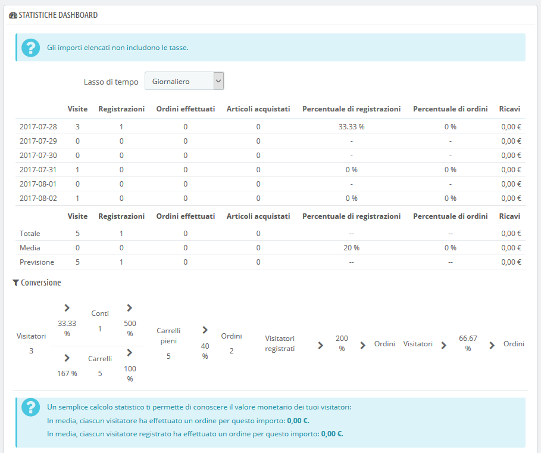
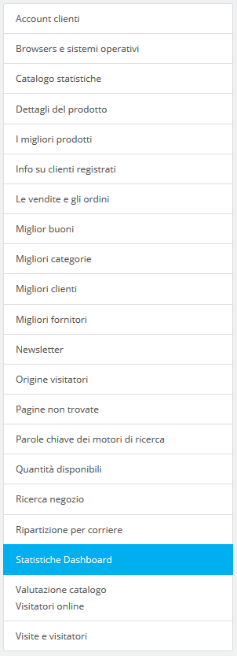

# Capire le Statistiche

Questa sezione presenta nel dettaglio l'utilità delle varie statistiche disponibili. Cliccando su ciascuna delle categorie a tua disposizione nella barra laterale della pagina "Statistiche", la pagina principale viene ricaricata con i numeri più aggiornati.

Per alcune statistiche, viene fornita una spiegazione completa per aiutarti a comprendere i dati forniti in modo da poter utilizzare le informazioni per migliorare il tuo negozio e il suo tasso di conversione.

Video - 4 semplici passaggi per ottimizzare le prestazioni del tuo negozio online

## Interfaccia Principale 

Per impostazione predefinita, la pagina mostra il Pannello delle Statistiche, una panoramica sui numeri principali raccolti da PrestaShop stat system sin da quando hai lanciato il tuo negozio online.

Nella parte superiore della pagina è presente una singola barra che ti aiuta a scegliere il lasso di tempo delle statistiche che desideri visualizzare. Sono disponibili tre opzioni:

* Giorno corrente, mese o anno.
* Giorno, mese o anno precedenti.
* Selezione precisa del periodo \(data da/a\).

Clicca su "Salva" per visualizzare le statistiche del periodo di tua scelta.

Il pannello contiene 8 sezioni:

* Le principali statistiche. Questo è veramente il cuore delle tue statistiche. In un'unica pagina, PrestaShop fornisce una panoramica dei numeri più importanti raccolti per il periodo di tempo selezionato: visitatori, nuove registrazioni, nuovi ordini, numero di articoli acquistati per tutti gli ordini combinati, percentuale di registrazione per visitatori, percentuale di ordini per visitatori, quantità di voucher utilizzati, quantità di tutte le vendite combinate.È possibile modificare la scala di livello con il selettore a discesa in alto a destra della sezione. I periodi disponibili sono: giornalieri, settimanali, mensili e annuali. Le tre righe in fondo alla tabella non sono influenzate dal periodo selezionato: le cifre totali, medie e di previsione consentono di ottenere una migliore stima di dove si posiziona il tuo negozio.
* **Conversioni.** Questa sezione ti dà un'idea di quanto vale un visitatore o un cliente registrato sul tuo negozio, fondamentalmente in base al numero di ordini che piazza. È un ottimo indicatore della direzione in cui il tuo negozio sta andando. Nota: la differenza tra un "carrello" e un "carrello pieno" è che il primo è un carrello di un visitatore, con prodotti e non molto altro, mentre un carrello pieno contiene prodotti E un indirizzo di spedizione E un corriere scelto. In breve, il carrello è _quasi completamente_ giunto al processo di checkout, tutto quello che resta da fare è pagare.
* **Distribuzione dei pagamenti**. Questa sezione descrive quali metodi di pagamento sono scelti più spesso dai tuoi clienti. Sulla base di queste cifre, potresti desiderare di adattare il tuo negozio o la tua attività al fine di meglio soddisfare i metodi più popolari o supportare un metodo specifico che preferisci che i tuoi clienti scelgano. Utilizzando il selettore a discesa "Zona" in alto a destra della sezione, è possibile limitare i numeri a una zona geografica specifica e quindi vedere quale metodo funziona meglio o peggio a seconda della regione.
* **Distribuzione di categoria**. Questa sezione fornisce informazioni specifiche sulle categorie. Per ogni categoria presenta numeri utili: prodotti, vendite, percentuale di prodotto venduto per l'intero negozio, percentuale di vendite per l'intero negozio, prezzo medio del prodotto. Se noti che una categoria è più efficace di altre, potrebbe essere utile spingere sulla sua promozione. D'altra parte, potresti provare a rafforzare i numeri delle categorie deludenti rilasciando buoni o altre azioni promozionali... Utilizzando il selettore a discesa "Zona" in alto a destra della sezione, è possibile limitare i numeri a una determinata area geografica e pertanto vedere quale categoria ha maggior successo a seconda della regione.
* **Distribuzione lingua**. I tuoi clienti possono scegliere la lingua preferita per navigare sul tuo sito, puoi vedere la distribuzione della lingua tramite questa sezione. Assicurati di aver tradotto correttamente tutti i tuoi prodotti per almeno le due lingue più popolari.
* **Distribuzione di zona**. Puoi filtrare un'altra sezione di zone, che ti dà direttamente riscontro sul numero di clienti registrati e sulle vendite per zona \(e sulle rispettive percentuali\).
* **Distribuzione in valuta**. Se accetti più di una valuta, questa sezione ti aiuta a vedere qual è la più utilizzata dai tuoi clienti. Utilizzando il selettore a discesa "Zona" in alto a destra della sezione, è possibile limitare i numeri a una determinata area geografica e quindi vedere quale valuta è la migliore a seconda della regione.
* **Distribuzione degli attribut**i. Questo è più di una statistica interna che consente di vedere quale attributo e gruppo di attributi è il più utilizzato all'interno dei tuoi prodotti.

## Navigare le statistiche 

La maggior parte dei dati statistici può essere scaricata come file CSV cliccando sul pulsante "Esporta CSV" nella parte inferiore della pagina.

* **Account clienti.** Questa pagina mostra un grafico con il numero di account clienti creati nel tuo negozio online. Con queste informazioni puoi misurare l'impatto delle tue campagne di marketing. Puoi vedere il numero di visitatori che si sono registrati ma non hanno mai acquistato nulla, oltre al numero di clienti che hanno creato un account e hanno acquistato un elemento subito dopo la registrazione. ****
* **Browser e sistemi operativi**. Questa sezione ti informa sui browser web utilizzati dai visitatori e dai clienti per navigare nel tuo negozio. Devi verificare che il tuo negozio sia perfettamente compatibile con questi browser o almeno con i tre più popolari. Ti dice anche se i visitatori stanno navigando sul tuo negozio dai loro dispositivi mobili \(come gli smartphone\). Se questo numero è significativo, dovresti pensare ad una versione mobile del tuo negozio. Infine, puoi vedere quali sistemi operativi utilizzano i visitatori. Assicurati che il tuo negozio sia completamente compatibile con tutte le piattaforme dei tuoi visitatori.
* **Catalogo statistiche.** Questa sezione contiene informazioni pratiche sui prodotti venduti nel tuo negozio online e sul tuo catalogo nel suo complesso. Le cifre possono essere filtrate per categoria utilizzando il selettore a discesa nella parte superiore della sezione. Puoi agire sulle performance del tuo catalogo considerando i seguenti indicatori:
  * **Prodotti disponibili.** La quantità disponibile dei prodotti in questa categoria \(per impostazione predefinita, tutte le categorie\).
  * **Prezzo medio.** Prezzo medio del prodotto della categoria selezionata.
  * **Pagine del prodotto visualizzate.** Numero di pagine visitate dai tuoi potenziali clienti. Confronta questi dati tra le diverse categorie per vedere quali sono le più viste, o al contrario quali non attirano molti clienti. Utilizza queste informazioni per apportare qualche miglioramento al tuo catalogo.
  * **Prodotti acquistati.** L'importo dei prodotti acquistati in ciascuna categoria.
  * **Numero medio di visite per pagina.** Il numero globale di visite per i prodotti della categoria selezionata.
  * **Numero medio di acquisti.** Il rendimento globale per le vendite di prodotti nella categoria selezionata.
  * **Immagini disponibili.** Indica quante immagini sono legate ai prodotti della categoria selezionata. Un modo rapido per sapere se per alcuni prodotti mancano è se ci sono meno immagini rispetto ai prodotti esistenti.
  * **Numero medio di immagini.** Numero di immagini diviso per il numero di prodotti della categoria selezionata.
  * **Prodotti mai visti.** Alcuni dei tuoi prodotti potrebbero non essere stati mai visitati. Controlla le loro pagine per cercare di capire perché.
  * **Prodotti mai acquistati.** Alcuni dei tuoi prodotti potrebbero non essere mai stati acquistati dai clienti. Questo è un problema serio e devi prenderti del tempo per capire perché.
  * **Tasso di conversione.** Indica la relazione tra il numero di visitatori e il numero di acquisti. È importante che questo valore sia il più alto possibile.
  * Una tabella nella parte inferiore della pagina indica quali prodotti di questa categoria non sono mai stati acquistati. Potresti prendere in considerazione la modifica del prezzo o scrivere una descrizione più attraente, ad esempio.
* **Dettagli del prodotto.** Questa pagina mostra tutti i prodotti del tuo negozio per numero di riferimento, nome e disponibilità. Puoi filtrare i risultati selezionando il menu a discesa della categoria di prodotti che desideri visualizzare. Clicca su un prodotto per accedere alle sue statistiche. È quindi possibile visualizzare un grafico con due set di dati: vendite effettuate e numero di visite alla pagina del prodotto. Sarà inoltre visualizzato il tasso di conversione del prodotto. ****
* **Migliori prodotti**. Questa sezione mostra i prodotti con ottimi risultati. Puoi visualizzare il fatturato realizzato, le vendite giornaliere medie, il numero di pagine visualizzate e la quantità restante in magazzino. Con questa tabella è possibile identificare i prodotti principali e decidere se eseguire azioni quali aumentare o diminuire i prezzi o fare sconti su un prodotto specifico.
* **Informazioni sui clienti registrati.** Questa sezione è suddivisa in 5 grafici.
  * **Distribuzione di genere.** Puoi vedere come i tuoi clienti sono distribuiti tra i diversi titoli sociali che hai impostato - per impostazione predefinita, signor e signora, ma ce ne possono essere molti altri, come dottor o il dottoressa. Di conseguenza, non puoi fare affidamento a questo grafico per la distribuzione di genere a meno che tu non abbia ridotto i tuoi titoli sociali a due soli generi.
  * **Fasce di età.** Puoi conoscere la distribuzione dei tuoi clienti in base alla loro età, a condizione che richiedi la loro data di nascita. Se vedi che l'intervallo di età dei tuoi clienti non è quello che avevi immaginato, pensa a modificare il tuo approccio di marketing.
  * **Distribuzione del Paese.** Puoi consultare rapidamente in quali Paesi i tuoi clienti vivono. Ciò può aiutare a concentrare gli sforzi di marketing su un singolo Paese.
  * **Distribuzione di valuta.** Puoi vedere quali valute vengono utilizzate per acquistare oggetti nel tuo negozio e in quali proporzioni.
  * **Distribuzione lingua.** Puoi vedere in quali lingue il tuo negozio viene consultato più spesso e quindi decidere se migliorare le traduzioni del tuo negozio in una determinata lingua.
* **Vendite e ordini.** Questi due grafici mostrano l'evoluzione delle vendite e degli ordini del tuo negozio. Possono essere filtrati per Paese, utilizzando il menu a discesa in alto a destra. ****
  * Il primo grafico indica il numero totale di ordini validi, nonché il numero totale di prodotti ordinati. Con questo grafico, è possibile analizzare quali periodi hanno dato il maggior ritorno in termini di quantità di ordini.
  * Il secondo grafico consente di visualizzare graficamente le vendite. Può analizzare i periodi di tempo in cui hai avuto le vendite migliori. Ciò consente ad esempio di avere un'idea migliore di quando iniziare le tue campagne marketing.
* **Migliori buoni**. In questa sezione vengono visualizzati i buoni, i voucher, le regole del carrello e le regole dei prezzi di catalogo più popolari che hai creato e distribuito, personalmente o tramite una campagna promozionale. La tabella mostra anche il fatturato e il numero di buoni utilizzati. ****
* **Migliori categorie**. Questa sezione presenta le prestazioni del tuo negozio per categoria. Puoi scoprire quanti prodotti di ciascuna categoria sono stati venduti, il ricavo generato e il numero di pagine visualizzate. Assicurati di controllare regolarmente la coerenza dei risultati tra le diverse categorie per rendere omogeneo il tuo negozio.
* **Migliori clienti**. Questa sezione elenca i migliori clienti del tuo negozio. Mostra il loro indirizzo email, così come il numero di volte in cui hanno visitato il sito e quanto hanno speso finora. Tieni d'occhio questa pagina per tenere traccia dei tuoi migliori clienti. Cliccando sui pulsanti nella parte superiore delle colonne, puoi scegliere come ordinare questi dati.
* **Migliori fornitori**. Questa sezione fornisce statistiche sui tuoi fornitori con le quantità vendute e i ricavi generati.
* **Newsletter.** Questa pagina mostra le statistiche di iscrizione alla newsletter. È possibile utilizzare questo database per informare i clienti. Le newsletter di solito aiutano ad aumentare il traffico al tuo negozio. Se vuoi migliorare l'iscrizione, considera l'aggiunta di codici voucher / regole del carrello a ogni newsletter. Puoi vedere tutti gli indirizzi degli iscritti tramite il modulo "Abbonamento email" nella pagina "Moduli e servizi".
* **Origine dei visitatori.** Questa pagina utilizza un grafico per darti i primi dieci siti e motori di ricerca che hanno portato visitatori. Di solito, i motori di ricerca svolgono un ruolo molto importante. Se crei una campagna di marketing pubblicando articoli su altri siti, puoi vedere quale impatto abbia avuto sul tuo negozio. Sotto il grafico ci sono i nomi dei siti che hanno portato pubblico, con il numero di visitatori di ciascuno nella colonna di destra.
* **Pagine non trovate.** Questa pagina ti dice a quali pagine del tuo catalogo le persone hanno tentato di accedere senza esito positivo \(con conseguente errore "HTTP 404"\). Questo è utile per trovare potenziali problemi tecnici che potrebbero ostacolare le vendite.
* **Parole chiave del motore di ricerca.** Questa pagina ti dice quali parole chiave digitate in un motore di ricerca portano i visitatori al tuo negozio online. Ciò consente di sapere quali termini rendono il vostro negozio facilmente identificabile. Al contrario, puoi vedere quali parole chiave sono assenti da questa lista e quindi non sono efficaci.
* **Quantità disponibili.** Questa sezione fornisce una panoramica del valore del tuo magazzino attuale.
* **Ricerca negozio**. Questa sezione presenta due indicatori. 
  * Il primo è un grafico che mostra la distribuzione di parole chiave digitate nella barra di ricerca del tuo negozio. Questo ti permette di vedere quali prodotti i tuoi visitatori stanno cercando - e quindi, quelli di cui dovresti avere tanto di stock.
  * La seconda è una tabella che riassume le ricerche dei tuoi visitatori. Puoi vedere quali parole chiave vengono utilizzate, quante volte sono state digitate e quanti risultati sono stati resi disponibili. È importante che tutte le richieste dei tuoi clienti ottengano un risultato. Per migliorare il tuo negozio, assicurati di aggiungere i prodotti che soddisfano le richieste dei clienti \(ricerche\) o aggiungi ulteriori tag ai tuoi prodotti per renderli facilmente identificabili.
* **Ripartizione per corriere**. Questa pagina indica quali corrieri sono utilizzati maggiormente dai visitatori. Puoi filtrare tutti i risultati per lo stato dell'ordine. Se scopri che un corriere non viene utilizzato spesso, nonostante sia veloce ed efficiente, potrebbe essere opportuno mostrarlo in modo più accurato durante la cassa, per aumentare la soddisfazione del cliente.
* **Dashboard delle statistiche.** Questa è la home page delle statistiche, presenta una visione globale delle statistiche del tuo negozio. Cliccando su quest'ultima opzione si torna al pannello delle statistiche globali.
* **Valutazione del catalogo**. Questa sezione fornisce una panoramica delle prestazioni del tuo catalogo. Puoi scoprire se ogni prodotto è attivo o se la sua descrizione è correttamente inserita in tutte le lingue attive del tuo negozio. Puoi anche vedere se tutti i tuoi prodotti dispongono di immagini sufficienti, le loro prestazioni di vendita e lo stato attuale del magazzino. Il punteggio complessivo per ogni prodotto viene visualizzato utilizzando un'icona colorata. È possibile definire i criteri compilando la tabella in cima alla pagina, quindi salvando le impostazioni.
* **Visitatori online.** Questa sezione indica il numero di visitatori presenti al momento sul tuo negozio. Puoi vedere i loro nomi e le pagine che stanno guardando. I dati vengono aggiornati in diretta. È necessario attivare l'opzione "Salva visualizzazioni pagina per ogni cliente" nel modulo "Data mining per le statistiche" \(StatsData\) per visualizzare le pagine visitate.
* **Visite e visitatori.** Questa pagina ti dà statistiche sui visitatori del tuo negozio e sul numero di volte che lo visitano. Maggiore è il numero, più popolare è il tuo negozio. Il grafico aiuta a capire il comportamento dei tuoi visitatori. In pratica, vedrai quante visite il tuo negozio ottiene e potrai confrontarlo con il numero di visitatori \(PrestaShop può riconoscere quando la stessa persona visita il tuo negozio più volte, quindi il numero di visite sarà molto più alto del numero di visitatori\). Maggiore è la differenza tra i due numeri, più si sta riuscendo a creare una base fedele di clienti.

