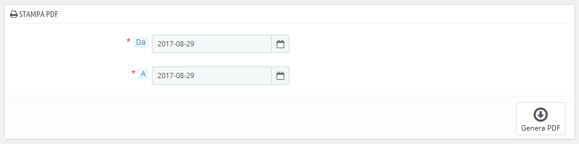
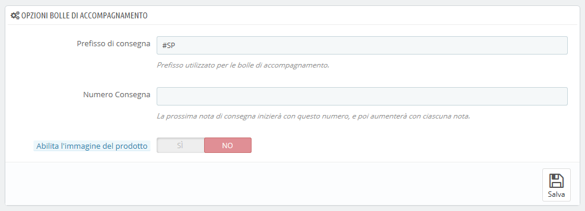

# Bolle di Accompagnamento

Una bolla di accompagnamento è una notifica dell’avvenuta consegna. Occorre inserirla nella spedizione contenente i prodotti ordinati. Riporta il logo del tuo negozio e indica il contenuto. Al ricevimento della spedizione, il cliente sarà in grado di utilizzare il bollettino di consegna per controllare due volte il contenuto del pacchetto, verificare che non manchi nulla dell'ordine.

Realizzare una bolla di accompagnamento è esattamente come realizzare una fattura. Seleziona le date e le opzioni desiderate e conferma per creare i tuoi documenti.

È possibile ottenere un file PDF di più bolle di accompagnamento a seconda della data, funzione molto utile quando è necessario stampare tutte le bolle di accompagnamento di un determinato giorno o di un dato trimestre. Seleziona la data di inizio e di fine e clicca sul pulsante "Genera PDF".

## Opzioni Bolle di Accompagnamento 

Ci sono tre opzioni, le stesse opzioni che riguardano le fatture: 

* **Prefisso di consegna**. Potrebbe essere utile impostare un tag per la lingua della bolla di accompagnamento: “CO” per l’italiano \(“consegna”\), "DE" per l’inglese \(“delivery”\), "LI" per il francese \(“livraison”\), "EN" per lo spagnolo \("entrenga"\), ecc. Oppure puoi scegliere se impostare codici di lingua come: “IT”, "EN", "FR", "SP", ecc. Naturalmente puoi scegliere anche di non impostare alcun prefisso.
* **Numero di consegna**. Se la tua azienda ha già generato bolle di accompagnamento prima di iniziare a utilizzare PrestaShop, puoi utilizzare questa opzione per cominciare la numerazione con numero sequenziale maggiore.
* **Abilita l’immagine del prodotto**. Quando abilitata, visualizza l'immagine di un prodotto davanti al nome del prodotto.

PrestaShop genererà quindi il numero delle bolle di accompagnamento secondo le tue impostazioni: "\#IT000001", "\#DE000002", ecc.

Non dimenticare di salvare le tue modifiche.

