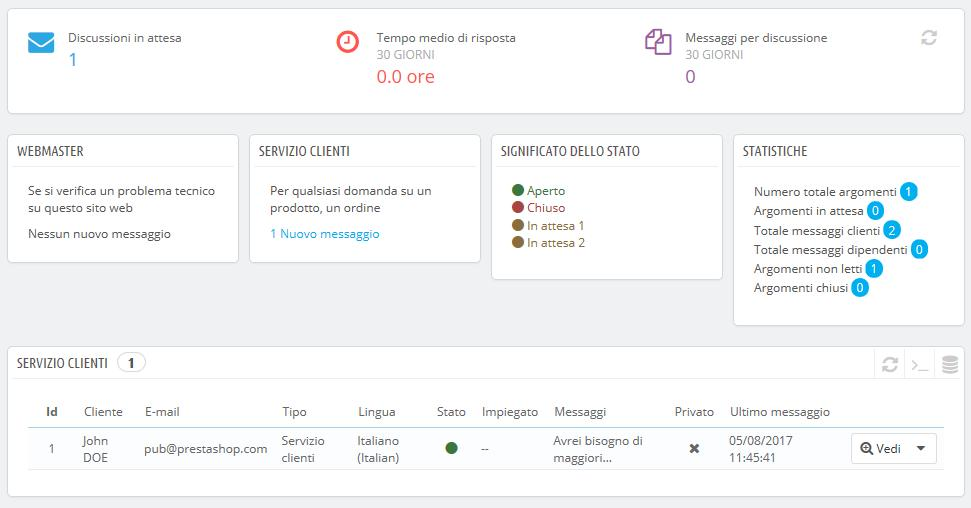
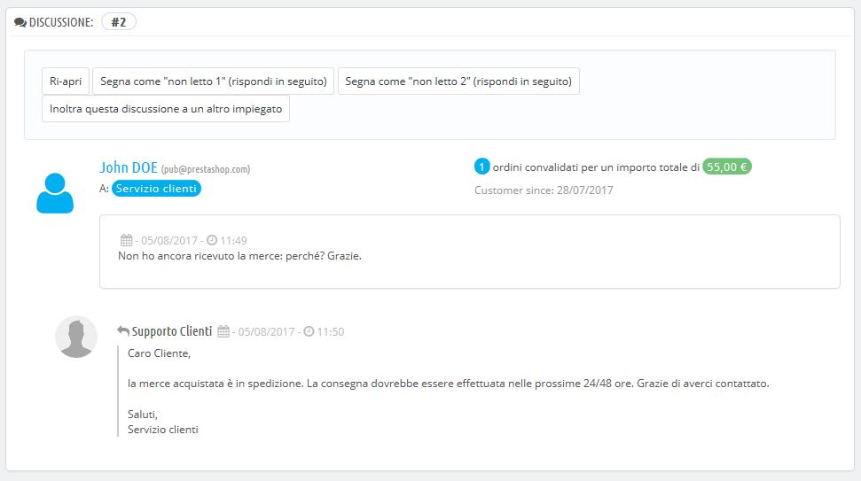
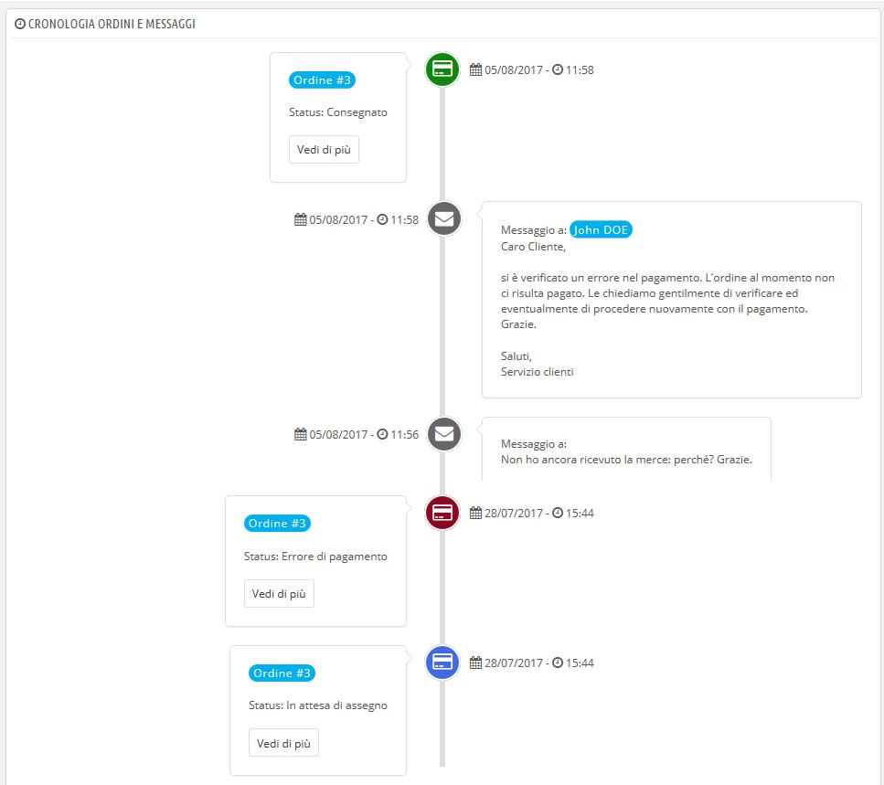
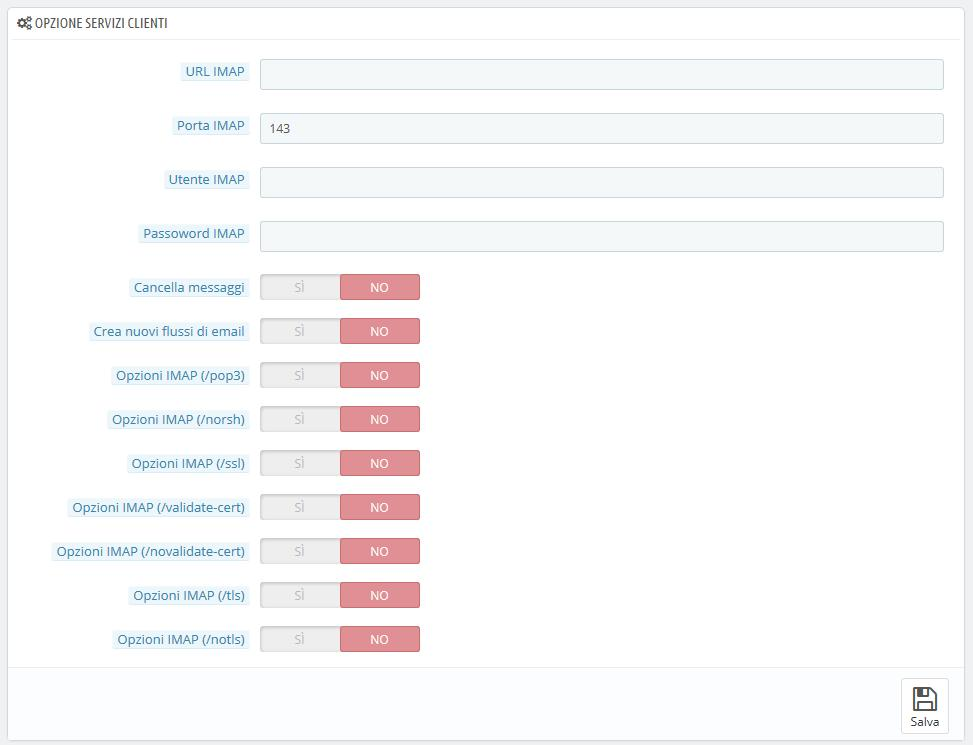

# Servizio Clienti

PrestaShop consente di gestire tutte le richieste dei clienti all'interno della sua area. Ciò consente di tenere traccia dei nuovi flussi di email a cui occorre rispondere, senza dover controllare tutti i destinatari di posta per vedere se qualcuno ha risposto.

In pratica, per impostazione predefinita, il modulo contatti del tuo negozio, al link "Contattaci" nel piè di pagina, presenta al cliente due opzioni di contatto predefinite: "Servizio clienti" e "Webmaster". Il cliente deve scegliere chi deve contattare e quindi compilare i campi. Il messaggio viene registrato all’interno dello strumento di assistenza clienti di PrestaShop.

I nuovi flussi di email di conversazione sono presenti nello strumento di assistenza clienti esclusivamente se è stata abilitata l’opzione "Salva messaggi?". È possibile modificare questa impostazione o aggiungere altri contatti, passando alla pagina "Contatti", nel menu "Parametri negozio". L'opzione è disponibile quando si modificano i contatti esistenti.

Se l'opzione è disattivata per il contatto che il cliente sceglie, il messaggio viene semplicemente inviato all'indirizzo email del contatto e non viene memorizzato in PrestaShop.

È inoltre necessario configurare correttamente le impostazioni IMAP in modo che PrestaShop possa recuperare le risposte del cliente alle e-mail inviate attraverso lo strumento di assistenza clienti. Ciò avviene nella sezione "Opzioni servizio clienti" nella parte inferiore dello schermo.

In questa pagina, ogni contatto ha una propria casella in cui è possibile controllare rapidamente se ci sono nuovi messaggi \(non ancora letti\). Per impostazione predefinita sono presenti due caselle e, aggiungendo più contatti, le caselle “Significato dello stato" e "Statistiche" vengono spostate ulteriormente verso sinistra e verso il basso.

Queste due ultime caselle sono utili quando è necessario gestire giornalmente nuovi messaggi:

* **Significato dello stato**. Un semplice promemoria dei colori dei codici che il tuo team ha applicato ai nuovi flussi di email di conversazione.
* **Statistiche**. Una panoramica dell'attività globale del servizio clienti dall'inizio.

Di seguito troverai l'elenco dei messaggi ricevuti, vecchi e nuovi.

È possibile modificare alcune opzioni nella parte inferiore della pagina; la modifica si applica a tutti i contatti:

* **Consenti caricamento file**. Il cliente può allegare file al messaggio. Può essere utile in caso di problemi visivi sul front-end, in quanto il cliente può inviare da qui le eventuali schermate acquisite.
* **Messaggi predefiniti**. Il modello predefinito per la risposta che forniranno i tuoi dipendenti. È bene che sia semplice, in modo che possa adattarsi alle diverse situazioni, anche se necessiterà comunque di piccole modifiche per adattarlo a ogni specifico caso.

Puoi contattare i tuoi clienti anche attraverso la pagina di ciascun ordine, in cui puoi inviare messaggi predefiniti. Questi messaggi vengono gestiti nella pagina "Messaggi Ordini", anche sotto il menu "Servizio clienti".

Infine, nella parte inferiore della pagina è presente la sezione "Opzioni servizio clienti", in cui è possibile impostare molte opzioni relative al server IMAP.

## Gestire i Messaggi del Servizio Clienti 

Ogni conversazione con qualsiasi cliente può essere gestita interamente attraverso l’interfaccia di PrestaShop, senza dover usare un client email come Outlook o Thunderbird.

Nell’elenco delle conversazioni, clicca su una riga per visualizzare i dettagli:

* È possibile applicare una serie di azioni a una conversazione, in modo da ordinarle rapidamente e quindi gestirle al meglio. Sono disponibili 4 azioni:
  * **Segna come "gestito"** o **"Ri-apri"**. Cambia lo stato della conversazione da “Chiuso” a “Aperto”.
  * **Segna come "in sospeso 1"** e **Segna come "in sospeso 2"**. Questi due stati sono interni: il significato è opzionabile dal tuo team. Puoi anche scegliere di non usarli e far riferimento esclusivamente a Chiuso” e “Aperto”.
  * **Inoltra questa conversazione a un altro impiegato**. Dal momento in cui un dipendente ha iniziato a rispondere al messaggio di un cliente, prende in carico la richiesta del cliente. Se durante la lavorazione della pratica risulta che è di competenza di un altro dipendente, è possibile utilizzare questo pulsante per attribuire la pratica a un altro dipendente, tramite un elenco a discesa. L'altro dipendente riceverà una notifica. Se la persona a cui si desidera inoltrare la conversazione non è disponibile nell'elenco, seleziona "qualcun altro" nell'elenco a discesa e visualizzerai due opzioni che consentono di inserire l'indirizzo email del destinatario e un commento sul tuo messaggio.
* **Rispondi al successivo messaggio senza risposta in un nuovo flusso di email.** Ti conduce al successivo messaggio senza risposta in modo che tu possa rispondere direttamente. 

Sono disponibili dettagli essenziali: 

* Nome e email del cliente, in cui puoi cliccare per accedere alle informazioni \(se il cliente è registrato\).
* Numero di ordini, spesa totale, data di registrazione del cliente \(se il cliente è registrato\).
* Ora e data del messaggio.
* Infine il messaggio stesso.

Per rispondere a questo nuovo flusso di email, basta semplicemente usare il modulo con il messaggio predefinito \(come hai impostato nella sezione “Opzioni di Contatto” della pagina “Servizio Clienti”\), quindi cliccare su “Invia”.

Al fondo della pagina, “Ordini e messaggi timeline" ti fornisce una chiara cronologia degli eventi pertinenti la conversazione contenuta in quel flusso di email. Se è collegato a un ordine, saranno presenti anche i dettagli dell'ordine.

## Opzioni Servizio Clienti 

In questa sezione è possibile configurare in modo preciso l'accesso di PrestaShop al proprio server di posta elettronica tramite l'interfaccia IMAP. È necessario assicurarsi che tutti i campi vengano riempiti, affinché lo strumento di assistenza clienti funzioni correttamente. La maggior parte di queste informazioni dovrebbe essere fornita dal tuo web hosting.

* **IMAP URL**, **porta IMAP**, **utente** **IMAP** e **password IMAP**. Dettagli essenziali per accedere al server email usando il protocollo IMAP.
* **Cancella messaggi.** Se abilitato i messaggi del server verranno cancellati non appena PrestaShop li recupera. Usalo con cauzione: rende i tuoi messaggi non disponibili ad altri client di posta elettronica.
* **Crea nuovi flussi di email**. Crea nuovi flussi di email per email sconosciute.
* **/pop3**. Se abilitato, usa POP3 anziché IMAP.
* **/norsh**. Se abilitato, la connessione al tuo server email non si pre-autenticherà. Non consigliato.
* **/ssl**. Se abilitato, la connessione al tuo server email non verrà crittografata. Non consigliato.
* **/validate-cert**. Se abilitato, PrestaShop forzerà la validazione del certificato server TLS/SSL.
* **/novalidate-cert**. Se abilitato, PrestaShop non proverà a validare il certificato server TLS/SSL. Essenziale per server con certificati auto-firmati.
* **/tls**. Se abilitato, PrestaShop forzerà l'uso di StartTLS per crittografare la connessione. I server che non supportano StartTLS saranno rifiutati.
* **/notls**. Se abilitato, PrestaShop non utilizzerà StartTLS per crittografare la sessione, anche con i server che lo supportano.

