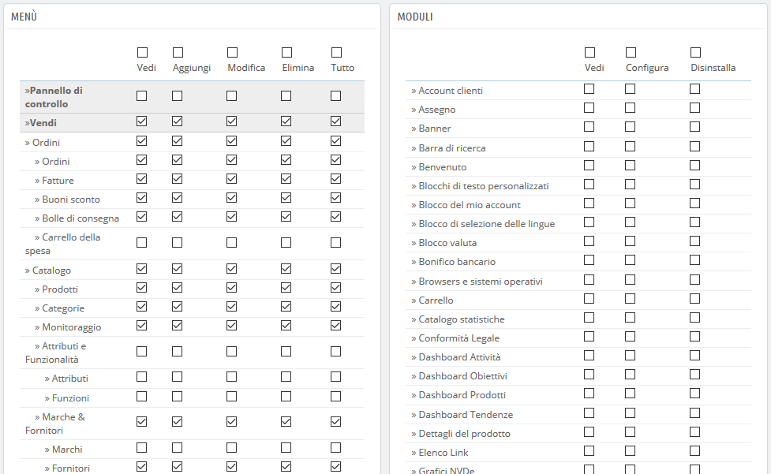

# Autorizzazioni

Le autorizzazioni sono la parte centrale dei profili di PrestaShop. Consentono di vedere in modo preciso cosa un account di un dipendente può o non può fare sul tuo negozio.

La pagina di amministrazione "Autorizzazioni" viene costruita utilizzando le schede:

* Sulla sinistra dello schermo, tante schede quanti sono i profili disponibili.
* Sullo restante parte a destra dello schermo, PrestaShop visualizza le autorizzazioni del profilo selezionato. Questa scheda contiene due tabelle una a fianco all’altra.

Quando clicchi su un profilo \(ad eccezione del SuperAdmin\), le due tabelle appaiono e consentono di accedere ai loro criteri:

* Sulla sinistra, le autorizzazioni correlate al menu: puoi decidere cosa può fare il profilo. È possibile impedire a un profilo di modificare il contenuto di una pagina oppure nascondere completamente il menu.
* A destra, le autorizzazioni relative al modulo: mentre è possibile consentire ad alcuni profili di visualizzare i moduli disponibili, è preferibile che solo i dipendenti più affidabili possano configurare alcuni moduli chiave.

Per ciascuno dei criteri del menu, hai 5 opzioni:

* **Vedi**. Il dipendente può visualizzare le informazioni.
* **Aggiungi**. Il dipendente può aggiungere nuove informazioni.
* **Modifica**. Il dipendente può cambiare le informazioni.
* **Elimina**. Il dipendente può eliminare le informazioni.
* **Tutto**. Attiva tutte le opzioni di cui sopra per la riga corrente.

Inoltre, i criteri del modulo dispongono di 3 opzioni:

* **Vedi**. L'impiegato può visualizzare la configurazione del modulo.
* **Configura**. L'impiegato può configurare il modulo.
* **Disinstalla**. L'impiegato può disinstallare il modulo.

Le autorizzazioni SuperAdmin non possono essere modificate: il profilo ha semplicemente tutti i diritti per ogni criterio.

## Impostare autorizzazioni per un nuovo profilo 

Per questo esempio creeremo un nuovo profilo, "Preparatore ordine ". Per prima cosa crea l’account nella pagina "Profili", compilando il campo "Nome". Appena salvato, apparirà nell'elenco dei profili.

Quindi è necessario assegnare autorizzazioni a questo nuovo profilo. Vai alla pagina "Autorizzazioni" e clicca sulla scheda del nuovo profilo: appare l'elenco dei criteri. Per impostazione predefinita, un nuovo profilo non ha accesso a nessuna pagina del back office.

Ci sono due modi per riempire i criteri, a seconda dei limiti o della libertà che desideri che il profilo abbia:

* Clicca sulle caselle di autorizzazione una per volta finché non ha abbastanza diritti di accesso per svolgere il lavoro di sua competenza.
* Verifica tutte le caselle di autorizzazione, quindi rimuovi le autorizzazioni una per una finché non si dispone solo di quelle necessarie.

Hai di due modi per controllare le caselle in gruppo:

* Per colonna: nella parte superiore di ogni colonna, una casella consente di verificare contemporaneamente tutte le caselle della colonna. Deselezionandola, verranno deselezionate tutte le caselle al momento selezionate.
* Per riga: se si clicca sulla casella "Tutto" per una determinata riga, verranno verificate tutte le caselle di quella riga. Deselezionandola, verranno deselezionate tutte le caselle al momento selezionate.

Puoi quindi usare questo metodo piuttosto che trascorrere il tempo controllando ogni riga, una per una.

Per evitare errori durante la configurazione delle autorizzazioni, PrestaShop salva automaticamente le impostazioni ogni volta che apporta una modifica. Ciò significa che non è necessario cliccare su "Salva". Dopo aver assegnato i vari diritti al profilo, puoi tornare nella pagina di amministrazione "Dipendenti" e continuare ad assegnare nuovi diritti ai profili dei dipendenti in base alle necessità.

