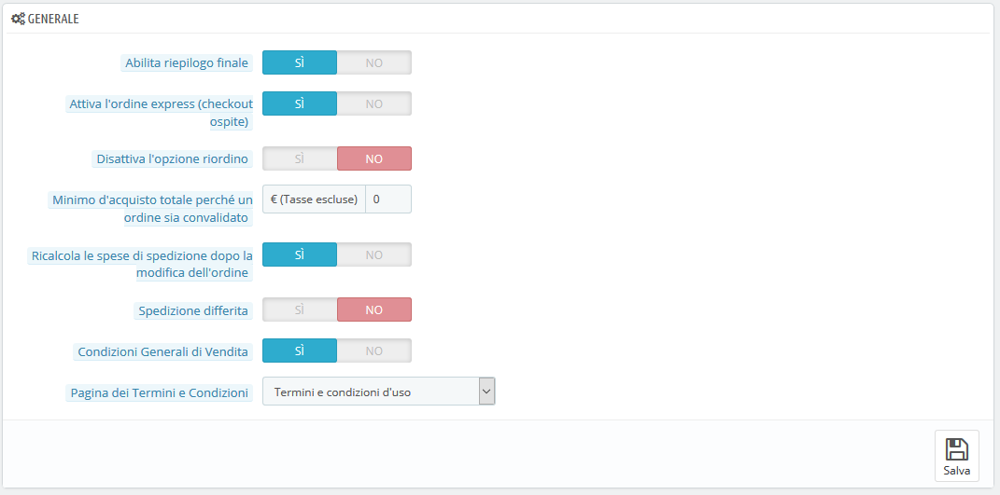
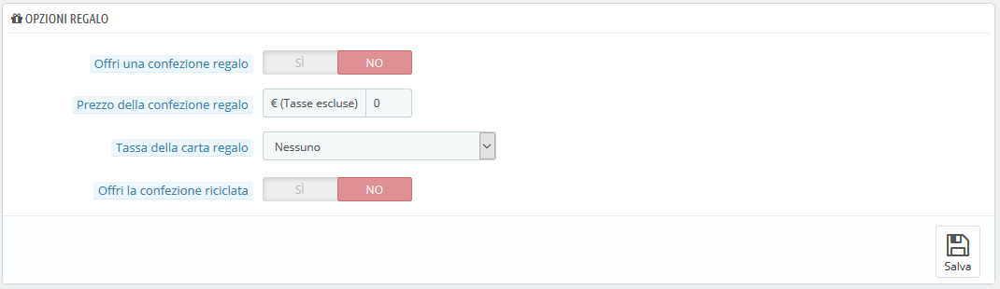

# Preferenze Ordine

Le impostazioni della pagina delle preferenze "Ordini" si applicano agli ordini che i clienti effettuano, ma anche ad alcuni altri dettagli, come le opzioni regalo.

## Preferenze Generali 

* **Abilita riepilogo finale**. Come richiesto in alcuni Paesi europei, potrebbe essere necessario visualizzare un riepilogo dell’ordine \(carrello, indirizzo, metodo di consegna ...\) appena prima del pulsante di conferma dell'ordine.
* **Attiva l’ordine express \(checkout ordine\)**. Consente ai visitatori non registrati di effettuare un ordine senza dover creare un account.
* **Disattiva l’opzione riordino**. Se impostato su "Sì", i clienti non saranno in grado di riordinare qualcosa in un solo clic passando dalla loro cronologia degli ordini \(è un requisito di alcuni Paesi europei: se è necessario disattivare questa opzione - inserisci "Sì"\).
* **Minimo d’acquisto totale perché un ordine sia convalidato**. Indica l'importo minimo nel carrello per inviare un ordine. Se l'importo in questo campo non viene raggiunto, il tuo cliente non può completare l'acquisto. Se non si desidera impostare un importo minimo, immettere "0" nel campo.
* **Ricalcola le spese di spedizione dopo la modifica dell’ordine**. _Novità in 1._7. Ricalcolerà automaticamente i costi di spedizione quando viene modificato un ordine \(aggiunto un prodotto, modificato l'indirizzo di consegna, ecc.\). Consente inoltre di cambiare un corriere per un ordine non ancora confermato e quindi aggiornare i costi di spedizione.
* **Spedizione differita**. Se abiliti l'opzione "Consenti l'ordine dei prodotti non in magazzino" \(nella pagina "Impostazione prodotti"\), l’ordine verrà erogato non appena gli articoli saranno disponibili, a seconda del numero di spedizioni necessarie. Inizialmente, PrestaShop dividerà l'ordine in due: gli articoli disponibili vengono inviati subito, mentre gli altri oggetti diventano un secondo ordine, in attesa di essere convalidati.
* **Condizioni generali di vendita**. Fa accettare ai clienti i tuoi termini di servizio prima di convalidare un ordine.
* **Pagina dei termini e condizioni**. I termini e le condizioni d'uso del tuo negozio devono essere memorizzati in una pagina statica \(vedi "Design&gt; Pagine"\). Seleziona la pagina da utilizzare in modo che PrestaShop possa indicarla correttamente.

## Opzioni Regalo 

* **Offri una confezione regalo**. PrestaShop suggerisce la confezione regalo al cliente e la possibilità di aggiungere un messaggio stampato. È sempre piacevole per chi desidera inviare regali attraverso il tuo negozio.
* **Prezzo della confezione regalo**. Imposta il prezzo del servizio di confezionamento regalo.
* **Tassa della carta regalo**. Se necessario, indica a quale imposta locale la confezione regalo è sottoposta. Puoi aggiungere altre tasse nella pagina "Imposte", nel menu "Internazionale".
* **Offri la confezione riciclata**. Se sei in grado di offrire questo servizio, molti clienti lo apprezzeranno.

