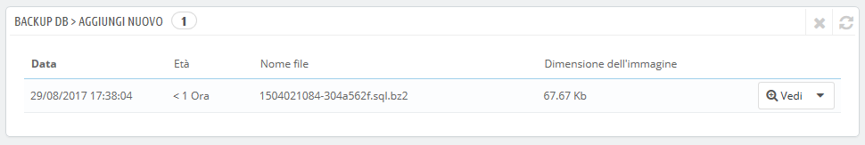
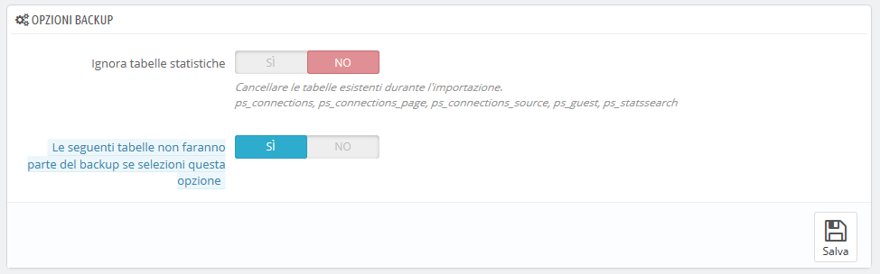

# Backup del Database

Il backup permette di salvare il contenuto del database in file archiviati in un luogo sicuro. Puoi ripristinare quindi i file nel caso il tuo database non riuscisse.

È’ necessario eseguire regolarmente il backup del negozio, in modo che in caso di crash, si possa ripristinare rapidamente il negozio in condizioni ottimali. Il database contiene la maggior parte delle informazioni del tuo negozio, molte delle quali sono indispensabili per PrestaShop per funzionare correttamente - inclusi i prodotti, le categorie e altri dati che hai aggiunto dall'installazione, ma non le immagini per esempio (che sono memorizzate, insieme ai file di tema, sul tuo server).

Più spesso effettuerai backup, più potrai stare tranquillo. Almeno una volta a settimana è la frequenza minima consigliata.

Per creare backup del database del tuo negozio, hai diverse soluzioni. È possibile utilizzare strumenti come phpMyAdmin (riservati agli utenti avanzati) o utilizzare quello integrato in PrestaShop: pagina "backup DB".

La pagina inizia con due grandi notifiche. Devi leggerle completamente entrambe per avere un'idea migliore di quello che consente di fare la pagina:

* La sezione "Disclaimer" fornisce una serie di promemoria sui backup, che si dovrebbe leggere ogni volta che si effettua un backup. La sezione termina con il pulsante "Ho letto il disclaimer. Crea un nuovo backup", quindi occorre cliccare per creare il backup. Una volta creato, il backup viene visualizzato in una nuova sezione "Download" nella parte superiore della pagina (cliccare sul pulsante per scaricare il file di backup sul computer) e nell'elenco sotto alle notifiche.
* La sezione "Come ripristinare" fornisce suggerimenti su come recuperare i dati in PrestaShop in caso di guasto. Dovresti memorizzare questa procedura, o almeno salvare queste informazioni da qualche parte nel caso in cui un crash del database renda impossibile l'accesso all'amministrazione PrestaShop e quindi alla pagina di backup DB. Nel caso, la troverai anche sotto.\
  \

Come ripristinare il backup del database in 10 semplici passi:

1. Imposta "Abilita negozio" su "No" in "Manutenzione" sotto il menu "Preferenze".
2. Scarica il backup dall'elenco sottostante o dal server FTP (nella cartella "admin / backup").
3. Controlla l'integrità del backup: cerca errori, file incompleti, ecc. Assicurati di verificare tutti i tuoi dati.
4. Chiedi al provider hosting di accedere al database "phpMyAdmin".
5. Connettiti a "phpMyAdmin" e seleziona il database corrente.
6. A meno che non abilitati l'opzione "Svuota le tabelle esistenti", è necessario eliminare tutte le tabelle dal database corrente.
7. Nella parte superiore dello schermo, seleziona la scheda "Importa"
8. Clicca sul pulsante "Sfoglia" e seleziona il file di backup dal disco rigido.
9. Controllare il numero massimo di file consentito (ad esempio Max: 16 MB)
10. Clicca sul pulsante "Vai" e attendi con pazienza che si concluda il processo di importazione. Potrebbe richiedere diversi minuti.&#x20;

La tabella riportata di seguito elenca tutti i backup già eseguiti, indica la data di creazione, l'età, il nome del file e la dimensione dell’immagine.

A destra di ogni riga ci sono le azioni disponibili:

* **Visualizza**. Fornisce la possibilità di scaricare questo backup.
* **Cancella**. Fornisce la possibilità di eliminare questo backup. Fai attenzione, non c’è modo di tornare indietro.&#x20;

Dopo ogni processo di backup, dovresti scaricare il file di backup generato cliccando sull'icona "Visualizza" o semplicemente utilizzando il collegamento nella casella di notifica in alto. Metti il tuo file di backup in un luogo sicuro, perché potresti averne bisogno in qualsiasi momento. Inoltre, è possibile trovare questi backup direttamente sul server, nella cartella / `backup`, sotto la cartella personalizzata / `amministratore`.

Il tuo database viene salvato usando il formato standard SQL e la sua `.sql` estensione file, compresso usando l’algoritmo BZip2 (semplicemente una variante del più noto formato Zip. Scopri di più: [https://it.wikipedia.org/wiki/Bzip2](https://it.wikipedia.org/wiki/Bzip2)) e la sua `.bz2` estensione file. Il file  verrà archiviato con l’estensione `.sql.bz2`.

## Opzioni backup 

Al fondo dello schermo, sono disponibili due opzioni:&#x20;

* **Ignora le tabelle delle statistiche**. PrestaShop memorizza le statistiche del tuo sito nel database in tabelle che possono aumentare molto rapidamente. Può essere utile custodire le statistiche in un luogo sicuro, ma si tratta di file enormi da scaricare, probabilmente si è più interessati al backup dei prodotti, delle categorie, dei clienti, degli ordini, ecc. Per impostazione predefinita, PrestaShop consente di eseguire il backup di tutte le tabelle, ma se si dispone di poco spazio su disco del server web, è possibile modificare questa opzione su "Sì".
* **Eliminare le tabelle esistenti durante l'importazione**. Durante l'importazione di un file di backup, il sistema può sovrascrivere le tabelle esistenti con il contenuto di quelle di cui si è fatto il backup o eliminare tutte le esistenti per sostituirle con il contenuto del backup. Il primo caso può dare luogo a duplicati, per cui questa opzione è abilitata per impostazione predefinita.\
  \

