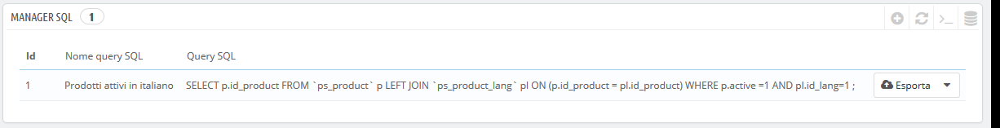
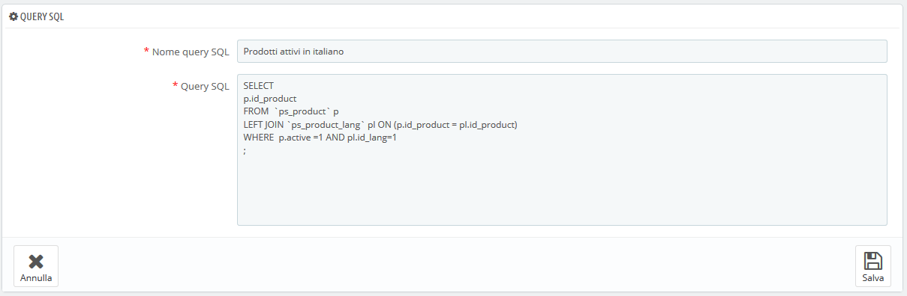
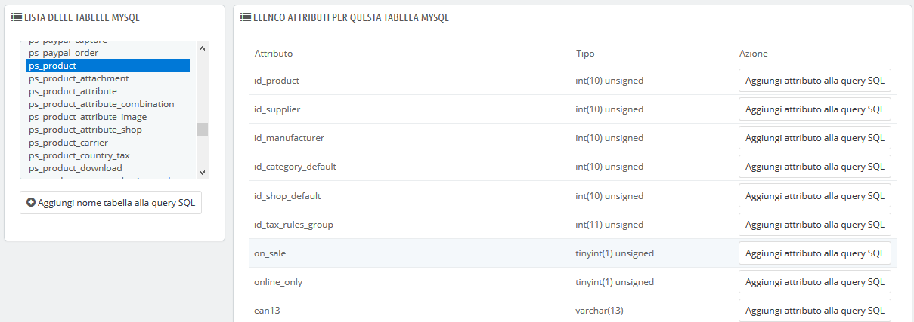
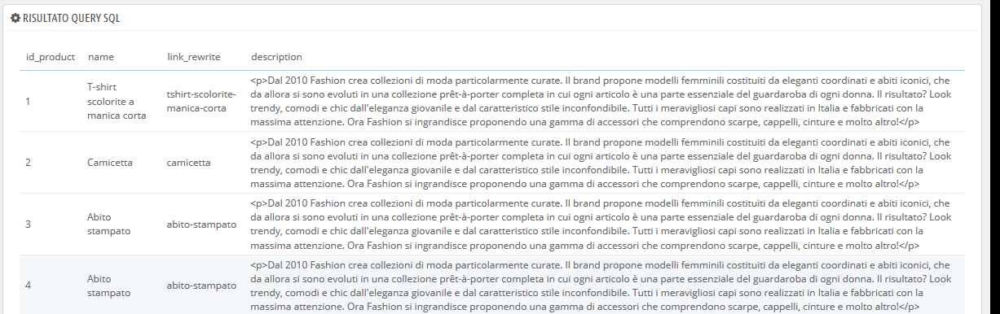
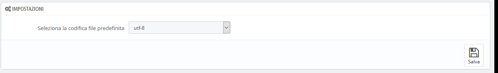

# SQL Manager/ Gestore SQL

L’SQL Manager è una funzionalità complessa, riservata a persone tecniche che sanno esplorare un database utilizzando il linguaggio SQL. È molto complesso, ma altrettanto potente e si rivela immensamente utile per coloro che lo padroneggiano.

Questo strumento consente di eseguire una query SQL direttamente sul database PrestaShop e salvarla per l'utilizzo in qualsiasi momento successivo. Infatti, PrestaShop presenta i suoi dati in molti modi, ma potrebbe essere necessario qualcosa di più, o più semplicemente, qualcosa di più grezzo rispetto all'interfaccia pulita di PrestaShop. Utilizzando il gestore SQL è possibile eseguire query complesse che si basano su tabelle di dati nel modo in cui ti è utile.

Ad esempio, utilizzando questo strumento e la tua conoscenza SQL, è possibile creare una query riutilizzabile che consente di visualizzare un elenco aggiornato dei clienti iscritti alla newsletter oppure ottenere un elenco di prodotti in formato HTML o CSV.

Per motivi di sicurezza non sono consentiti alcuni tipi di query: UPDATE, DELETE, CREATE TABLE, DROP, ecc. In breve, è possibile leggere solo i dati \(query SELECT\).

Inoltre, chiavi o password protette sono nascoste \(\*\*\*\*\*\*\*\*\*\*\*\).

## Creare una nuova query 

Come al solito, il pulsante "Aggiungi nuova query SQL" porta al form di creazione. Ha due campi principali:

* **Nome query SQL**. Rendi il nome lungo e descrittivo quanto necessario.
* **Query SQL**. La query SQL stessa. Sei libero di eseguire JOIN o altre selezioni intricate.

Inoltre, la sezione "Elenco delle tabelle MySQL" ti aiuta a esplorare il database e rendere più semplice la creazione di query. Ti fornisce un selettore pratico e cliccabile di tutte le tabelle del database attualmente disponibili. Seleziona una tabella per far sì che PrestaShop mostri gli attributi e le tipologie, quindi clicca su "Aggiungi attributi alla query SQL" per inviare il nome nel campo "Richiesta".

Salva il modulo e giungi alla pagina principale, con l’elenco delle query.

**Avviare una query**

Ogni query salvata nella tabella dispone di quattro icone a destra della sua riga:

* **Esporta**. Esegue la query e la scarica in formato CSV.
* **Vista**. Esegue la query e la mostra in una tabella HTML, proprio nell'interfaccia di PrestaShop.
* **Modifica**. Puoi modificare una query quanto volte è necessario, per perfezionarla e ottenere risultati migliori.
* **Elimina**. Una volta che una query non viene più utilizzata \(o semplicemente non funziona\), puoi eliminarla cliccando su quel pulsante e confermando la scelta.

## Impostazioni 

Questa volta c’è solo un’impostazione:

* **Seleziona la codifica file predefinita**. È possibile configurare la codifica dei caratteri del file CSV scaricato. L'impostazione predefinita, UTF-8, è quella consigliata, ma è possibile selezionare ISO-8859-1 se necessario.

## Qualche query di esempio 

Le possibilità sono infinite, ma ecco qualche query di esempio per aiutarti a costruire la tua.

**Elencare gli indirizzi email di tutti i clienti**

| `SELECT email FROM ps_customer` |
| :--- |

### Elencare tutti gli indirizzi email di tutti i clienti iscritti alla tua newsletter 

| `SELECT emailFROM ps_customerWHERE newsletter = 1` |
| :--- |

### Elencare tutti i prodotti attivi e ottenere la descrizione in italiano \(id\_lang = 1\) 

| `SELECT p.id_product,` [`pl.name`](http://pl.name/)`, pl.link_rewrite, pl.descriptionFROM ps_product pLEFT JOIN ps_product_lang pl ON (p.id_product = pl.id_product)WHERE p.active = 1AND pl.id_lang = 1` |
| :--- |

### Inserire tutti gli ordini, con dettagli relativi al corriere, valuta, pagamento, totale e data 

| ``SELECT o.`id_order` AS `id`,    CONCAT(LEFT(c.`firstname`, 1), '. ', c.`lastname`) AS `Customer`,    ca.`name` AS `Carrier`,    cu.`name` AS `Currency`,    o.`payment`, CONCAT(o.`total_paid_real`, ' ', cu.`sign`) AS `Total`,    o.`date_add` AS `Date`FROM `ps_orders` oLEFT JOIN `ps_customer` c ON (o.`id_customer` = c.`id_customer`)LEFT JOIN `ps_carrier` ca ON (o.id_carrier = ca.id_carrier)LEFT JOIN `ps_currency` cu ON (o.`id_currency` = cu.`id_currency`)``  |
| :--- |

