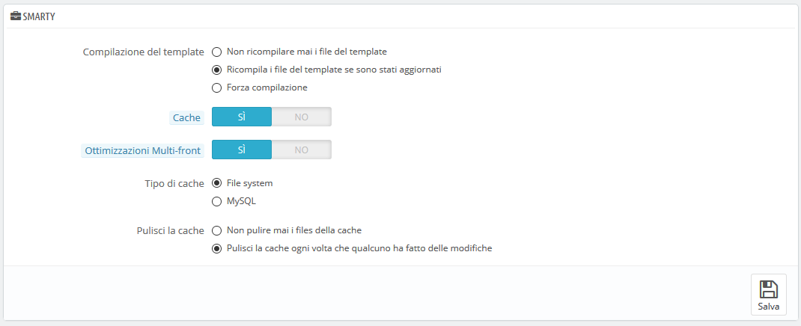
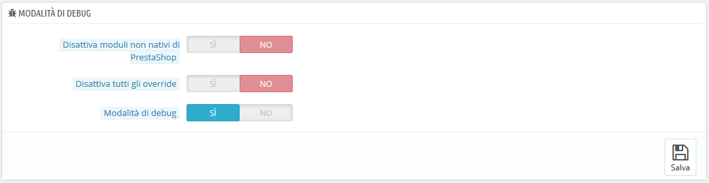
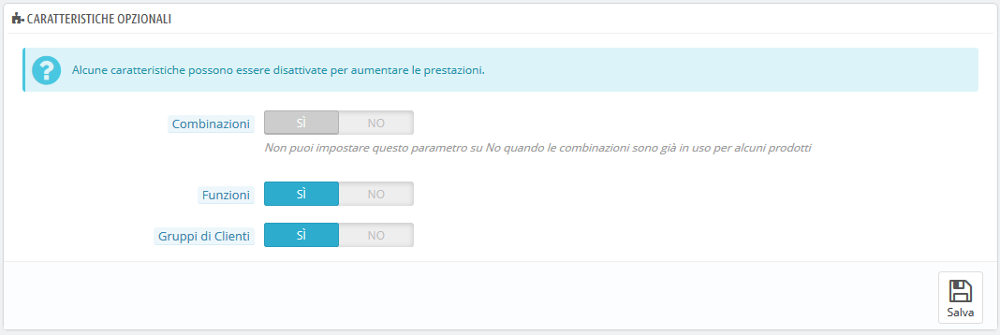
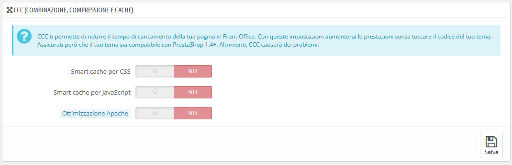
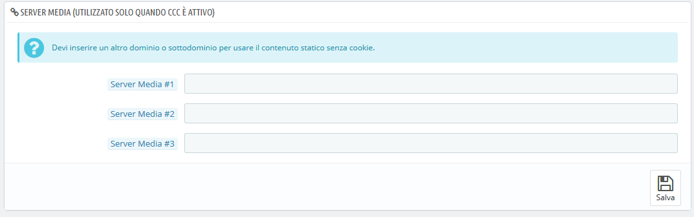
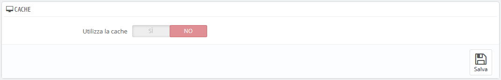

# Performance/ Prestazioni

Questa pagina presenta molti strumenti e suggerimenti che potrebbero aiutarti a migliorare le prestazioni del tuo negozio, non si parla di vendite, anche se un server che lavora bene è in grado di servire più clienti e quindi generare più vendite.

## Smarty <a href="performance-prestazioni-smarty" id="performance-prestazioni-smarty"></a>

Smarty è il nome del linguaggio del template utilizzato dai temi di PrestaShop. Puoi scoprire di più qui: [http://www.smarty.net/](http://www.smarty.net).



Ci sono diverse opzioni:

* **Template Cache**. Per una migliore prestazione front end, PrestaShop memorizza le pagine HTML.
  * **Non ricompilare mai i file del template**. Il comportamento normale: le pagine HTML vengono compilate e memorizzate nella cache, quindi visualizzate come sono, anche se nel frattempo è cambiato il tema.
  * **Ricompila i modelli se i file sono stati aggiornati**. PrestaShop è in grado di vedere quando un file di tema è cambiato.
  * **Forza la compilazione**. Consenti solo se stai apportando modifiche al tema e devi visualizzare le modifiche ogni volta che ricarichi la tua pagina.
* **Cache**. Questa opzione consente di disattivare tutti file della cache e non solo quelli relativi ai file del template. Disattivalo solo se stai eseguendo un debug di un tema o di un modulo di PrestaShop. Altrimenti, dovresti lasciarlo abilitato.\
  Il pulsante "Cancella cache" nella parte superiore della pagina consente di eliminare la cache in un solo clic, invece di dover eliminare i file sul server FTP.
* **Ottimizzazione Multi-front**. Quando hai più server, questa opzione ti aiuta con la sincronizzazione della cache.
* **Tipo di cache**. Per impostazione predefinita, Smarty utilizza un meccanismo di cache basato su file. È possibile scegliere di utilizzare MySQL come risorsa di archiviazione per la cache di output di Smarty.
* **Pulisci la cache**. A seconda di quanto spesso il tuo negozio cambia, potresti non cancellare mai i file di cache, né cancellarli ogni volta che il tuo negozio viene modificato (a livello di prodotti o di design).

**Modalità di debug**

Quando si è in modalità di debug, è possibile scegliere di diminuire l'impatto di alcune funzioni su PrestaShop, al fine di individuare meglio dove viene generato un errore:



* **Disabilita i moduli non nativi PrestaShop.** Il modulo di PrestaShop viene testato molto, quindi non dovrebbe presentare alcun problema. Se abiliti questa impostazione, potrai capire se il problema viene dal codice di PrestaShop (core o modulo) o da un modulo di terze parti.
* **Disattiva tutti gli override.** Molte funzioni di PrestaShop possono essere sovrascritte. Se abiliti queste impostazioni, tutti i codici di overriding saranno disabilitati e potrai capire se il problema viene dal codice di PrestaShop o da un override di terze parti.
* **Modalità di debug.** Attivando questa opzione saranno visibili i messaggi di errore tecnico. È utile quando vieni aiutato da qualcuno che non ha accesso al tuo negozio ma che ha bisogno di sapere cosa sta succedendo tecnicamente.

## Caratteristiche opzionali <a href="performance-prestazioni-caratteristicheopzionali" id="performance-prestazioni-caratteristicheopzionali"></a>

Alcune funzioni di PrestaShop possono essere disattivate se non si utilizzano, in quanto possono rallentare il negozio.

Se il tuo catalogo ha prodotti che utilizzano queste funzionalità, però, non sarai in grado di disattivarle. Devi eliminare alcuni dati prima di poterli disattivare.

È possibile disattivare le seguenti funzioni:



* **Combinazioni**. Le combinazioni di prodotti consentono di disporre di un'intera linea di prodotti di un unico prodotto: dimensioni, colori, capacità, ecc.
* **Funzioni**. Le caratteristiche del prodotto consentono di indicare le informazioni specifiche del prodotto: peso, materiale, paese di origine, ecc.
* **Gruppi di clienti**. I gruppi clienti consentono di raggruppare i clienti in modo da conferir loro alcuni privilegi e restrizioni: sconti, restrizioni di moduli, ecc.

## Combinazione, Compressione e Cache (CCC) <a href="performance-prestazioni-combinazione-compressioneecache-ccc" id="performance-prestazioni-combinazione-compressioneecache-ccc"></a>

CCC è un insieme di strumenti per ridurre al minimo il carico del server e il tempo di caricamento dei temi.

Fa quello che dice: unisce file testuali dello stesso tipo in un file più grande, ottenendo meno file scaricabili; quindi comprimerà il file utilizzando l'algoritmo Zip che rende più rapidi i download; infine, elabora il file compresso in modo che il server non debba eseguire questo processo ogni volta che viene caricata una pagina, ciò riduce il carico sul processore del server.\




* **Smart cache per CSS**. I file CSS sono basati su testo e possono essere combinati e compressi in modo sicuro.
* **Smart cache per JavaScript**. Anche i file JavaScript sono basati su testo, ma la loro combinazione a volte può risultare problematica. Assicurati di testare tutto prima di lasciare abilitata l'impostazione.
* **Ottimizzazione Apache**. Questa impostazione modificherà il file di configurazione del server web per renderlo più efficiente per la CCC.

## Server Media <a href="performance-prestazioni-servermedia" id="performance-prestazioni-servermedia"></a>

Questa sezione consente di reindirizzare una parte del traffico (file immagine e video, ad esempio) su altri server di tuo controllo, attraverso altri domini o sotto-domini. Di solito i file vengono ospitati su un CDN (Content Delivery Network). Per impostazione predefinita, PrestaShop supporta un server multimediale.



Inserire il nome di dominio del negozio in questo campo non è il modo giusto per ottenere prestazioni fantastiche. Detto questo, è facile impostare un server multimediale e i vantaggi sono reali e quasi immediati. Ecco come:

1. Apri un account in un nuovo host, preferibilmente uno specializzato in contenuti distribuiti. I più popolari sono Akamai ([http://www.akamai.com/](http://www.akamai.com)), Amazon (con i suoi servizi AWS, tra cui CloudFront: [http://aws.amazon.com/](http://aws.amazon.com)) o CloudFlare (http: // [www.cloudflare.com/](http://www.cloudflare.com)). Dovresti anche chiedere al tuo host, forse ha un servizio CDN a cui puoi iscriverti.
2. Copia i file multimediali sul server dell'host. Ciò significa che il server CDN deve contenere una copia esatta delle seguenti cartelle dal server principale del negozio: `img`, `/themes` e `/modules`.\
   Ricorda: devi fare in modo che queste cartelle siano sempre sincronizzate: anche se si aggiungono nuovi prodotti o si modifica il tema, il server CDN deve contenere l'ultima versione di tutti questi file.
3. Una volta che il server CDN è nel posto giusto, aggiungi l'indirizzo Web (come indicato dal tuo host CDN) nel campo, "Media server # 1". Se tale host consente di aggiungere più indirizzi web, aggiungili.

Se preferisci che i tuoi file vengano ancora visivamente scaricati dal tuo nome di dominio piuttosto che da un nome di dominio sconosciuto, segui questo processo:

1. Crea un sottodominio per il nome di dominio del tuo negozio, ad esempio [http://cdn1.esempio.com](http://cdn1.esempio.com) (come fare dipende dal tuo host, informati).
2.  Inserirsci un file `.htaccess`  alla radice del sottodominio. Quel file dovrebbe contenere una singola riga:

    ```
    Redirect permanente / http://cdn-adress.com
    ```

    \
    Sostituisci [http://cdn-adress.com](http://cdn-adress.com) con quello del tuo server CDN. In questo modo, stai creando un reindirizzamento automatico dal tuo sottodominio al tuo server CDN.
3. Una volta che il sottodominio è in posizione, aggiungilo nel primo campo, "Media server # 1". Se tale host consente di utilizzare più indirizzi web, crea il maggior numero di sottodomini per il dominio principale del tuo negozio.

Anche se non si dispone di un server CDN, è possibile utilizzare la funzionalità server multimediale per consentire al browser del cliente di scaricare più file alla volta, rendendo più veloce il processo di caricamento della pagina:

1. Configura il server web per avere sottodomini virtuali, come [images1.esempio.com](http://images1.esempio.com), [images2.esempio.com](http://images2.esempio.com) e images3. [esempio.com](http://esempio.com), indicando la cartella principale di PrestaShop.
2. Nella pagina delle prestazioni del tuo back office, imposta ciascun campo "Media server" su questi sottodomini virtuali.

Una volta in atto, PrestaShop caricherà le tue immagini da uno di questi sottodomini. In effetti, le immagini provengono da una cartella (quella principale), ma il browser aprirà più thread di connessione al server web di quanto non avrebbe fatto per impostazione predefinita, rendendo più veloce l'intera pagina.

## Cache <a href="performance-prestazioni-cache" id="performance-prestazioni-cache"></a>

La cache del tuo server memorizza le versioni statiche della tua pagina web dinamica per ridurre il carico del server e il tempo di compilazione.

Nella maggior parte dei casi, si dovrebbe controllare prima questa impostazione con il proprio host web, in quanto richiede impostazioni speciali sul server.

Questa sezione consente di scegliere di abilitare la cache e quindi scegliere il metodo di caching:



* **Memcached**. Un sistema di cache distribuito. Molto efficace, soprattutto con più server, ma è necessario assicurarsi che i server/host lo supportino - probabilmente, se la configurazione PHP è dotata dell'estensione MemCached PECL, è positivo (puoi scaricarlo qui: http: //[pecl.php.net/package/memcache](http://pecl.php.net/package/memcache)). È possibile aggiungere il server Memcached cliccando sul collegamento "Aggiungi server".
* **APC**. PHP alternativo la Cache è libera, aperta e robusta, ma funziona con un solo server, è il caso più frequente quando si avvia la propria attività online. Di nuovo, controlla la disponibilità dell'estensione APC PECL sul server: [http://pecl.php.net/package/APC](http://pecl.php.net/package/APC).
* **XCache**. Xcache è un nuovo sistema di cache, specifico per il server Lighttpd - pertanto, non funziona con il comune server Apache. Leggi di più su [http://xcache.lighttpd.net/](http://xcache.lighttpd.net).
