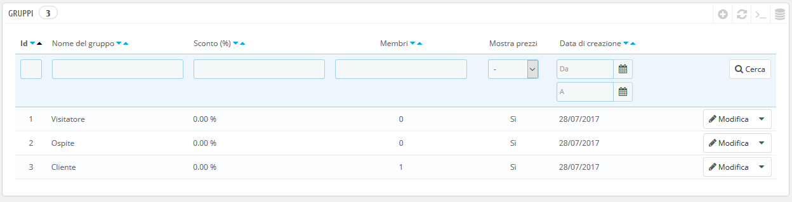
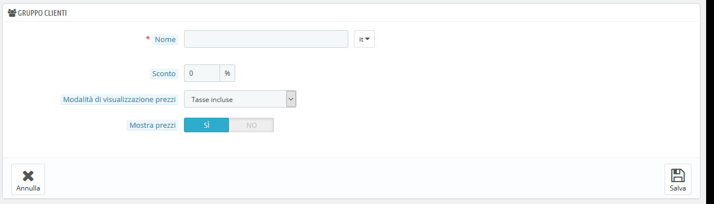
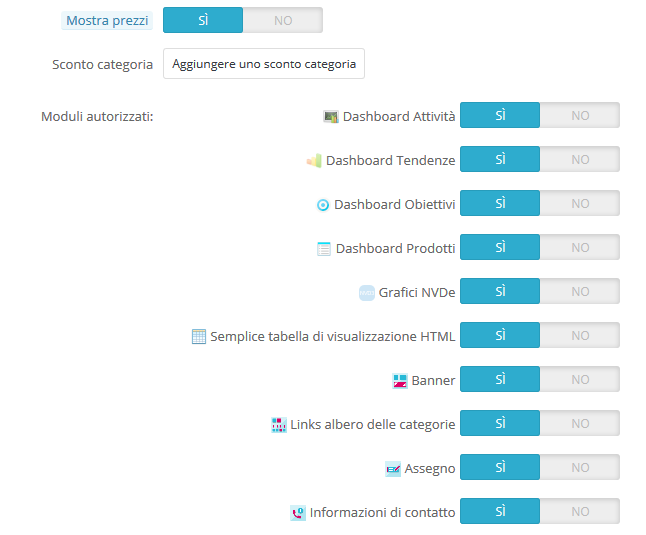
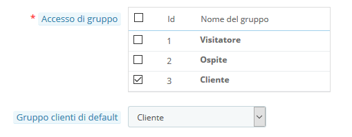

# Gruppi

PrestaShop ti consente di fornire ai tuoi clienti alcuni privilegi attraverso l’assegnazione a specifici gruppi. È possibile creare più gruppi di clienti a seconda delle tue necessità e assegnare un utente a quanti più gruppi desideri.

Queste impostazioni si effettuano nella scheda "Gruppi", nel menu "Impostazioni clienti".

Per impostazione predefinita sono disponibili tre gruppi:

* **Visitatori**. Tutte le persone prive di un account cliente o che non si sono autenticate. 
* **Ospite**. Tutte le persone che effettuano un ordine con l’account ospite – opzione che deve essere abilitata. 
* **Cliente**. Tutte le persone che hanno creato un account nel tuo negozio e si sono autenticate.

Questi tre gruppi non possono essere eliminati.

Per creare altri gruppi, clicca sul pulsante "Aggiungi nuovo gruppo": otterrai un modulo di creazione.

* **Nome**. Usa un breve nome descrittivo.
* **Sconto \(%\)**. Lo sconto che puoi impostare per i membri dei gruppi e che si applicano a tutti i prodotti del tuo negozio. Puoi scegliere di non impostare alcun sconto e creare invece regole del carrello.
* **Metodo visualizzazione prezzi**. PrestaShop viene spesso utilizzato nel settore Business to Business \(B2B\). È possibile creare un gruppo di clienti che possono acquistare prodotti privi di tasse. L'elenco a discesa consente di scegliere tra "imposte incluse" e "imposte escluse".
* **Mostra Prezzi**. Per impostazione predefinita, tutti gli utenti del tuo negozio possono visualizzare i prezzi. Puoi decidere di non farli visualizzare ad alcuni. Ad esempio, puoi fare in modo che gli utenti possano visualizzare i prezzi solo se dispongono di un account. In questo caso, è necessario effettuare una modifica nel gruppo "Visitatori" in modo che "Mostra prezzi" sia impostato su "No".

Una volta stabilite queste impostazioni, puoi salvare il gruppo così com’è, oppure aggiungere le impostazioni per-categoria e / o per-modulo. Nel secondo caso, dopo aver salvato il gruppo, apri nuovamente: la scheda verrà aggiornata con altre due opzioni:

* **Categoria sconto**. Clicca su "Aggiungi una categoria di sconto" per visualizzare una nuova finestra che contiene un elenco di tutte le categorie. Puoi sceglierne una e applicare uno sconto specifico destinato solo a quel gruppo di clienti e solo per quella categoria.  Nota che: 
  * Solo i prodotti con quella categoria di default saranno coinvolti dallo sconto. I prodotti con quella categoria come categoria secondaria non saranno coinvolti.
  * Questo sconto di categoria sostituirà qualsiasi altro sconto di cui i membri di quel gruppo avrebbero altrimenti potuto usufruire relativamente a quella categoria.
  * È possibile aggiungere più sconti di categoria per un gruppo di clienti a seconda delle necessità – è possibile assegnare a tutto il gruppo un intero set di sconti diversi se opportuno.
* **Moduli autorizzati**. Questa sezione consente di bloccare i membri del gruppo ad alcuni dei moduli del tuo negozio. Ad esempio, puoi decidere che alcuni clienti non possano vedere i prodotti più venduti o gli speciali.

Puoi aggiungere un cliente a un gruppo di tua scelta modificando i dettagli del cliente: dall'elenco dei clienti \(nella pagina "Clienti" nel menu "Clienti"\), clicca sul pulsante Modifica nella riga del cliente. Quindi, nella scheda "Accesso al gruppo", seleziona i gruppi a cui desideri che il tuo cliente appartenga. Se assegni il cliente a più di un gruppo, ricorda di impostare il gruppo principale come "Gruppo clienti di default".

