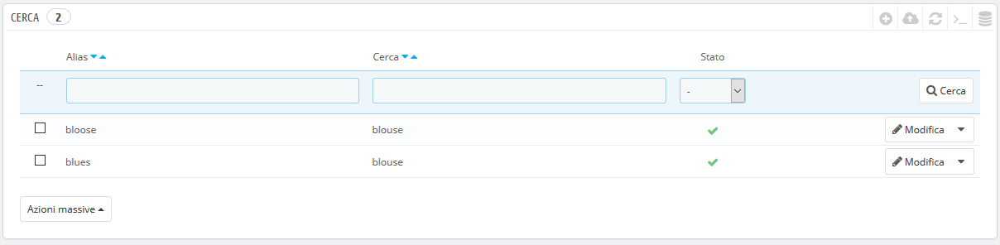
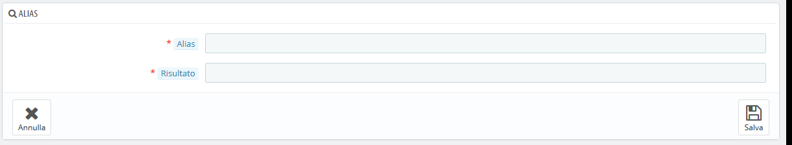
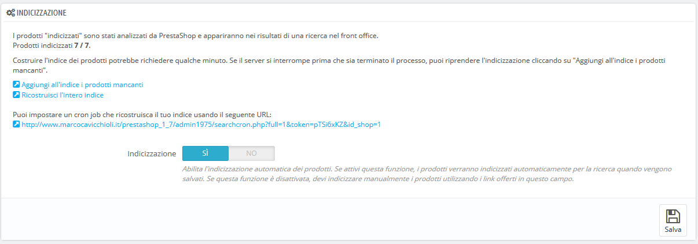
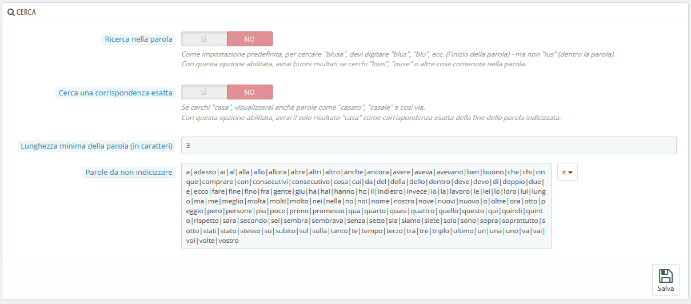
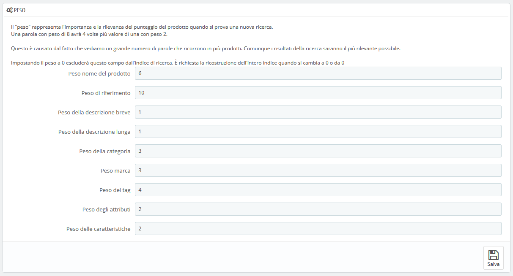

# Parametri di Ricerca

La pagina "Cerca" consente di configurare le funzioni di ricerca del tuo negozio.

**Elenco degli alias**

Quando i clienti effettuano una richiesta utilizzando il motore di ricerca interno del tuo negozio, possono commettere errori di ortografia. Se PrestaShop non mostra i risultati corretti, la funzionalità "alias" può indirizzarli. Sarai in grado di considerare anche parole con errori di ortografia e indirizzarle ai prodotti reali richiesti dai cliente.

Per creare un nuovo alias utile devi prima trovare gli errori di ortografia più frequentemente digitati dagli utenti:

1. Vai alla scheda "Ricerca negozio" dalla pagina "Statistiche",nel menu "Statistiche". Puoi vedere le parole digitate dai tuoi clienti, nonché gli errori più frequenti.
2. Prendi quelli più frequenti e aggiungili alla lista di alias, per indirizzare gli utenti ai prodotti corretti.
3. Clicca sul pulsante "Aggiungi nuovo alias" nella pagina dei parametri "Ricerca".

Il form di creazione è molto semplice: indica la digitazione che si desidera correggere e la parola corretta a cui dovrebbe portare.

Ad esempio, supponiamo che i visitatori spesso scrivano "cachemire" come "cachemere " o "cashemire ". È possibile creare un alias per ciascuno di questo tipo di errore, che corrisponde alla parola "cachemire". Gli alias possono essere utilizzati non appena vengono salvati.

Ti invitiamo inoltre a consultare le sezioni di questa guida sui meta tag dei prodotti e delle categorie per meglio comprendere come mostrare i prodotti in base alle parole digitate dai tuoi clienti.

## Indexing 

Questa sezione fornisce informazioni sul numero di prodotti che possono essere ricercati tramite la funzione di ricerca del tuo negozio e la confronta con il numero di prodotti presenti nel tuo catalogo.

Se i valori non corrispondono, è necessario aggiornare cliccando su "Aggiungi all'indice i prodotti mancanti". Saranno indicizzati solo i nuovi prodotti.

Se hai apportato diverse modifiche ai prodotti già indicizzati, opta per ricostruire l'intero indice. Il processo "Ricostruisci l’intero indice" richiede più tempo, ma è più approfondito.

PrestaShop ti fornisce l'URL anche per consentirti di creare un cron task per la regolare ricostruzione dell'indice. Se non conosci i cron e i crontab, chiedi al tuo hosting web.

Inoltre, l'opzione "Indicizza" consente di indicizzare un prodotto non appena viene creato/modificato, rendendo così superflui i collegamenti di cui sopra e il collegamento cron.

## **Opzioni di ricerca** 

Questa sezione consente di configurare il comportamento delle funzioni di ricerca del tuo negozio:

* **Ricerca nella parola**. Questa opzione migliora la ricerca consentendo di eseguire query che non corrispondono solo all’inizio della parola ricercata; per esempio, "cam" per "camicetta".
* **Cerca una corrispondenza esatta**. Con questa opzione puoi fornire risultati che corrispondono esattamente alla fine della parola ricercata. Ad esempio, se si cerca "penne", vedrai "portapenne", ma non "pennette".
* **Lunghezza minima della parola** \(in caratteri\). Puoi scegliere la dimensione minima in cui una parola può essere registrata nell'indice di ricerca e trovata dai tuoi clienti. Questa funzione consente di eliminare parole corte nella ricerca, come preposizioni o articoli \(il, e, di, ecc.\).
* **Parole da non indicizzare**. Puoi scegliere i termini che non devono essere trovati dai tuoi visitatori. Inseriscili direttamente nel campo, separati da "\|" \(carattere "pipe", non L minuscola\). Per impostazione predefinita, PrestaShop riempie l'elenco con parole corte comuni.

## Peso 

PrestaShop ti consente di dare priorità a certi dati durante una ricerca nel tuo negozio. 

Come indicato nella sezione, la ricerca "peso" di un prodotto rappresenta la sua importanza e rilevanza in base al punteggio nella classifica dei prodotti che appaiono quando i clienti fanno una ricerca. Un elemento con un peso 8 avrà 4 volte più valore di un elemento con un peso 2.

Ad esempio, per impostazione predefinita "Peso nome prodotto" è 6, "Peso tag" è 4 e sia "Peso descrizione breve" sia "Peso descrizione" sono 1. Ciò significa che un prodotto con "ipod" nel nome apparirà più alto nei risultati di ricerca rispetto a un altro prodotto che ha "ipod" solo nei tag. Nel frattempo, un prodotto che ha solo "ipod" in una qualsiasi delle sue descrizioni avrà il rango più basso nei risultati di ricerca.

Puoi assegnare un peso a molti fattori: descrizione breve, categoria, tag, attributi, ecc. Troverai che l'ordine di visualizzazione dei risultati può essere invertito perché hai cambiato il peso dei diversi campi. L'ottimizzazione di queste impostazioni sarà più visibile con un grande catalogo con molti riferimenti.

Una volta salvate le modifiche avranno effetto immediatamente.

