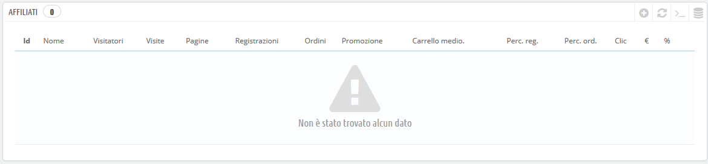
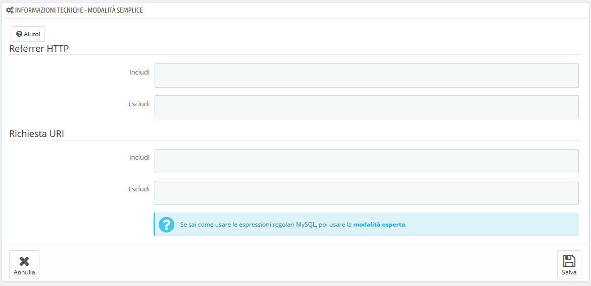
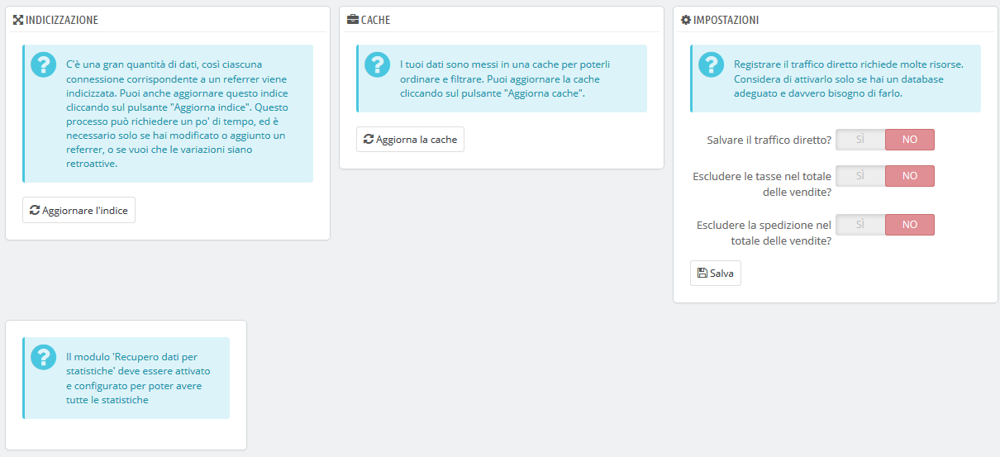

# Affiliati

Un affiliato è un sito web che ti porta almeno un visitatore. Questo sito dispone di un collegamento con il tuo negozio, quindi ti aiuta a costruire un pubblico e alla fine concretizzare più vendite.

Alcuni affiliati sono più importanti di altri: i partner hanno link del tuo negozio sul proprio sito web e quindi ti occorre sapere quanti visitatori ti portano. Puoi anche scegliere di pagare un partner affinché inserisca un link al tuo negozio, a seconda di quanto valuti il tuo traffico.

Questo è chiamato affiliazione e la pagina "Affiliati" ti aiuta a creare un programma di affiliazione completo, al quale anche il tuo partner può connettersi per vedere il numero di visite e vendite che il suo link ha generato. Gli affiliati registrati generano traffico al tuo negozio, puoi ricompensarli per quei visitatori e il programma di affiliazione è il modo in cui entrambi potrete accedere ai dati sui quali si basa la ricompensa.

Lo strumento di affiliazione di PrestaShop può essere paragonato a un pannello di statistiche aperto ad altri. Quando crei una campagna di affiliazione per un sito, puoi concedere a quel sito l'accesso a tutte le attività legate al tuo sito, tramite un URL protetto da password, come: [http://example.com/modules/trackingfront/stats.php](http://example.com/modules/trackingfront/stats.php).

Nell'elenco degli affiliati, le tariffe a Clic, di Base e Percentuali vengono calcolate in base ai clic effettivi, alle vendite e alle percentuali di vendite provenienti dal sito affiliato.&#x20;

## Aggiungere un nuovo affiliato 

La sezione dedicata agli affiliati consente di creare un accesso privilegiato per i tuoi partner. Avranno accesso a tutte le statistiche sul flusso dei visitatori dal loro sito al tuo negozio online. Per creare questo spazio privilegiato è necessario prima creare l’account affiliato nel programma di affiliazione, quindi definire come pagherà, se in base al traffico o alle vendite generate.

Per creare un nuovo partner di affiliazione, clicca sul pulsante "Aggiungi nuovo", che ti porterà al form di creazione dell’affiliato.

Ogni sezione è importante:

* **Affiliato**. Il profilo del partner nel programma di affiliazione.
  * **Nome.** Per connettersi al tuo ufficio di affiliazione, il tuo partner ha bisogno di un nome di accesso; puoi utilizzare un semplice nome o una email, ma assicurati di utilizzare qualcosa facilmente memorizzabile.
  * **Password.** La prima volta che si crea l'account PrestaShop salva la password insieme al nome di accesso. Quando è necessario modificare l'account (ad esempio, quando si desidera modificare la commissione), la password sarà vuota. Ciò non significa che non esiste una password; se si compila il campo vuoto durante la modifica dell'account la password cambierà.
* **Piano della Commissione.** Qui si indicano le commissioni dell’affiliato - cioè il denaro che spetterà al tuo partner per portare traffico al tuo sito.\

  * **Tariffa clic.** Il valore di un visitatore che proviene dal sito del partner. Ogni volta che un visitatore del sito del tuo partner viene nel tuo negozio cliccando sul suo collegamento, il partner guadagna l'importo indicato.
  * **Tariffa di base.** Puoi anche premiare i tuoi partner quando i visitatori dei loro siti acquistano uno dei tuoi prodotti. Tieni presente che questo è valido solo se l'acquisto viene effettuato durante la sessione di ricerca che traccia il clic sul collegamento del partner.
  * **Tariffa percentuale.** Oltre alla commissione di base o in sostituzione, puoi premiare i partner con una percentuale sulle vendite effettuate durante la sessione di navigazione dei visitatori dai loro siti.
* **Informazioni tecniche - Modalità semplice.** Questo è molto importante, poiché differenzia il link di un affiliato da un altro. Una volta configurato, dovresti eseguire un paio di test per assicurarti che stai monitorando correttamente l'affiliato.\

  * **Referrer HTTP.** Nel campo "Includi", imposta il nome di dominio del partner di cui si desidera tenere traccia come dominio affiliato.
  * **Richiesta URI.** Nel campo "Includi", imposta l'ultima parte della stringa di query. Il sistema seguirà gli affiliati che utilizzano una stringa di query speciale. Ad esempio, è possibile tenere traccia degli affiliati che utilizzano l'argomento? ?prestaff=  nel loro URL. Ciò può aiutarti a differenziare ulteriormente gli affiliati.
* **Informazioni tecniche - Modalità Esperti.** Mentre la modalità semplice funziona con la corrispondenza delle parole tramite la funzione "LIKE" di MySQL, la modalità Esperti consente di utilizzare espressioni regolari di MySQL. Questo può rivelarsi molto potente ma anche molto difficile da mantenere. Assicurati di conoscere bene l'argomento delle espressioni regolari prima di mettere qualcosa in questi campi.

La sezione "Aiuto" fornisce alcune preziose indicazioni su come configurare meglio la tua affiliazione. Leggila.

## Impostazioni 

Le impostazioni per gli affiliati sono principalmente strumenti per aiutarti a realizzare al meglio il tuo programma di affiliazione.

Esistono tre possibilità:

* **Indicizzazione**. È necessario cliccare una volta sul pulsante "Aggiornare indice" quando si aggiunge un nuovo affiliato e si desidera analizzare il traffico di questo nuovo affiliato.
* **Cache**. PrestaShop memorizza i dati raccolti. È possibile utilizzare il pulsante "Aggiorna cache" per aggiornare regolarmente la cache dati.
* **Salvare il traffico diretto?**. Il traffico diretto rappresenta i visitatori che arrivano direttamente al tuo negozio, digitando l’ URL nel browser. Sono dati importanti perché si tratta di visitatori che conoscono davvero il tuo negozio e sono interessati ai tuoi prodotti (contrariamente ai visitatori degli affiliati che potrebbero semplicemente inciampare sul tuo negozio per caso), salvare questo traffico può essere un ostacolo per il tuo database. Ecco quindi il motivo per cui questo traffico non viene salvato né analizzato per impostazione predefinita. Abilita questa opzione solo se sai cosa stai facendo.
