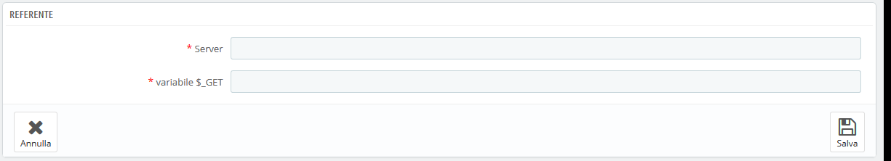

# Motori di Ricerca

Molti visitatori arriveranno dai motori di ricerca. Per sapere cosa cercano e come puoi migliorare il tuo negozio in base alle loro query di ricerca, devi sapere quali sono le loro ricerche.

Questa pagina presenta una tabella di tutti i motori di ricerca che l'installazione di PrestaShop supporta - il che significa che PrestaShop è in grado di riconoscere e di estrarre le query che il visitatore usa per trovare il tuo negozio in quel motore di ricerca.

Anche se Google detiene la quota più grande di utenti, ci sono molti altri motori di ricerca che le persone potrebbero utilizzare per trovare il tuo sito web. Dunque è necessario recuperare anche queste ricerche. Quando un motore di ricerca sconosciuto inizia a portare regalmente visitatori, è giunto il momento di aggiungerlo al database. Altrimenti, i visitatori vengono contrassegnati nelle statistiche come provenienti da "Altri motori di ricerca", che non è molto utile.

## Aggiungere un motore di ricerca 

È molto semplice aggiungere un nuovo motore di ricerca nell’elenco.

Supponiamo che si desidera aggiungere DuckDuckGo, un motore di ricerca che enfatizza il rispetto per la privacy dei dati:

1. Prendi l'URL completo del referrer di ricerca. Ad esempio, [http://duckduckgo.com/?q=kids+shoes](http://duckduckgo.com/?q=kids+shoes)
2. Prendi il nome di dominio specifico per quel motore di ricerca e inseriscilo nel campo "Server". Nel nostro caso, "duckduckgo".
3. Trovare la variabile di query:\

   1. Trova la stringa di query. Dovrebbe essere un insieme di lettere, seguito da un segno "=", seguito dalla stessa query, chiusa da un "&" o dalla fine della stringa. Nel nostro caso, è "q = kids + shoes".
   2. La variabile di query è l'insieme di lettere prima del segno "=". Nel nostro caso: "q". Inseriscilo nella casella "$ \_GET variabile".
4. Clicca sul pulsante "Salva", e da oggi in poi PrestaShop sarà in grado di riconoscere i visitatori provenienti da DuckDuckGo.&#x20;
