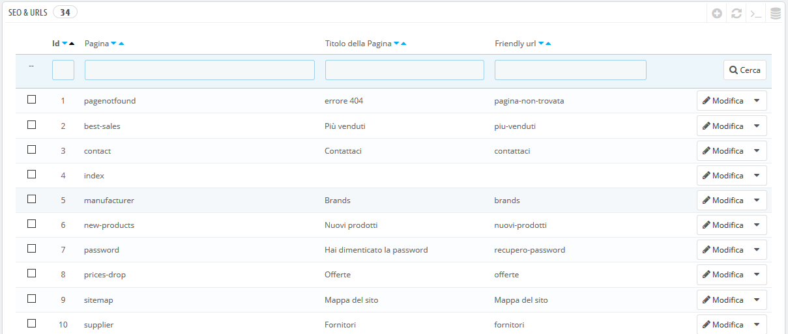
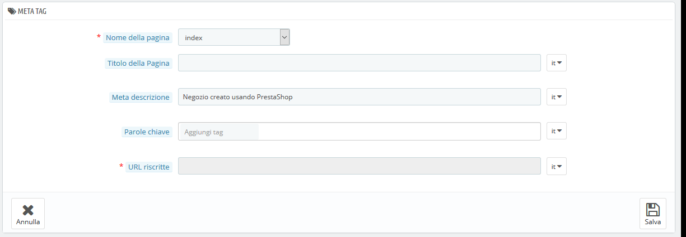
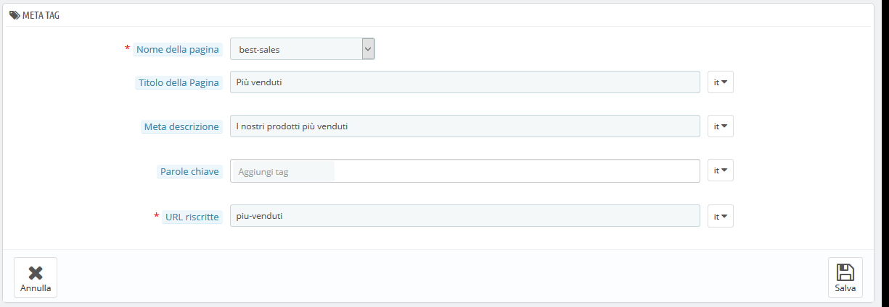
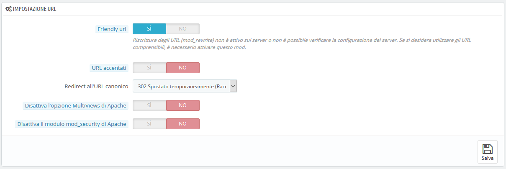
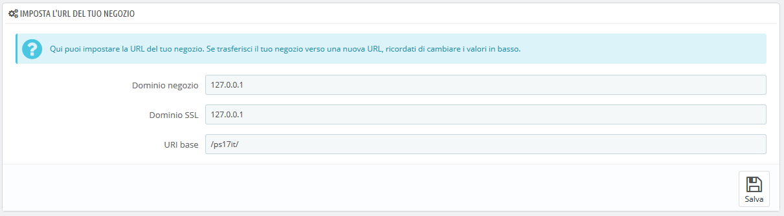
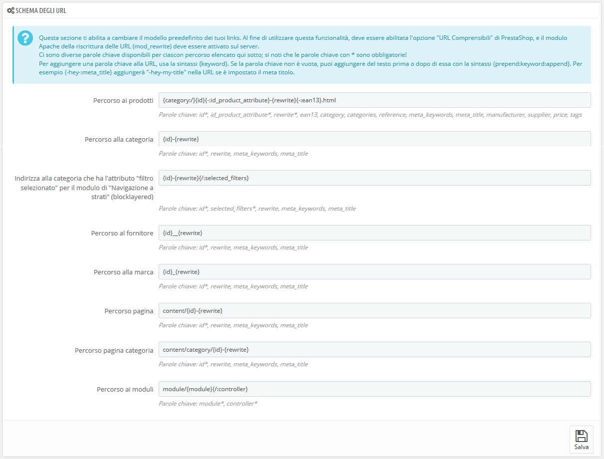

# SEO e URL

Gli strumenti di questa pagina aiutano a migliorare la presenza del tuo sito PrestaShop nelle ricerche web e quindi raggiungere più potenziali clienti.

SEO significa "ottimizzazione dei motori di ricerca". Rappresenta un insieme di tecniche e pratiche volte a migliorare la visibilità di un sito web sui motori di ricerca. Puoi scoprire di più su Wikipedia: [https://it.wikipedia.org/wiki/Ottimizzazione\_(motori\_di\_ricerca)](https://it.wikipedia.org/wiki/Ottimizzazione\_\(motori\_di\_ricerca\)).

URL sta per "uniform resource locator”, più semplicemente è l'indirizzo online di una pagina web. Puoi scoprire di più su Wikipedia [https://it.wikipedia.org/wiki/Uniform\_Resource\_Locator](https://it.wikipedia.org/wiki/Uniform\_Resource\_Locator).

Per impostazione predefinita, gli URL di secondo livello di PrestaShop (pagine specifiche piuttosto che il nome di dominio online) sono piuttosto non informative sia per il cliente che per i motori di ricerca: un URL come [http://www.myprestashop.com/product.php?id\_product=](http://www.myprestashop.com/product.php?id\_product=) 27 non aiuta i visitatori a sapere qual è il prodotto di quella pagina. I friendly URL sono il modo per raggiungere questo obiettivo, come, per esempio, [http://www.myprestashop.com/2-music-players/27-ipod-nano-verde](http://www.myprestashop.com/2-music-players/27-ipod-nano-verde).

Come si può vedere nel secondo esempio sopra, entrambe le categorie e i prodotti possono avere un Friendly URL: nell'esempio precedente `id_category=2` diventa `2-music-players` e `id_product=27` diventa `27-ipod-nano-verde`. Mentre il numero ID non può essere rimosso per impostazione predefinita, le parole possono essere generate dal nome categoria/prodotto o scritte a mano. Ciò avviene direttamente nella pagina di configurazione del prodotto o nella categoria (nel menu Catalogo): il campo "Friendly URL" può essere trovato direttamente nella pagina di configurazione principale di una categoria e nella scheda "SEO" della pagina di configurazione di un prodotto.

Ci sono altre pagine individuali dell'installazione di PrestaShop che beneficiano sicuramente dei Friendly URL: pagine CMS, pagine account utente, pagine con contenuto generato automaticamente... La pagina "SEO & URL" presenta un elenco di queste pagine e ti consente di modificare i Friendly URL e i loro meta tag (titolo, descrizione, parole chiave).

I Friendly URL funzionano solo con un'installazione server che supporta la riscrittura dell'URL (ad esempio, con la funzione `mod_rewrite` del server Web di Apache). Assicurati che il tuo server lo supporti (chiedi al tuo fornitore di hosting!), poiché abilitare i Friendly URL può rendere il tuo negozio completamente inaccessibile ai clienti se il server non lo supporta!

Impostazioni SEO della homepage

Per modificare i meta tag della home page è sufficiente aprire la pagina "SEO & URL", andare nelle impostazioni della pagina "indice" e modificare le informazioni importanti SEO.

Alcuni suggerimenti:

* inserisci contenuti nel campo, il titolo completo della pagina web verrà sostituito dal tuo input.\
  Il nome del negozio stesso viene impostato durante l'installazione di PrestaShop e può essere modificato dalla pagina di preferenze "Conserva contatti", utilizzando l'opzione "Nome negozio" della sezione "Contatti".
* La tua descrizione deve essere breve: è sufficiente un paragrafo di testo.
* Per aggiungere una parola chiave, clicca sul campo "Aggiungi tag" e convalida premendo il pulsante di ritorno. Puoi rimuovere i tag cliccando sulla X.
* Non è necessario riscrivere un URL se ce n'è già uno valido.

Tieni presente che se il tuo negozio è già stato indicizzato da Google o da un altro motore di ricerca, potrebbe richiedere del tempo per apportare modifiche ai risultati di ricerca. Sii paziente.

Nella parte inferiore della pagina "SEO & URL" ci sono tre sezioni con opzioni aggiuntive: Imposta URL, Imposta URL negozio e Generazione file Robot. Vedi di seguito la spiegazione di queste sezioni.

## Aggiungere un nuovo Friendly URL 

I Friendly URL vanno impostati nella pagina di configurazione di ogni prodotto, di ogni categoria, di ogni pagina di contenuto statico... questa pagina di creazione è utile solo per alcune pagine automatiche e per la maggior parte del tempo non dovrai preoccupartene.

Assicurati di compilare i campi in tutte le lingue disponibili nel tuo negozio: non solo è molto utile agli utenti locali, ma alcuni motori di ricerca possono anche utilizzare queste informazioni locali.

Clicca sul pulsante "Aggiungi nuova pagina" per il form di creazione di un Friendly URL. Hai una serie di campi:

* **Pagina**. L'elenco a discesa fornisce tutte le pagine che possono beneficiare di un Friendly URL.
* **Titolo di pagina**. Il titolo che apparirà nei motori di ricerca quando viene effettuata una ricerca.
* **Meta Descrizione**. Una presentazione della pagina in poche parole, intesa a catturare l'interesse di un cliente. Apparirà nei risultati della ricerca.
* **Parole chiave**. Parole chiave da definire affinché il tuo sito si riferisca ai motori di ricerca. È possibile immetterne diverse: digita le parole, premi il tasto Invio e vedi come il tag viene inglobato in un blocco blu, con una piccola icona X per eliminarlo.
* **URL riscritti**. È qui che imposti il Friendly URL. Rendili brevi e descrittivi, utilizza solo lettere e numeri e sostituisci gli spazi ("") con i trattini ("-").

## Impostare URL 

Le opzioni principali per i friendly URL:

*   **Friendly URL**. Cambia questa opzione se sai che il tuo server supporta la riscrittura dell'URL. Se no, lasciala su "No".

    Potresti vedere un messaggio del tipo _"La riscrittura dell'URL (mod\_rewrite) non è attiva sul tuo server o non è possibile controllare la configurazione del tuo server. Se desideri utilizzare Friendly URL devi attivare questa modalità"_. In questo caso, PrestaShop non riesce a rilevare le impostazioni del server, ma non significa che la funzionalità non funzionerà. Devi testarlo.
* **URL Accentati**. PrestaShop è in grado di produrre URL con caratteri speciali, per prodotti con nomi non ASCII. È possibile disattivare l'opzione qui.
*   **Redirect all’URL canonico**. Una data pagina di PrestaShop può avere diversi URL, specialmente se presenta diversi parametri da considerare: ad esempio, [`http://example.com/product.php?id=5&option1`](http://example.com/product.php?id=5\&option1) e [`http://example.com/product.php?id=5&option2`](http://example.com/product.php?id=5\&option2) puntano allo stesso prodotto, ma con una differenza. Poiché desideri che il tuo prodotto disponga di un singolo URL e non di duplicati, devi abilitare URL Canonici. Gli URL canonici sono un modo per eliminare i contenuti duplicati creati automaticamente, cosa che può incidere drasticamente sul tuo livello di ricerca, in quanto è considerato spam. Per evitare che i motori di ricerca spammino il proprio indice, PrestaShop utilizza il tag di collegamento standard `rel="canonical"` per indicare qual è l'unico URL di base per un determinato contenuto.\
    È altamente consigliabile attivare questa opzione e dipende anche dal fatto che il tuo tema realmente implementi correttamente il tag `<link>` dell’header. Chiedi a chi ha progettato il tuo tema per ulteriori informazioni.

    Ci sono tre opzioni:

    * **Nessun reindirizzamento**. Potresti ottenere URL duplicati.
    * **301 Spostalo permanentemente**. Restituisce il codice di stato HTTP 301, indicando l'URL principale e avvisando i motori di ricerca che questo è l'unico URL da tenere in cosiderazione.
    * **302 spostato temporaneamente**. Restituisce il codice di stato HTTP 302, che indica l'URL principale e notifica ai motori di ricerca che l'URL principale potrebbe cambiare in un secondo momento.
* **Disattiva l’opzione MultiViews di Apache**. Apache è il server web più diffuso ed è molto probabilmente quello utilizzato dal tuo hosting web per il tuo sito (anche se è meglio controllare per conferma). Multiviews è un sistema di negoziazione di contenuti: quando abilitato, il server web cerca di fornire all'utente una pagina che reputa la migliore versione della lingua corrispondente, sotto lo stesso URL. Purtroppo, questo potrebbe causare problemi alle funzioni Friendly URL di PrestaShop. Se è questo il caso, disattiva la visualizzazione multipla in questa opzione.
* **Disattiva il Modulo mod\_security di Apache**. `mod_security`  è un modulo del server web Apache, che funge da firewall, proteggendo il server da intrusioni. Può comunque bloccare alcune funzioni chiave o addirittura produrre errori in alcune configurazioni. In questo caso, disattiva il firewall qui.

Nelle versioni precedenti di PrestaShop, è necessario generare manualmente un nuovo file `.htaccess` dopo aver abilitato i friendly URL. Dalla versione 1.5 ciò non accade più: il file `.htaccess` è ora gestito in silenzio da PrestaShop e non devi preoccuparti.

## Impostare l’URL del tuo negozio 

In questa sezione è possibile visualizzare e modificare alcune delle impostazioni predefinite del server:

* **Dominio negozio**. Nome dominio o indirizzo IP del tuo negozio.
* **Dominio SSL**. Nome dominio protetto del tuo negozio (https: //) o indirizzo IP.
* **URI base**. La cartella in cui è stato installato PrestaShop. Se si trova alla radice del dominio, utilizzare "/".

Nella maggior parte dei casi, non dovresti toccare questi campi senza sapere esattamente cosa stai facendo. Un errore potrebbe rompere il tuo negozio.

## Schema degli URL 

**Novità della versione 1.6**.

Puoi cambiare il modo in cui vengono generati i friendly URL, cambiando il percorso di una risorsa nel tuo negozio.

Ad esempio, il percorso predefinito per visualizzare la pagina di un prodotto è `{category:/}{id}-{rewrite}{-:ean13}.html`, che produce `/summer-dresses/7-printed-chiffon-dress.html`

Potresti cambiare tale itinerario in: `{manufacturer:/}{id}-{rewrite:/}` per ottenere `/fashion-manufacturer//7-printed-chiffon-dress/`

Per impostazione predefinita sono disponibili 8 campi, ciascuno dei quali è accompagnato da un elenco di parole chiave disponibili. Alcune parole chiave sono obbligatorie e sono indicate con un \*.

Dopo aver aggiornato i campi, non dimenticare di salvare le modifiche, quindi "Salva" nella sezione "Imposta URL" per rigenerare il file .htaccess, necessario per i tuoi friendly URL.

## Generazione dei file Robot 

Un file `robots.txt` consente di bloccare specifici robot automatici e gli spieder che eseguono la scansione per trovare ulteriori pagine web da aggiungere ai server della propria azienda. Puoi desiderare che alcuni bot abbiano pieno accesso al tuo sito web, ad esempio Google o Yahoo!, e alcuni no, come i bot spam, i ladri di contenuti, i collezionisti di e-mail, ecc. Si noti che i peggiori bot non rispettano le direttive di questo file, in quanto è puramente consultivo.

Lo strumento di generazione di `robots.txt` di PrestaShop crea semplicemente un file con direttive di esclusione per file e directory che non sono destinati a essere pubblici e non devono essere indicizzati. Queste direttive si applicano a tutti i bot, buoni o cattivi: il file generato utilizza la stringa "User-agent: \*".

Cliccando sul pulsante "Genera robots.txt" sostituisce qualsiasi `robots.txt` file esistente con uno nuovo. Pertanto, se desideri aggiungere le tue regole, fallo dopo che PrestaShop ha generato la sua versione del file.

Video - 4 suggerimenti per ben impostare il SEO per il tuo sito e-commerce

