# Conformarsi con la legislazione europea

* [Introduzione](conformarsi-con-la-legislazione-europea.md#Conformarsiconlalegislazioneeuropea-Introduzione)
* [Perché dovresti preoccupartene](conformarsi-con-la-legislazione-europea.md#perche-dovresti-preoccupartene)
* [Come configurare il tuo negozio](conformarsi-con-la-legislazione-europea.md#Conformarsiconlalegislazioneeuropea-Comeconfigurareiltuonegozio)
  * [Configurare il modulo di conformità legale](conformarsi-con-la-legislazione-europea.md#configurare-il-modulo-di-conformita-legale)
  * [Configurare altri elementi di PrestaShop](conformarsi-con-la-legislazione-europea.md#Conformarsiconlalegislazioneeuropea-ConfigurarealtrielementidiPrestaShop)
  * [Elementi esterni o graditi](conformarsi-con-la-legislazione-europea.md#Conformarsiconlalegislazioneeuropea-Elementiesterniograditi)
* [Cosa è ancora di tua responsabilità](conformarsi-con-la-legislazione-europea.md#cosa-e-ancora-di-tua-responsabilita)

## Introduzione 

Questa guida è rivolta ai commercianti europei e spiega come configurare il proprio negozio e assicurarsi che sia conforme alle normative europea in materia di commercio elettronico \(e-commerce\).

## Perché dovresti preoccupartene

Se hai sede in Germania, Austria o Svizzera, o intendi vendere in quei Paesi, assicurarti che il tuo negozio sia conforme alla legislazione è un requisito obbligatorio. In essenza di questa conformità potresti essere perseguito legalmente. Per evitare che ciò accada puoi rivolgerti ad aziende di certificazione come Trusted Shops, EHI, Händlerbund e Protected Shops in grado di controllare il tuo negozio e produrre un certificato che dimostra di essere conformi ai requisiti legali.  
  
PrestaShop 1.7 è già pre-certificato da queste 4 società, ciò facilita il processo di ottenimento della certificazione completa.  
Per saperne di più su 1.7 puoi leggere: [https://www.prestashop.com/it/1.7  
](https://www.prestashop.com/it/1.7)  
Questa pre-certificazione sta a indicare che PrestaShop fornisce tutte le funzionalità richieste per essere conformi. La configurazione però sta a te!

## Come configurare il tuo negozio 

La pietra miliare della conformità di PrestaShop è il modulo "Conformità Legale" \(nome tecnico: ps\_legalcompliance\), che consente di eseguire il 90% dell'installazione in modo conforme. Alcuni altri elementi non appartengono questo modulo e possono essere configurati separatamente. Andremo a vedere ogni aspetto del modulo di conformità legale e di questi altri elementi.

### Configurare il modulo di conformità legale

#### Installazione 

Vai nel tuo back office, nella pagina Moduli & Servizi e, nella prima scheda "Selezione" utilizza la barra di ricerca per trovare "conformità legale", quindi installa il modulo.  
Puoi ora entrare nella seconda scheda "Moduli installati" e cliccare sul pulsante "Configura" nel modulo Conformità Legale.

#### Elementi pre-impostati 

Quando si installa il modulo legale di conformità, in realtà si innescano una serie di pre-configurazioni che consentono di risparmiare del tempo prezioso. Ecco l'elenco:

* Vengono create diverse pagine statiche che ti forniscono i mezzi per indicare al cliente le informazioni legali. Per ulteriori informazioni, vedere  "[Gestione dei contenuti legali](conformarsi-con-la-legislazione-europea.md#Conformarsiconlalegislazioneeuropea-Gestionedeicontenutilegali)"
* Queste pagine statiche contenenti le note legali includono un pulsante "Stampa", che permette ai clienti di stampare o salvare facilmente in PDF queste informazioni.
* È inoltre abilitato il [riepilogo finale del check-out](conformarsi-con-la-legislazione-europea.md#Conformarsiconlalegislazioneeuropea-riepilogofinale).
* L'opzione "[Visualizza tasse nel carrello](conformarsi-con-la-legislazione-europea.md#Conformarsiconlalegislazioneeuropea-impostazionitasse)" è abilitata.
* Condizioni di spedizione "gratuite": talvolta, il corriere predefinito del Paese predefinito può essere gratuito e queste informazioni vengono visualizzate nella pagina del carrello anche se non si è impostato l'indirizzo e il metodo di consegna durante la verifica. Poiché il costo finale di acquisto dipende dall'indirizzo e dal corriere scelto, il modulo Conformità Legale aggiunge automaticamente una nota "Con condizioni" collegata alla pagina statica "Spedizione e pagamento" dove occorre dettagliare le condizioni di spedizione e i costi.   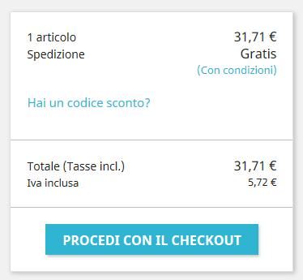 
* L'opt-in per le Condizioni di Servizio includerà anche i Termini per il Recesso \(se disponibili\) durante il checkout  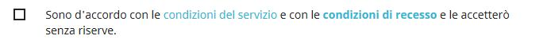 

#### Configurazione 

In questo paragrafo ci soffermeremo su ogni opzione interna alle pagine di configurazione del modulo Conformità Legale.  

**ETICHETTA**

**Etichetta tempo di consegna \(per prodotti disponibili\)**

Si tratta di un parametro globale che verrà visualizzato nella pagina dettaglio di ogni prodotto non virtuale. Ti raccomandiamo di usare una precisa indicazione del tipo “Tempo di consegna: dai 2 ai 5 giorni” anziché indicazioni vaghe come “Consegna in 3 giorni in condizioni normali”.

Nel back-office:

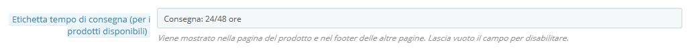

Nel front-office:

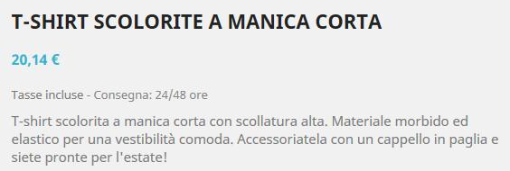

**Etichetta tempo di consegna \(per prodotti non in magazzino\)**

Come sopra, ma per prodotti non in magazzino.

**Informazioni supplementari sui tempi di consegna**

È possibile utilizzare questo campo per visualizzare ulteriori informazioni sulle condizioni applicabili delle suddette etichette di consegna. Ad esempio, il termine di consegna può essere applicato solo alla Germania.

Viene inoltre aggiunto un collegamento alla pagina statica "Spedizione e pagamento" in modo che il cliente possa avere accesso alle informazioni complete sulle condizioni di spedizione.

Nel back-office:

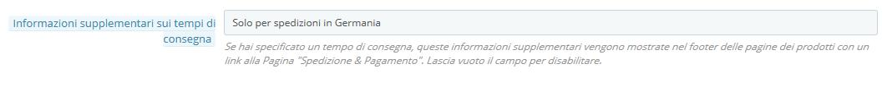

Nella pagina di dettaglio del prodotto:

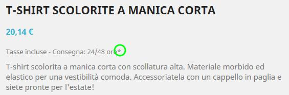

Nel footer della pagina di dettaglio del prodotto:

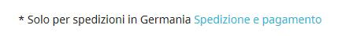

**Etichetta "il nostro prezzo precedente"**

Quando un prodotto è in vendita, questa opzione aggiunge l'etichetta "Il nostro prezzo precedente" prima del prezzo scontato. Consente quindi di spiegare che questo prezzo scontato deriva da una promozione attiva e che non è il prezzo consigliato dal produttore né il prezzo del concorrente.

Nella pagina del dettaglio prodotto:

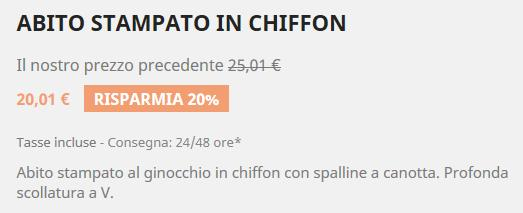

**Etichetta tasse 'incl./escl.'**

Questa opzione mostra se la tassa è inclusa sulla pagina del prodotto o no \(Etichetta tasse 'incl./escl.'\) e aggiunge una nota nel footer delle altre pagine \(elenco prodotti\).

Nelle pagine di dettaglio prodotto:

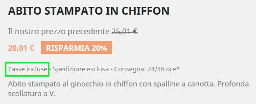

Nel footer delle pagine elenco prodotto:

**Etichetta prezzo per unità**

Quando questa opzione è abilitata, il prezzo per unità \(prezzo per kg, L...\) sarà visibile accanto al prezzo del prodotto ove disponibile. 

Guarda come impostare un prezzo unitario [qui](conformarsi-con-la-legislazione-europea.md#Conformarsiconlalegislazioneeuropea-prezzoperunità)[.](file:///C:/Serena/LAVORO/PRESTASHOP/Complying+with+the+European+legislation%20_Conformarsi+con+la+legislazione+europea.doc#ComplyingwiththeEuropeanlegislation-pri)

Nel front office:

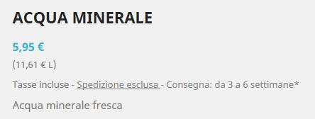

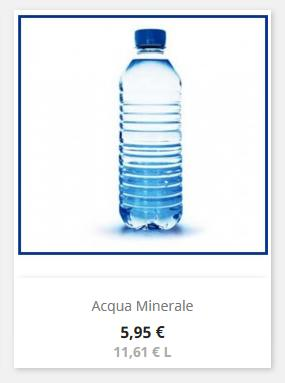

**Etichetta 'Spese di spedizione escl.'** 

Quando abilitata, questa opzione visualizza un'etichetta "spedizione esclusa" sia nelle pagine dettagliate del prodotto che nel piè di pagina dei prodotti. L'etichetta "spedizione esclusa" è un collegamento alla pagina statica "Spedizione e pagamento", creata automaticamente dal modulo Conformità Legale sin dall'installazione. Assicurati che i termini di spedizione e di pagamento siano associati a una [pagina statica](conformarsi-con-la-legislazione-europea.md#Conformarsiconlalegislazioneeuropea-Gestionedeicontenutilegali).

Nella pagina di dettaglio del prodotto:  

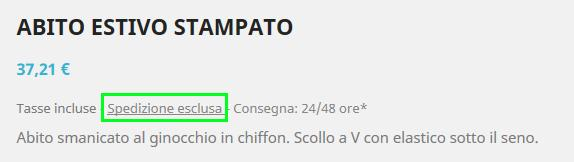

Nel footer dell’elenco prodotto:

**Termini per il recesso entro CdS**          

Questa opzione include i contenuti dei Termini per il recesso all’interno delle Condizioni di Servizio.

**Recesso per prodotti virtuali**

Questa opzione aggiunge una casella di controllo obbligatoria al termine del processo di pagamento nel caso il carrello contenga un prodotto virtuale \(un servizio o un bene digitale\). Assicura che il cliente sia consapevole del fatto che perde il diritto di annullare la transazione una volta che il download del bene digitale è iniziato o una volta che il servizio è stato completamente eseguito.

**'Da' etichetta di prezzo \(per combinazioni\)**

Se un prodotto ha combinazioni con prezzi diversi, questa opzione aggiunge un'etichetta "Da" prima del prezzo del prodotto negli elenchi dei prodotti. Si prega di notare che il prezzo visualizzato nell'elenco dei prodotti non è il prezzo più basso possibile ma il prezzo di combinazione predefinito

Nell’elenco dei prodotti:

**Testo personalizzato nella pagina del carrello**

Questa opzione ti consente di aggiungere un testo destinato al cliente all’interno della pagina del carrello, fornendo l’opportunità di informare il cliente riguardo a come l’ordine è legalmente confermato e come i dati verranno usati o conservati.    
  
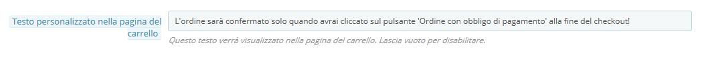

Nella pagina del carrello:

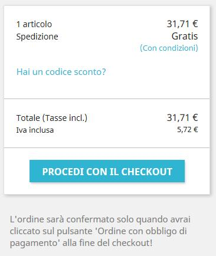

**CARATTERISTICHE**

**Abilitare la caratteristica 'Ordina di nuovo'**

Questa opzione consente ai clienti di ordinare, con un semplice click, la stessa merce attraverso la Cronologia degli Ordini. Disabilita questa opzione se va contro la tua legislazione locale.

**Imposta proporzionale per spedizione e imballaggio**

Quando questa opzione è abilitata, la tassa per i costi di spedizione e di imballaggio verrà calcolata proporzionalmente alle tasse applicabili ai prodotti nel carrello. Consente di definire un costo fisso incluso per ciascun corriere, mentre l'aliquota fiscale è calcolata in base alle tasse medie del carrello. Questa opzione sostituisce l’opzione predefinita che prevede la spedizione esente da imposta e sceglie una regola fiscale fissa.

Quando abilitato, assicurati che le tasse di spedizione impostate siano incluse nella tassa:

* Costi di spedizione del corriere _\(in MIGLIORA / Spedizione / Vettori / il tuo Vettore\)_
* Spese di gestione \(in _MIGLIORA / Spedizione_ / _Preferenze_\)
* Spese di spedizione addizionali _\(in VENDI / Catalogo / Prodotti / i tuoi Prodotti\)_

**GESTIONE DEI CONTENUTI LEGALI**

La legislazione del tuo Paese potrebbe richiedere di comunicare alcune informazioni legali specifiche ai tuoi clienti, quali le condizioni di servizio o i termini per il recesso. A tal fine è possibile utilizzare le pagine statiche create automaticamente dal modulo di Conformità Legale. È tua responsabilità compilare queste pagine con il contenuto legale richiesto. Per un supporto legale è possibile ottenere aiuto dai partner di PrestaShop:

[https://www.prestashop.com/it/partner](https://www.prestashop.com/it/partner)

Per completare queste pagine, vai in MIGLIORA / Design / CMS e scopri di più su [Gestisci Contenuti Statici](http://doc.prestashop.com/display/PS17/Pagine+-+Gestione+Contenuti+Statici).  
  
La Conformità Legale è composta da 7 argomenti predefiniti che giocano ruoli diversi in diverse condizioni. Questi argomenti sono: 

* Condizioni del Servizio \(CdS\)
* Comunicazione ambientale
* Note legali
* Privacy
* Termini per il recesso
* Modulo di recesso
* Spedizione e Pagamenti

Ognuno di questi argomenti può essere assegnato a una pagina statica che corrisponde al relativo argomento. 

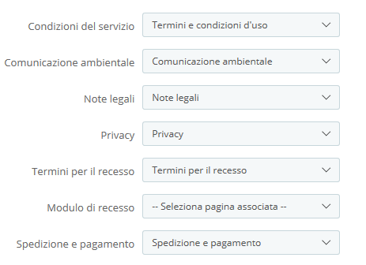

Per assicurati che altre opzioni come '[Etichetta spese di spedizione escl.](conformarsi-con-la-legislazione-europea.md#Conformarsiconlalegislazioneeuropea-etichettaescl)' o [Ulteriori informazioni sui tempi di consegna ](conformarsi-con-la-legislazione-europea.md#Conformarsiconlalegislazioneeuropea-infosupplementaritempidiconsegna)siano collegate al contenuto corrispondente, assicurati di aver assegnato una pagina statica all’argomento.

Puoi anche lasciare vuoto il campo “Comunicazioni Ambientali” se non ne hai bisogno dal punto di vista legale. Ad esempio, potrebbe non essere necessario se non vendi prodotti elettronici.

I collegamenti a queste pagine statiche faranno automaticamente parte del footer del front office, quindi sono accessibili per i tuoi clienti in qualsiasi momento. Nel footer del front office verrà mostrato qualcosa  del tipo:

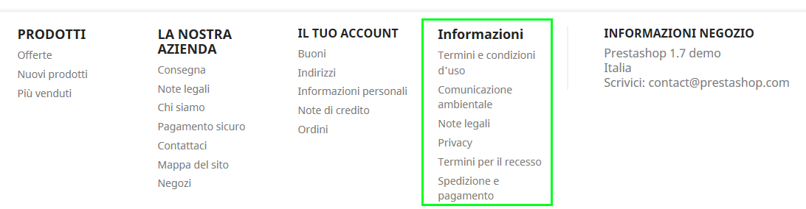

**INCLUSIONE DEL CONTENUTO EMAIL**

Questa sezione consente di includere informazioni dalla sezione "Gestione Contenuti Legali" sotto al bottone email del tuo negozio. Per ogni tipo di email, puoi definire quali contenuti intendi includere. Per impostazione predefinita, alcuni contenuti legali sono già predisposti per essere inclusi in alcuni modelli di posta elettronica. Tieni presente che l'elenco dei template di questa sezione non contiene modelli provenienti da moduli esterni.

### Configurare altri elementi di PrestaShop 

#### Impostazione ordini 

**GENERALE**

**Abilita riepilogo conclusivo**

Questa opzione permette di visualizzare una panoramica dell'ordine \(indirizzi di spedizione e fatturazione, metodo di spedizione e contenuto del carrello\) nella fase finale di verifica prima di confermare l'ordine. Consente ai tuoi clienti di controllare il proprio ordine e di modificarlo se necessario. Questa sintesi è richiesta esplicitamente dalle normative di alcuni Paesi europei.

Nel processo di checkout:  
  
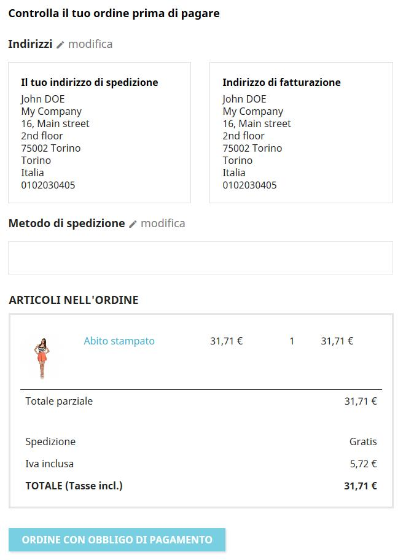

**Condizioni di Servizio**

Abilita questa opzione per richiedere ai clienti di accettare le condizioni di servizio durante il checkout. 

#### Impostazioni prodotti 

**Prezzo per unità**

A seconda della legislazione locale, può essere richiesto di visualizzare un prezzo unitario per i prodotti che possono essere quantificati con volume o massa \(€/kg o €/L ...\). È possibile impostare questo prezzo per unità nella pagina di configurazione del prodotto:  
  
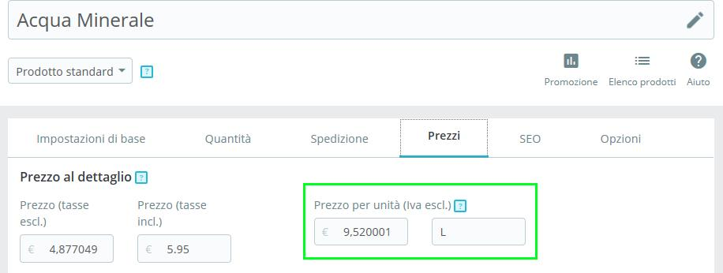

**Riepilogo dettagli prodotto**

Nel riepilogo del carrello della spesa \(sia nella pagina del carrello sia nel [riepilogo finale](conformarsi-con-la-legislazione-europea.md#Conformarsiconlalegislazioneeuropea-riepilogofinale)\), per impostazione predefinita, solo gli attributi di combinazione prodotti verranno visualizzati nel riepilogo del carrello. A questo punto potrebbe essere necessario visualizzare altri dettagli pertinenti al prodotto. Per aggiungere queste informazioni una soluzione alternativa è creare attributi.

Per esempio, supponiamo che stai vendendo una televisione e che sia necessario visualizzare la sua diagonale nel riepilogo del carrello della spesa.  

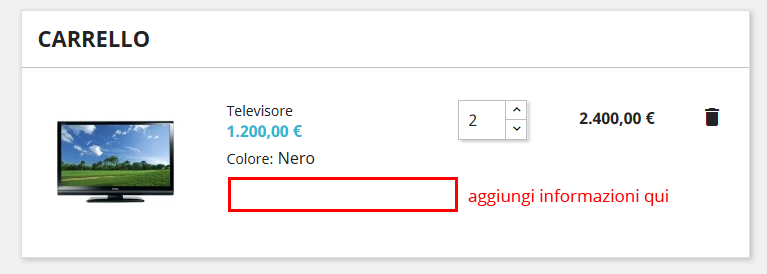

1. In VENDI / Catalogo / Attributi & Caratteristiche, vai su "Aggiungi nuovo attributo", nominalo “Diagonale" con nome pubblico "Diag.", seleziona il tipo di attributo “Pulsante Scelta Rapida" e salva.
2. Torna in VENDI / Catalogo / Attributi & Caratteristiche, clicca sull’attributo appena creato "Diagonale" che trovi nella scheda.
3. Quindi vai su "Aggiungi nuovo valore", imposta "138 cm \(55''\)" e salva.
4. In VENDI / Catalogo / Attributi & Caratteristiche / Televisione, seleziona il pulsante di scelta rapida 'Prodotto con combinazioni' nella prima scheda 'Impostazioni Basiche"
5. Nella seconda scheda 'Combinazioni', seleziona "138 cm \(55''\)" in Diag. \(o digitalo nella barra testo\). Quindi genera la combinazione.
6. Ora hai un dettaglio addizionale nel riepilogo del carrello.

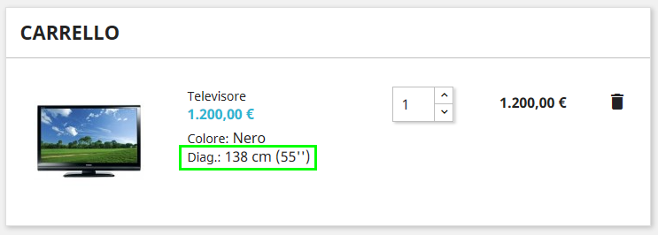

#### Impostazioni di spedizione 

**Tempo di transizione personalizzato per corriere**

Se hai creato un corriere personalizzato \(in MIGLIORA / Spedizione / Corrieri\), accertati che il **campo tempo di transizione** **non contraddica l’**[etichetta tempo di consegna](conformarsi-con-la-legislazione-europea.md#Conformarsiconlalegislazioneeuropea-tempidiconsegna) [impostata nel modulo Conformità Legale.   
](file:///C:/Serena/LAVORO/PRESTASHOP/Complying+with+the+European+legislation%20_Conformarsi+con+la+legislazione+europea.doc#ComplyingwiththeEuropeanlegislation-del)

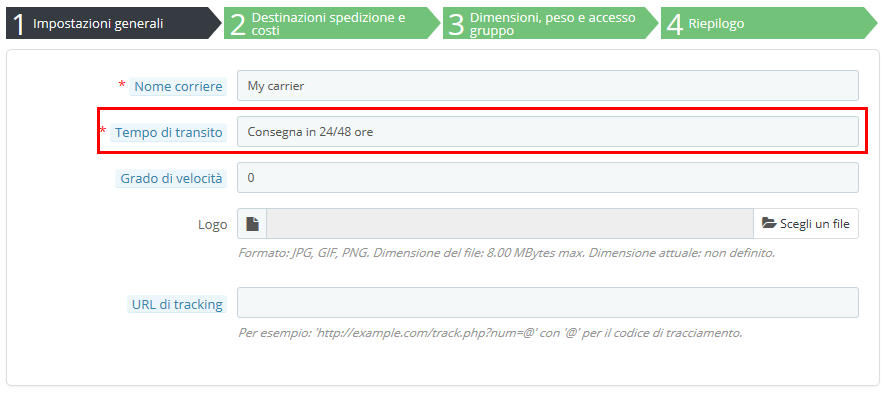

**Tariffe doganali speciali**

In paesi come la Svizzera, possono essere aggiunte ulteriori tasse quando il prodotto attraversa il confine. Per informare il cliente di queste tasse puoi modificare il campo di transito del tuo corriere svizzero \(se lo hai creato manualmente\).

Potrebbe essere necessario aggiungere dettagli su come iscriversi alla newsletter. A tal fine è possibile modificare il testo in "Condizioni della Newsletter" dalla pagina di configurazione del modulo.

#### Iscrizione alla newsletter 

Potrebbe essere necessario aggiungere dettagli su come annullare l’iscrizione al servizio newsletter. A tal proposito puoi modificare il testo nelle "Condizioni della Newsletter" dalla pagina di configurazione del modulo Sottoscrizione Email:

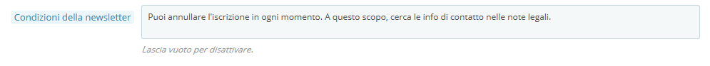

Nel front-office:  
  
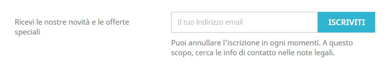

#### Modulo di rassicurazione cliente 

Questo modulo mostra ulteriori informazioni per rassicurare i tuoi clienti. Per impostazione predefinita non ha alcun contenuto di esempio, ma sta a te \(e ai tuoi consulenti legali\) inserire un testo pertinente. Ad esempio, è possibile specificare informazioni sulla procedura di reso, sulle spese di spedizione e sulla sicurezza dei dati. Fai attenzione a non inserire qualcosa in contraddizione con altre indicazioni.

#### Modulo bonifico bancario 

In alcuni Paesi la modalità di pagamento con bonifico bancario prevede che il cliente attenda la conferma d’ordine prima di effettuare il pagamento. Assicurati di disattivare "Visualizza l'invito a pagare nella pagina di conferma dell'ordine" nella configurazione del modulo in modo che il cliente riceva l'invito a pagare solo via email.

#### Impostazioni tasse 

**Mostra tasse nel carrello**

In alcuni Paesi potrebbe essere necessario mostrare l'importo totale delle tasse nel carrello. A tal fine, accertati che sia abilitata l'opzione "Mostra tasse nel carrello". Si visualizzerà l'importo totale delle tasse in una linea distinta del riepilogo del carrello.

#### Pagine Statiche 

#### \[da completare\]  

### Elementi esterni o graditi 

#### Legislazione sui Cookie 

#### \[da completare\]  

Sicurezza delle password

Potrebbe anche essere richiesto di proteggere i tuoi clienti da hacker e dal furto delle password. A tal fine è possibile acquistare un modulo su PrestaShop Marketplace:

[http://addons.prestashop.com/en/23824-login-sheriff-pro.html?pab=1&](http://addons.prestashop.com/en/23824-login-sheriff-pro.html?pab=1&)

#### Spese di pagamento 

#### \[da completare\]  

Prodotti elettronici

#### \[da completare\]  

## Cosa è ancora di tua responsabilità

I moduli principali e nativi di PrestaShop consentono di rispettare tutti i requisiti funzionali necessari per le autorità di competenza.

Tuttavia, ci sono alcuni elementi come i contenuti o i moduli esterni specifici del tuo negozio di cui è tua responsabilità assicurarti che siano conformi. Questi elementi sono:

* I contenuti legali delle pagine statiche
* Moduli di pagamento
* Moduli newsletter
* Moduli di spedizione

