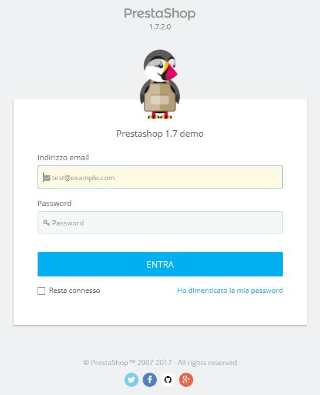
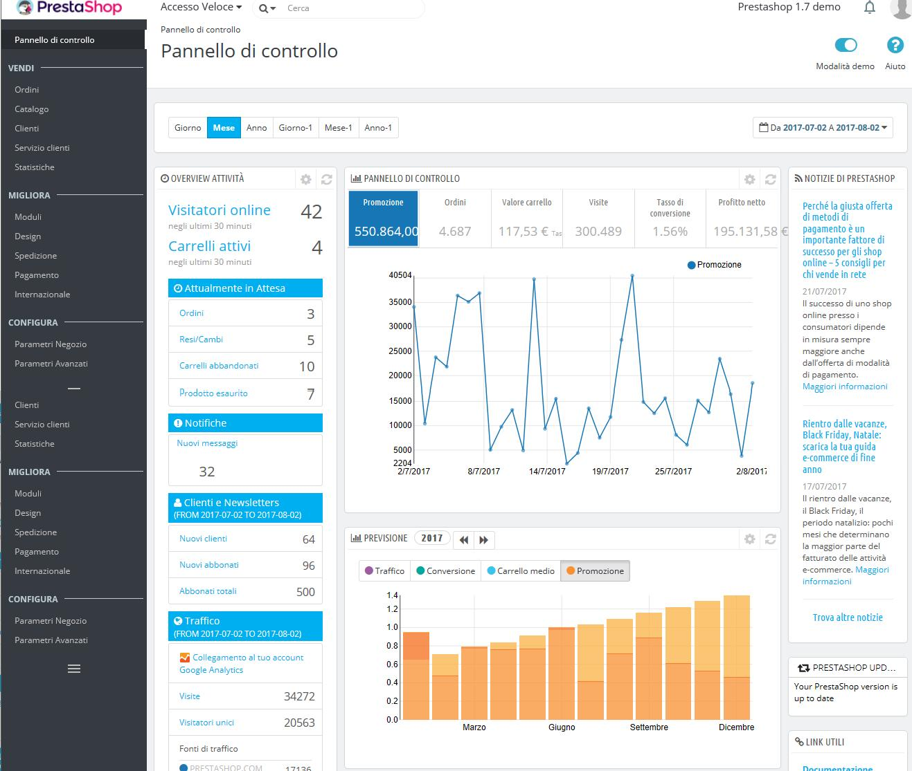

# Connettersi al back office di PrestaShop

Il back office di PrestaShop è il pannello di amministrazione del tuo sito PrestaShop, così chiamato in questa guida per l'utente. È in questo pannello che trascorrerai la maggior parte del tuo tempo, in quanto tutto ciò che l'utente vede viene gestito direttamente da qui: aggiungere / modificare / rimuovere prodotti, gestire i corrieri, creare pacchetti, creare vouchers, mantenere i contatti con i clienti, migliorare il tuo negozio, ecc.

Durante il processo di installazione la cartella `/admin` è rinominata con un nome univoco all’interno del tuo negozio \(per esempio, `/admin091anufki`\), \), per ragioni di sicurezza. Usa il nome di questa cartella per accedere al tuo negozio \(per esempio: http://www.esempio.com/admin091anufki\).

La modifica del nome viene effettuata automaticamente da PrestaShop. Fai attenzione a memorizzare la cartella la prima volta che accedi dopo l'installazione!

Vedrai la pagina di login del pannello di controllo del tuo negozio.

Inserisci l'indirizzo e-mail e la password con cui ti sei registrato quando hai installato PrestaShop. Clicca sul pulsante "Accedi" e atterrerai sul cruscotto del back office, una sorta di pagina di benvenuto del pannello di controllo.

Da questo passo in poi puoi iniziare a configurare il tuo negozio e vendere prodotti ai tuoi clienti.

Leggi il capitolo successivo di questa guida utente, denominato "Scoprire l'Area di Amministrazione", per comprendere tutte le diverse sezioni del back office.

