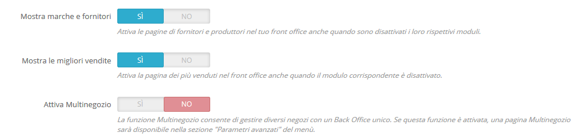

# Gestire Negozi Multipli

Una delle grandi caratteristiche di PrestaShop è chiamata "Multinegozio” e consiste nella capacità di gestire più negozi dallo stesso back office.

Grazie a questa funzionalità, puoi gestire molti negozi personalizzati che condividono molti elementi comuni. Per una maggiore efficienza, puoi anche creare gruppi di negozi.

## Come decidere se hai bisogno della funzionalità Multinegozio 

Puoi darsi che la funzionalità Multinegozio non sia necessaria. Ad esempio, se desideri un negozio multilingue, utilizzare più di una valuta oppure impostare un template grafico diverso per ciascuna categoria non è necessario.

Ecco due domande che dovresti porti prima di decidere se abilitare la funzionalità Multinegozio:

1. Vuoi che i tuoi negozi abbiano un prezzo diverso per gli stessi prodotti \(oltre agli sconti speciali per un cliente o un gruppo di clienti\)? **Se la risposta è "Sì", allora è necessario utilizzare la funzionalità Multinegozio**.
2. Quando un cliente acquista in un negozio, vuoi che NON abbia accesso alla cronologia degli ordini e alle fatture dell'altro negozio \(anche se il cliente ha le stesse credenziali di accesso in entrambi i negozi\) **Se la risposta è "Sì", allora devi utilizzare la funzionalità Multinegozio**: i negozi non condividono i loro carrelli e ordini e coloro che mettono gli oggetti nel proprio carrello del negozio 1 non vedranno questi articoli nel carrello del negozio 2. 

Se la risposta è “No” in entrambi i casi la non è necessaria funzionalità Multinegozio. 

## Abilitare la funzionalità Multinegozio 

Modificare PrestaShop da negozio singolo a multishop è molto semplice:

1. Accedi all'account amministratore del tuo negozio.
2. Vai al menu "Parametri del negozio" e seleziona la pagina "Generali".
3. Individua l'opzione "Abilita Multinegozio", seleziona "Sì".
4. Salva le modifiche.

Ecco fatto: la funzionalità Multinegozio è ora attiva, con l'aggiunta della pagina "Multinegozio" sotto il menu "Parametri avanzati". Questa è la pagina in cui gestirai i vari negozi creati con l’installazione di PrestaShop.  
  
Usare la funzionalità Multinegozio

* [L'interfaccia Multinegozio](linterfaccia-multinegozio.md)
* [Creare un nuovo gruppo negozi](creare-un-nuovo-gruppo-negozi.md)
* [Creare un nuovo negozio](creare-un-nuovo-negozio.md)
* [Impostare l’URL di un negozio](impostare-lurl-di-un-negozio.md)
* [Esempi di Uso e Specifiche](esempi-di-uso-e-specifiche.md)

