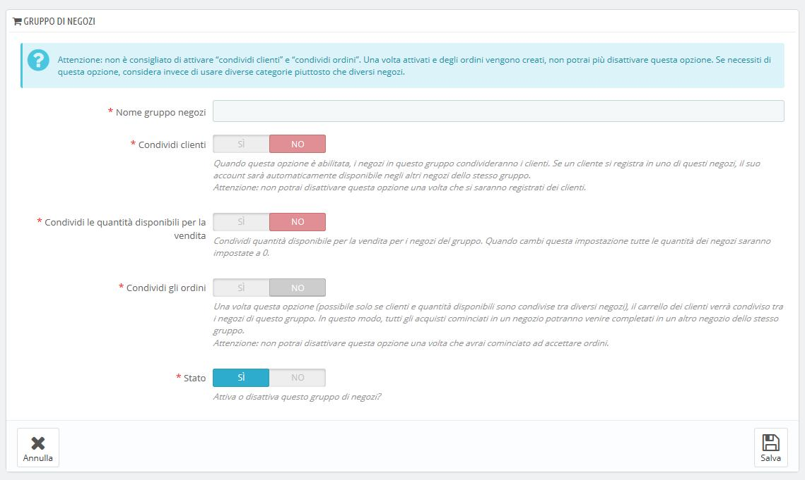

# Creare un nuovo gruppo negozi

Creare gruppi di negozi permette di condividere alcune caratteristiche tra i negozi di quel gruppo: catalogo, dipendenti, corrieri, moduli, ecc. Consente di gestire un insieme di negozi più facilmente di come si farebbe per un singolo negozio, ferma restando la possibilità di ottimizzare manualmente i dettagli di ogni negozio. Applicare nuovi parametri contemporaneamente a tutti i negozi di un gruppo richiede una sola singola azione. Nella modalità multistore è disponibile un menu a discesa sulla maggior parte delle pagine di amministrazione che consente di filtrare le modifiche di un negozio o di un gruppo di negozi.

Tecnicamente, quando si seleziona un gruppo di negozi nel menu a discesa multistore, le entità visualizzate riflettono l'**unione** delle entità relative ai negozi di quel gruppo.  
In generale, i parametri vengono applicati a tutte le entità selezionate nel menu a discesa multistore. Tutto ciò è spiegato più dettagliatamente in questo capitolo.

Cliccando il bottone "Aggiungi un nuovo gruppo negozi" compare un modulo con poche opzioni ma molto testo: è necessario leggere ogni descrizione dall'inizio alla fine, ti aiuterà a prendere una decisione su queste opzioni. Poiché alcune non sono reversibili \(non è possibile disattivarle una volta attivate\), è importante sapere esattamente ciò che viene abilitato.

Le impostazioni disponibili sono:

* **Nome gruppo negozi**. Il nome è privato, non verrà mostrato ai clienti. Accertati di usare un nome facilmente comprensibile: più gruppi di negozi avrai, più sarà necessario trovare rapidamente un determinato gruppo. Puoi modificare il nome in qualsiasi momento.
* **Condividi clienti**. _**Una volta attivata questa opzione non potrai disabilitarla**_. Si tratta di un’opzione molto utile che consente ai tuoi clienti di utilizzare le stesse credenziali di accesso per tutti i negozi di quel gruppo. 
* **Condividi le quantità disponibili per la vendita**. Puoi avere diverse quantità dello stesso prodotto in vendita nei tuoi negozi. Attraverso questa opzione i negozi del gruppo condivideranno la stessa quantità di prodotti. Ciò rende più semplice gestire le giacenze. 
* **Condividi gli ordini**. _**Una volta attivata questa opzione non potrai disabilitarla**_. Questa opzione può essere abilitata solo se sono state prima abilitate le opzioni "Condividi clienti" e "Condividi le quantità disponibili per la vendita". Con questa opzione, i clienti che sono connessi a qualsiasi negozio di questo gruppo potranno vedere la loro cronologia degli ordini per tutti i negozi del gruppo.
* **Stato**. È possibile scegliere di abilitare questo gruppo sin da subito, o in un secondo momento. È possibile abilitare / disabilitare un gruppo di negozi in qualsiasi momento.

Due gruppi di negozi non possono condividere clienti, carrelli o ordini

I gruppi di negozi esistenti possono essere modificati dall'elenco dei negozi nella prima pagina "Multistore": basta cliccare sull'icona "Modifica" a destra della riga del negozio per aprire il modulo. Come previsto, non è possibile modificare le opzioni "Condividi clienti" e "Condivisione ordini". 

