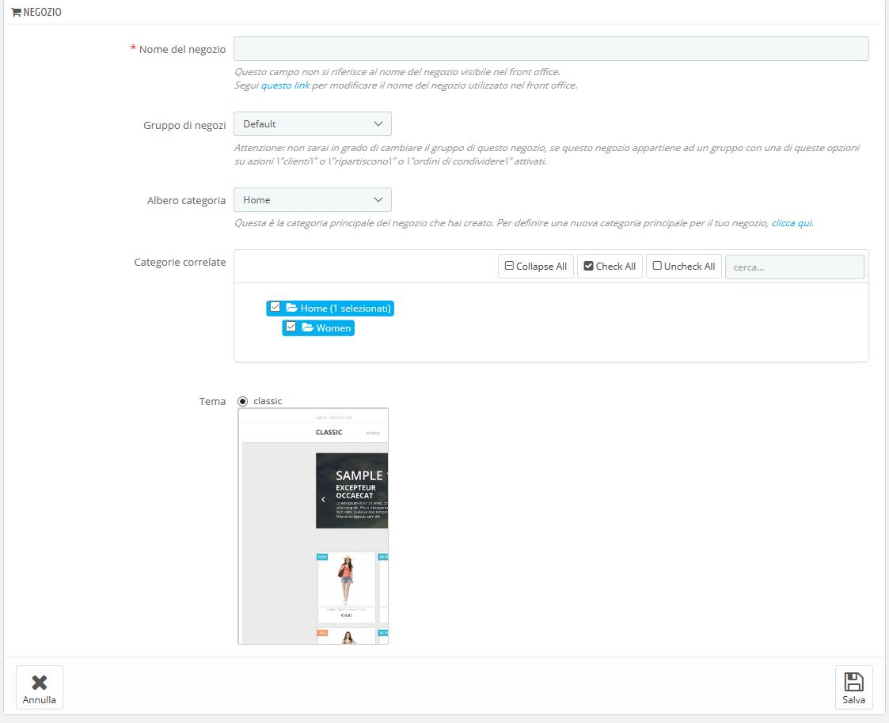
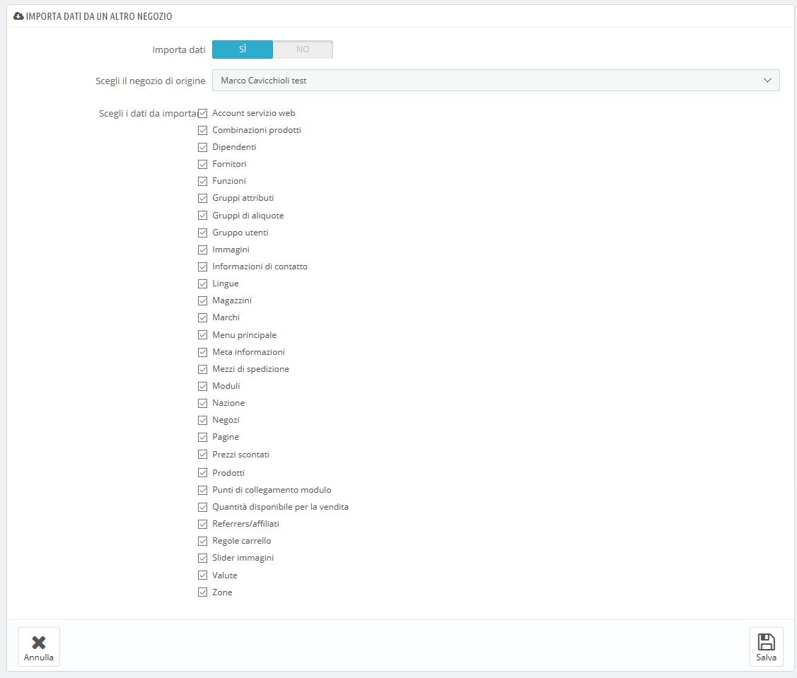

# Creare un nuovo negozio

Lo strumento di creazione negozio, che si trova nella pagina "Multistore", consente di definire, con semplicità e precisione, sia l'aspetto del front office del tuo negozio \(cioè il tema\) sia gli elementi da importare dal tuo negozio principale in quello nuovo.

Cliccando sul pulsante "Aggiungi nuovo negozio" si apre un modulo composto da due sezioni. La prima ha 5 opzioni: 

* **Nome del negozio**. Il nome è pubblico: i clienti lo vedranno in molti luoghi, come nel titolo del sito o nei riferimenti email. Accertati che descriva chiaramente il tuo negozio.  
* **Gruppo di negozi**. Un negozio può appartenere solo a un gruppo di negozi. Inoltre **deve** appartenere a un gruppo: non può esistere al di fuori di un gruppo di negozi. Nota: non potrai spostare il negozio da un gruppo a un altro se lo crei all'interno di un gruppo di negozi che ha una di queste 3 opzioni disattivate \("Condividi clienti", "Condividi quantità disponibili da vendere" o "Ordine degli ordini"\). 
* **Albero categoria**. Mentre la radice del catalogo è radice di categoria del tuo negozio principale, qualsiasi altro negozio può utilizzare la stessa radice o utilizzare qualsiasi altra categoria del catalogo come sua radice – di conseguenza utilizzare un sottoinsieme del catalogo principale come suo catalogo.
* **Categorie correlate**. Oltre a essere in grado di limitare un catalogo di un negozio a un sottoinsieme del catalogo principale \(si veda l'opzione "Albero categoria" sopra\), è possibile scegliere solo alcune sotto categorie della categoria principale da rendere disponibili nel nuovo negozio.
* **Tema**. Puoi utilizzare uno dei temi disponibili come tema per questo negozio. In pratica ciò consente di disporre dello stesso catalogo in due negozi completamente diversi, con un tema diverso, URL diverso o anche prezzi differenti.

La seconda sezione, "Importa dati da un altro negozio” è utile a definire quali dati del negozio principale desideri usare negli altri negozi. 

Presenta le opzioni:

* **Importa dati**. Se disattivato, il tuo negozio non condividerà alcun dato con nessun altro negozio e la sezione si chiuderà. Questa funzione è utile quando si desidera gestire due negozi completamente diversi con un'unica installazione di PrestaShop, ciò significa che, condividendo i dati non dovrai ricreare corrieri, valute o moduli, ad esempio. Pondera bene questa scelta, perché non potrai più tornare indietro.
* **Scegli il negozio di origine \(fonte\)**. Se si desidera importare i dati, è necessario indicare da quale dei negozi esistenti si desidera importare tali dati. Se hai già definito un “sotto negozio” del negozio principale, questo ti aiuterà a creare una "copia" di quel “sotto negozio”, anziché dover nuovamente impostare le diverse opzioni di importazione.
* **Scegli i dati da importare**. Qui decidi quali tipi di dati desideri importare dal negozio di origine. Occorre importare tutti i moduli, anche se significa disattivarne alcuni, in quanto l'intero front office viene visualizzato attraverso i moduli e alcune parti principali del back office si basano anche su moduli.

Quando crei un prodotto in un nuovo negozio che esiste già in un altro negozio, PrestaShop farà del meglio per suggerirti il prodotto già esistente, in modo che non dovrai ricreare tutto.

Quando salvi il negozio, PrestaShop ti avverte che non dispone ancora di un URL. Clicca sull'avviso rosso per aggiungerne uno \(vedi sotto\).

