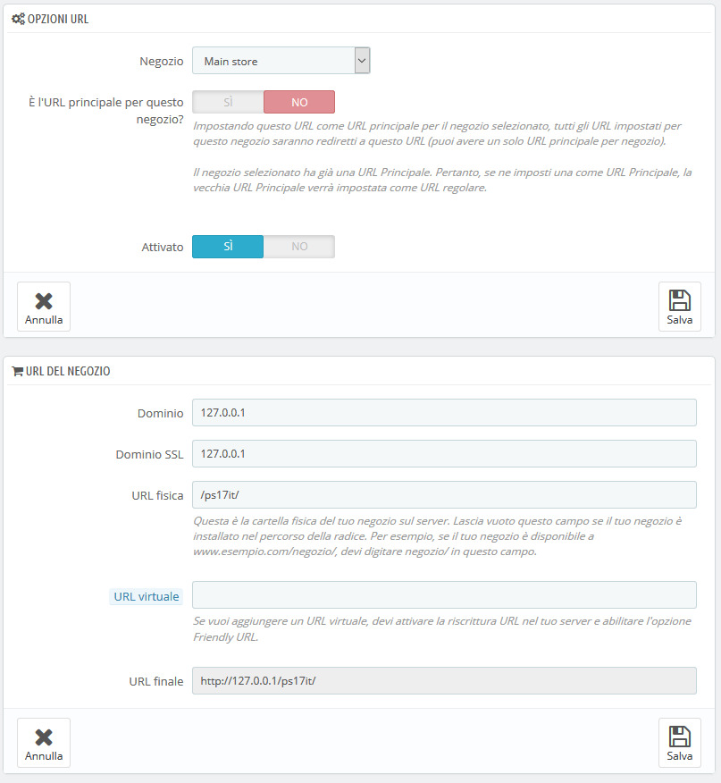

# Impostare l’URL di un negozio

**Impostare l’URL di un negozio**

Ogni negozio può avere un proprio indirizzo web (URL) o più indirizzi interauomote indipendenti dal negozio principale (il primo negozio che hai installato).

È necessario definire aluomoo un indirizzo web per ogni negozio.

**Due negozi non possono condividere lo stesso indirizzo**. Se si tenta di dare a un nuovo negozio un indirizzo già utilizzato, PrestaShop mostrerà un errore.

D’altronde, puoi avere tanti negozi su un nome di dominio quanti desideri:

*   Utilizzando sottocartelle: [http://www.esempio.com/uomo/](http://www.esempio.com/uomo/), [http://www.esempio.com/donna/](http://www.esempio.com/donna/), [http://www.esempio.com/bimbi/](http://www.esempio.com/bimbi/), http: //[www.esempio.com](http://www.esempio.com) /animalidomestici / ecc.

    Nel caso di negozi con sottocartelle, assicurati di creare due URL per ogni negozio: uno con "www" e uno senza!

    Ad esempio: [http://www.esempio.com/uomo/](http://www.esempio.com/uomo/) e [http://esempio.com/uomo/\
    ](http://esempio.com/uomo/)\
    Altrimenti, i clienti che cercano di accedere al tuo negozio secondario senza il "www." nell'URL verranno reindirizzati al tuo negozio principale.
* Utilizzando sottodomini: [http://uomo.esempio.com/](http://uomo.esempio.com), [http://donna.esempio.com/](http://donna.esempio.com), [http://bimbi.esempio.com/](http://bimbi.esempio.com), [http://animalidomestici.esempio.com/](http://animalidomestici.esempio.com), ecc.

Non creare alcun sottodominio o sottocartella da solo sul tuo server o sul tuo computer: PrestaShop cura la creazione del percorso per il tuo server. Quando il cliente richiede questo percorso, PrestaShop riconosce il negozio e serve automaticamente i file e i dati per il negozio corretto.

Naturalmente, un negozio può anche avere il proprio nome di dominio.

Usare un nome di dominio

Se si desidera utilizzare un nome di dominio diverso per il proprio negozio supplementare piuttosto che un sottodominio/sottocartella, è necessario configurare il dominio per specificare la cartella in cui si trova in PrestaShop. La riscrittura dell'URL è poi eseguita da PrestaShop.

In alternativa, è possibile creare un alias per il tuo nome di dominio che reindirizza l’URL assoluto in cui si trova l'installazione di PrestaShop. Il modo per raggiungere questo obiettivo dipende dal pannello di controllo e dalle opzioni che l'azienda di hosting ti fornisce: "Alias" per Plesk, "Inoltra" per CPanel, "Aliasdomain" per ISPConfig, ecc.

Per aggiungere un URL a un negozio, seleziona il negozio nel selettore "Albero Multinegozio" e quindi clicca sul pulsante "Aggiungi nuovo URL". PrestaShop caricherà uno schermata con due sezioni e otto opzioni:\

* **Opzioni URL**.
  * **Negozio**. Un promemoria del negozio a cui stai aggiungendo un URL. Puoi anche passare semplicemente a un altro negozio.
  * **URL Principale**. Attivandolo indichi se desideri che tutti gli altri URL di questo negozio siano reindirizzati a questo URL principale (cambierà qualsiasi altro URL da principale a URL normale).
  * **Stato**. Puoi attivare e disattivare un URL in ogni momento.
* **URL Negozio**.
  * **Dominio**. Il nome di dominio del negozio stesso. Non deve limitarlo al nome di dominio: è possibile indicare un sotto-dominio se necessario. Assicurati di non aggiungere '`http://`', o '`/`'. Esempio: [`www.esempio.com`](http://www.example.com) o [`bimbi.esempio.com`](http://kids.example.com).
  * **Dominio SSL**. Se il dominio SSL è diverso dal dominio principale, assicurati di indicarlo in questo campo. Esempio: [`www.esempio.com`](http://www.example.com) o [`bimbi.esempio.com`](http://kids.example.com).
  * **URI Fisico**. Qui è necessario impostare il percorso fisico dell'installazione effettiva sul server. Se il negozio è alla radice del dominio o del sottodominio, lascia vuoto questo campo. Esempio: `/` o `/bimbi/`.
  * **URI Virtuale**. Puoi rendere il negozio disponibile in modo trasparente ai clienti attraverso questa opzione: grazie alla potenza della riscrittura URL, puoi visualizzare il tuo negozio senza dover creare una sottocartella. Naturalmente deve essere abilitata in PrestaShop la riscrittura dagli URL (che significa Friendly URL, vedi la pagina "SEO & URL" in "traffico” e "Parametri del negozio"). Esempio: `/scarpe/`. Si noti che funziona solo per i negozi con sottocartelle, non per i negozi con sottodomini.
  * **Il tuo URL finale sarà**. Fornisce l'impatto che le impostazioni dell’URL avranno sul sito web completo nel tuo negozio.

