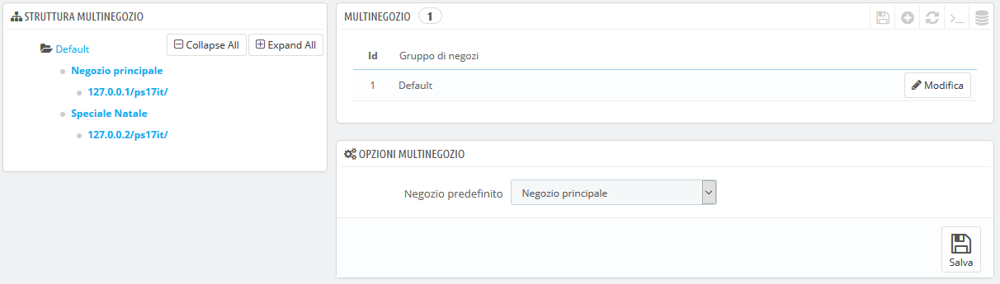
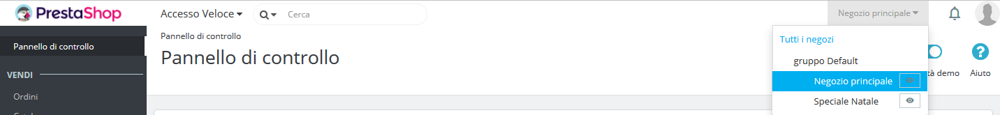

# L'interfaccia Multinegozio

## Gestire i tuoi Negozi 

La pagina "Multinegozio" comprende tre sezioni principali:

* **Struttura Multinegozio**. Dà un'occhiata ai gruppi di negozio, ai relativi negozi e anche ai vari URL di un singolo negozio. Per impostazione predefinita, c'è solo un negozio nel gruppo predefinito: il negozio principale.
* **Tabella dei gruppi di negozio**. Elenca i gruppi di negozi disponibili. Puoi modificarli cliccando sull'icona "Modifica" a destra.
* **Opzioni Multinegozio**. Elenca le opzioni disponibili per i negozi esistenti.
  * **Negozio di default.** Il negozio di default è quello che serve come canale centrale per tutti gli altri, condivide i suoi dettagli con altri negozi \(prodotti, corrieri, ecc.\) ed è quello che viene mostrato accedendo all'amministrazione.

## Un back office per gestire tutto 

Quando la funzionalità Multinegozio è abilitata per l'installazione di PrestaShop, molti aspetti su base negozio o su base gruppo diventano personalizzabili.

Per aiutarti a capire a quale negozio si applicano le modifiche, PrestaShop aggiunge un selettore a discesa in cima a ogni schermata, da cui è possibile scegliere l'ambito di applicazione delle modifiche:

* Applica a tutti i tuoi negozi di questa installazione di PrestaShop.
* Applica solo ai negozi del gruppo negozio selezionato.
* Applica solo al negozio selezionato.

Questo selettore di negozi ti aiuta a sapere in quale negozio stai lavorando.

Detto questo, una volta che la modalità Multinegozio è in atto, molte delle impostazioni regolari possono essere modificate solo su scala globale \(tutti i negozi\), \(parametri internazionali, negozio e avanzate, amministrazione\) e quindi le opzioni sono disabilitate in qualsiasi altra selezione. Tuttavia, è possibile modificare queste impostazioni su scala più locale \(per gruppi di negozio o per negozio\) se necessario.

Infatti, le pagine d’impostazione sono regolari quando il selettore di negozi è su "Tutti i negozi", mentre in qualsiasi altra selezione \(gruppo di negozi o negozio singolo\) dispongono di opzioni aggiuntive:

* Un'opzione "Sì/No" nella parte superiore di ogni sezione della pagina impostazioni.
* Una casella selezionabile, accanto a ciascuna opzione.

Servono entrambe allo stesso scopo: abilitare opzioni che altrimenti sarebbero disattivate nel contesto del negozio. È possibile selezionare le opzioni che si desidera abilitare oppure è attivare tutte le opzioni della sezione tramite l'opzione Sì/No. Una volta abilitata, sta a te modificare il valore di ciascuna opzione: cliccando sulla casella o modificando l'opzione Sì/No non si cambia alcuna impostazione, fatta eccezione per quel contesto.

Tuttavia, alcune opzioni non possono essere modificate in un contesto locale: visualizzerai "Non è possibile modificare il valore di questo campo di configurazione nel contesto di questo negozio".

La seguente tabella indica se un elemento può essere personalizzato per un singolo negozio, per un gruppo di negozi o per tutti i negozi contemporaneamente.

<table>
  <thead>
    <tr>
      <th style="text-align:left">Elemento</th>
      <th style="text-align:left">Per negozio</th>
      <th style="text-align:left">Per gruppi di negozi</th>
      <th style="text-align:left">Tutti i negozi</th>
    </tr>
  </thead>
  <tbody>
    <tr>
      <td style="text-align:left">Dipendenti</td>
      <td style="text-align:left">X</td>
      <td style="text-align:left">X</td>
      <td style="text-align:left">X</td>
    </tr>
    <tr>
      <td style="text-align:left">Gruppi Clienti</td>
      <td style="text-align:left">X</td>
      <td style="text-align:left">X</td>
      <td style="text-align:left">X</td>
    </tr>
    <tr>
      <td style="text-align:left">Prodotti</td>
      <td style="text-align:left">X</td>
      <td style="text-align:left">X</td>
      <td style="text-align:left">X</td>
    </tr>
    <tr>
      <td style="text-align:left">&#x2014; Prezzi</td>
      <td style="text-align:left">X</td>
      <td style="text-align:left">X</td>
      <td style="text-align:left">X</td>
    </tr>
    <tr>
      <td style="text-align:left">&#x2014; Combinazioni di Prezzi</td>
      <td style="text-align:left">X</td>
      <td style="text-align:left">X</td>
      <td style="text-align:left">X</td>
    </tr>
    <tr>
      <td style="text-align:left">&#x2014; Lingua</td>
      <td style="text-align:left">X</td>
      <td style="text-align:left">X</td>
      <td style="text-align:left">X</td>
    </tr>
    <tr>
      <td style="text-align:left">&#x2014; Immagini Multiple (<b>ad eccezione dell&#x2019;immagine principale)</b>
      </td>
      <td style="text-align:left">X</td>
      <td style="text-align:left">X</td>
      <td style="text-align:left">X</td>
    </tr>
    <tr>
      <td style="text-align:left">
        
&#x2014; Quantit&#xE0; disponibili per la vendita, a condizione che:

        <ul>
          <li>L&#x2019;opzione &quot;Quantit&#xE0; condivisa disponibile per la vendita
            &quot; &#xE8; selezionata per i il gruppo,</li>
          <li>Il gruppo non condivide le sue quantit&#xE0; disponibili per la vendita
            fuori dal gruppo.</li>
        </ul>
      </td>
      <td style="text-align:left">X</td>
      <td style="text-align:left">X</td>
      <td style="text-align:left"></td>
    </tr>
    <tr>
      <td style="text-align:left">&#x2014; Tutte le altre informazioni (descrizione, tag, friendly URL,
        ecc.)</td>
      <td style="text-align:left">X</td>
      <td style="text-align:left">X</td>
      <td style="text-align:left">X</td>
    </tr>
    <tr>
      <td style="text-align:left">Attributi e valori del catalogo</td>
      <td style="text-align:left">X</td>
      <td style="text-align:left">X</td>
      <td style="text-align:left">X</td>
    </tr>
    <tr>
      <td style="text-align:left">Sconti: regole del carrello</td>
      <td style="text-align:left">X</td>
      <td style="text-align:left"></td>
      <td style="text-align:left"></td>
    </tr>
    <tr>
      <td style="text-align:left">Sconti: regole dei prezzi del catalogo</td>
      <td style="text-align:left">X</td>
      <td style="text-align:left"></td>
      <td style="text-align:left"></td>
    </tr>
    <tr>
      <td style="text-align:left">Tasse: aliquote</td>
      <td style="text-align:left">X</td>
      <td style="text-align:left">X</td>
      <td style="text-align:left">X</td>
    </tr>
    <tr>
      <td style="text-align:left">Categorie (<b>ad eccezione dell&#x2019;immagine principale)</b>
      </td>
      <td style="text-align:left">X</td>
      <td style="text-align:left">X</td>
      <td style="text-align:left">X</td>
    </tr>
    <tr>
      <td style="text-align:left">Corrieri</td>
      <td style="text-align:left">X</td>
      <td style="text-align:left">X</td>
      <td style="text-align:left">X</td>
    </tr>
    <tr>
      <td style="text-align:left">Magazzini</td>
      <td style="text-align:left">X</td>
      <td style="text-align:left">X</td>
      <td style="text-align:left">X</td>
    </tr>
    <tr>
      <td style="text-align:left">Gestione avanzata degli stock</td>
      <td style="text-align:left">X</td>
      <td style="text-align:left"></td>
      <td style="text-align:left"></td>
    </tr>
    <tr>
      <td style="text-align:left">Fornitori</td>
      <td style="text-align:left">X</td>
      <td style="text-align:left">X</td>
      <td style="text-align:left">X</td>
    </tr>
    <tr>
      <td style="text-align:left">Marchi</td>
      <td style="text-align:left">X</td>
      <td style="text-align:left">X</td>
      <td style="text-align:left">X</td>
    </tr>
    <tr>
      <td style="text-align:left">Pagine CMS</td>
      <td style="text-align:left">X</td>
      <td style="text-align:left">X</td>
      <td style="text-align:left">X</td>
    </tr>
    <tr>
      <td style="text-align:left">Contatti</td>
      <td style="text-align:left">X</td>
      <td style="text-align:left">X</td>
      <td style="text-align:left">X</td>
    </tr>
    <tr>
      <td style="text-align:left">Nazioni
         Status dei Paesi (attivi o inattivi) comune a tutti i negozi associati</td>
      <td
      style="text-align:left">X</td>
        <td style="text-align:left">X</td>
        <td style="text-align:left">X</td>
    </tr>
    <tr>
      <td style="text-align:left">Valute</td>
      <td style="text-align:left">X</td>
      <td style="text-align:left">X</td>
      <td style="text-align:left">X</td>
    </tr>
    <tr>
      <td style="text-align:left">Lingue</td>
      <td style="text-align:left">X</td>
      <td style="text-align:left">X</td>
      <td style="text-align:left">X</td>
    </tr>
    <tr>
      <td style="text-align:left">Moduli</td>
      <td style="text-align:left">X</td>
      <td style="text-align:left">X</td>
      <td style="text-align:left">X</td>
    </tr>
    <tr>
      <td style="text-align:left">&#x2014; Hooks ed eccezioni</td>
      <td style="text-align:left">X</td>
      <td style="text-align:left">X</td>
      <td style="text-align:left">X</td>
    </tr>
    <tr>
      <td style="text-align:left">&#x2014; Attiva/Disattiva</td>
      <td style="text-align:left">X</td>
      <td style="text-align:left">X</td>
      <td style="text-align:left">X</td>
    </tr>
    <tr>
      <td style="text-align:left">&#x2014; Configurazione (for esempio credenziali PayPal)</td>
      <td style="text-align:left">X</td>
      <td style="text-align:left"></td>
      <td style="text-align:left"></td>
    </tr>
    <tr>
      <td style="text-align:left">Moduli di Pagamento</td>
      <td style="text-align:left">X</td>
      <td style="text-align:left">X</td>
      <td style="text-align:left">X</td>
    </tr>
    <tr>
      <td style="text-align:left">&#x2014; Restrizioni per Nazione</td>
      <td style="text-align:left">X</td>
      <td style="text-align:left"></td>
      <td style="text-align:left"></td>
    </tr>
    <tr>
      <td style="text-align:left">&#x2014; Restrizioni per Valuta</td>
      <td style="text-align:left">X</td>
      <td style="text-align:left"></td>
      <td style="text-align:left"></td>
    </tr>
    <tr>
      <td style="text-align:left">&#x2014; Restrizioni per gruppo clienti</td>
      <td style="text-align:left">X</td>
      <td style="text-align:left"></td>
      <td style="text-align:left"></td>
    </tr>
    <tr>
      <td style="text-align:left">Friendly URLs</td>
      <td style="text-align:left">X</td>
      <td style="text-align:left"></td>
      <td style="text-align:left"></td>
    </tr>
    <tr>
      <td style="text-align:left">Scene</td>
      <td style="text-align:left">X</td>
      <td style="text-align:left">X</td>
      <td style="text-align:left">X</td>
    </tr>
    <tr>
      <td style="text-align:left">Account servizi web</td>
      <td style="text-align:left">X</td>
      <td style="text-align:left">X</td>
      <td style="text-align:left">X</td>
    </tr>
    <tr>
      <td style="text-align:left">Slider Immagini della Homepage</td>
      <td style="text-align:left">X</td>
      <td style="text-align:left"></td>
      <td style="text-align:left"></td>
    </tr>
  </tbody>
</table>

Note

**Categorie:** un prodotto può apparire solo in una determinata categoria di un negozio se è stato associato a quella categoria nel contesto di quel negozio. In altre parole: se il negozio A e il negozio B hanno la categoria C in comune, è possibile associare il prodotto P alla categoria C per il contesto del negozio A e P non comparirà nella categoria C del negozio B.

**Corrieri:** è possibile gestire l'associazione dei corrieri su base per negozio, per gruppo di negozi o per tutti i negozi; ma non puoi personalizzare un corriere su base per negozio. È necessario duplicare il corriere se desideri utilizzarlo con fasce di prezzo diverse nei due negozi.

**Magazzini:** Mentre la gestione avanzata delle scorte può essere utilizzata solo per un singolo negozio alla volta, i magazzini possono essere utilizzati con i gruppi di negozi e basta semplicemente gestire i magazzini per gestire in modo avanzato le scorte.

Per ogni negozio puoi impostare prezzi specifici di ogni prodotto, condividere una parte del catalogo o tutto, modificare le immagini del prodotto, ecc.

Puoi scegliere di condividere gli account dei clienti tra i tuoi negozi, consentendo ai tuoi clienti di utilizzare le credenziali in tutti i negozi e perfino di accedere trasparentemente in ciascuno di essi.

Attraverso la gestione avanzata delle scorte, puoi gestire in modo raffinato le associazioni tra i tuoi negozi e il magazzino.

