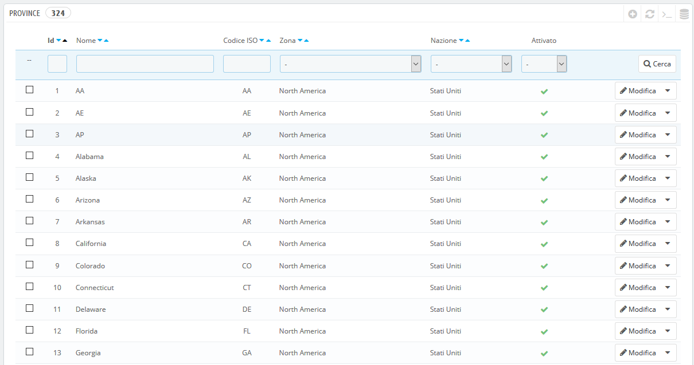
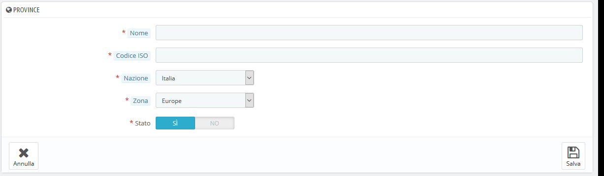

# Province

Per "Province", PrestaShop intende le divisioni amministrative di primo livello di un Paese. Negli Stati Uniti sono chiamati _States_; in Italia regioni; in Francia _régions_; nel Regno Unito _regions_.

Per impostazione predefinita, PrestaShop fornisce un insieme di Stati: 54 Stati e territori statunitensi, 31 _estados_ messicani, 13 province e territori canadesi, 34 _provinsi_ indonesiani, 24 _provincias_ argentine, 47 _todosfuken_ giapponesi e 110 province italiane.

Avere Stati definiti correttamente nel tuo database aiuta a rappresentare meglio le possibilità di consegna dei vostri corrieri. Questi Stati possono essere essenziali per il calcolo delle imposte, a seconda del Paese. È quindi importante immettere tutte le divisioni amministrative di un determinato Paese se sono importanti per i vostri corrieri. Puoi trovare un elenco di tali divisioni in questa pagina di Wikipedia: [http://it.wikipedia.org/wiki/Temnico\_di\_administrazioni\_divizioni\_di\_country](http://it.wikipedia.org/wiki/Temnico_di_administrazioni_divizioni_di_country).

Il modulo di indirizzi PrestaShop elenca solo gli Stati disponibili per il cliente. Pertanto, assicurati di utilizzare un elenco sensibile quando aggiungi un contenuto all'elenco di Stati. Questo è il motivo per cui, ad esempio, l'elenco contiene la provincia italiana \(divisioni amministrative di secondo livello\) piuttosto che le regioni \(divisioni amministrative di primo livello\).

## Aggiungere una nuova Provincia 

Creiamo un nuovo stato. Clicca sul pulsante "Aggiungi nuovo Stato" per accedere al form di creazione.  

* **Nome.** Il nome della Provincia per specificarlo sulle fatture e sul pacchetto. Dovrebbe quindi essere nella lingua del Paese dello Stato.
* **Codice ISO. Codice ISO-3166-2 dello Stato:**
  1. Vai in questa pagina Wikipedia: [http://it.wikipedia.org/wiki/ISO\_3166-2](http://it.wikipedia.org/wiki/ISO_3166-2),
  2. Clicca sul codice di due lettere del Paese \(nella colonna "Alfabetico" della tabella principale della pagina di Wikipedia sopra citata\),
  3. Sulla stessa pagina, trovi il codice dello Stato \(dovrebbe essere in un elenco nella pagina o nel testo per i Paesi più piccoli\),
  4. Se esiste, rimuove il prefisso del Paese per mantenere il codice sotto i 4 caratteri. Ad esempio, la ISO 3166-2 completa per Devon, nel Regno Unito, è "GB-DEV". Utilizza semplicemente "DEV" come codice ISO dello Stato - è già collegato al Paese utilizzando l'elenco a discesa "Paese" di PrestaShop \(vedi passo successivo\).
* **Nazione.** Indica il Paese utilizzando l'elenco a discesa.
* **Zona.** Indica la sua zona geografica utilizzando l'elenco a discesa. Presta attenzione a non utilizzare la zona sbagliata, in quanto ciò può confondere le impostazioni di Paese e di zona di PrestaShop.
* **Stato.** Lo stato disabilitato non verrà proposto tra le opzioni quando un visitatore desidera registrarsi e creare un nuovo account.

