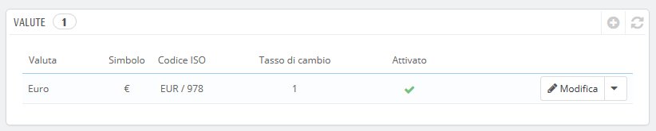
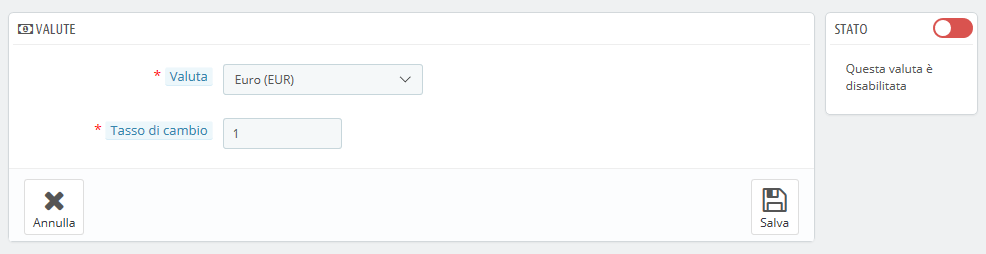

# Valute

PrestaShop accetta molteplici valute. Per impostazione predefinita la valuta standard del tuo negozio è quella del tuo Paese. Puoi però aggiungere e configurare nuove valute a seconda delle esigenze dei tuoi clienti. Questi ultimi, infatti, apprezzeranno vedere i prezzi nella propria valuta.  

Questa pagina è molto semplice ma fondamentale, in quanto riguarda i tassi di cambio delle valute. Per citare Wikipedia, "In finanza, un tasso di cambio tra due valute è il tasso in cui una valuta viene cambiata per un'altra. È anche considerato il valore della moneta di un Paese in riferimento a un'altra valuta. I tassi cambiano ogni giorno, a volte drasticamente a seconda degli eventi quotidiani e il tuo negozio dovrebbe essere sempre aggiornato con gli ultimi valori.

Per modificare la valuta predefinita è necessario andare alla pagina "Localizzazione" del menu "Localizzazione" e utilizzare l'opzione "Valuta predefinita" nella sezione "Configurazione".

Se la valuta che si desidera utilizzare non è disponibile in questa opzione è necessario importare la valuta da uno dei Paesi che la utilizzano, attraverso la sezione "Importa un pacchetto di localizzazione" della pagina "Localizzazione".

## Aggiornare i tassi di Valuta  

Puoi aggiornare i tassi di valuta in alto a destra della pagina, cliccando sul pulsante "Aggiorna i tassi di cambio". In questo modo scaricherai il file di aggiornamento dai server PrestaShop.com utilizzando il servizio web di PrestaShop.

Si noti che i tassi sono forniti dall’esterno: il team di PrestaShop presta attenzione nell’ottenere – e quindi fornire – tassi corretti in questi file, ma potrebbero essere leggermente diversi da quelli effettivi, già solo perché i tassi possono variare notevolmente in un tempo breve.

##  Aggiungere una nuova Valuta 

Il modo più semplice per aggiungere una valuta di un Paese è importare il suo pacchetto di localizzazione. Ciò avviene nella pagina "Localizzazione", sotto il menu "Internazionale". Una volta importato, per abilitarla, devi accedere alla pagina "Valute".

Potrebbe essere necessario aggiungere una valuta non presente nei pacchetti di localizzazione. In questo caso, è possibile utilizzare il modulo di creazione. Clicca su "Aggiungi nuova valuta", verrà visualizzata una nuova pagina:

* **Valuta**. Il nome della valuta, preferibilmente in Inglese, in modo che più clienti possibile possano comprendere. 
* **Tasso di Cambio**. Questo tasso va definito in base alla valuta predefinita del tuo negozio. Per esempio, se la valuta predefinita è l’Euro e la valuta da aggiungere è Dollari, digita "1.31", se 1€ vale $1.18 \(il valore mentre si sta redigendo questo documento\). Per supporto usa questo convertitore: [http://www.xe.com/it/currencyconverter/](http://www.xe.com/it/currencyconverter/). Se non conosci il tasso di cambio, inserisci 1 come valore durante la fase di creazione, poi per aggiornarlo clicca su “Aggiorna tasso di cambio”.
* **Stato**. Ogni valuta può essere disattivata in qualsiasi momento, sia dalla propria pagina di modifiche, sia dalla tabella delle valute nella pagina "Valute". Quando si crea una nuova valuta è disabilitata per impostazione predefinita. Attiva l'opzione "Stato" per attivarla. Lo stato cambierà in "Questa valuta è abilitata".

