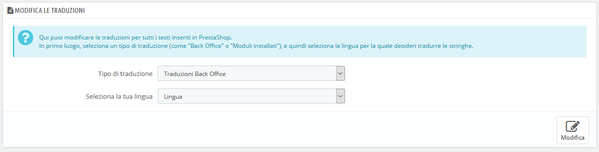
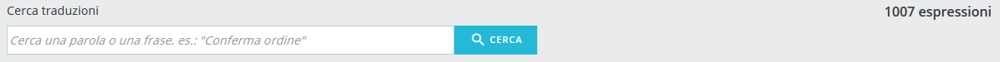
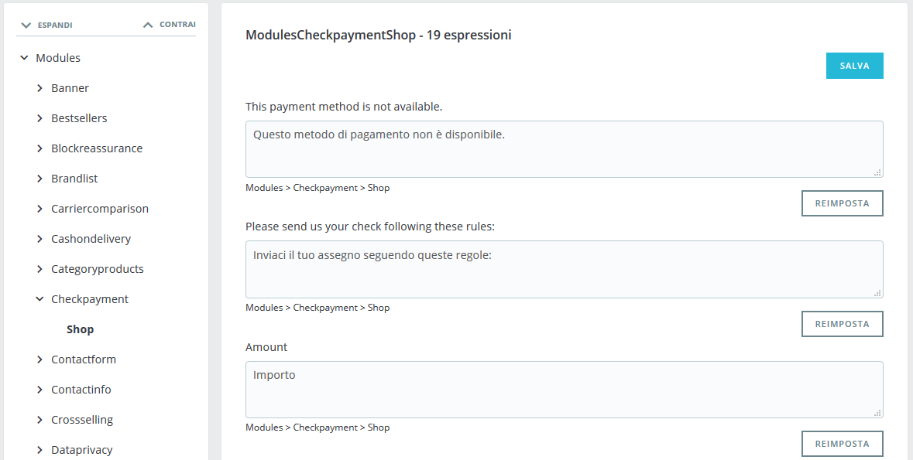
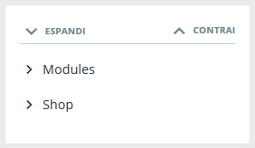
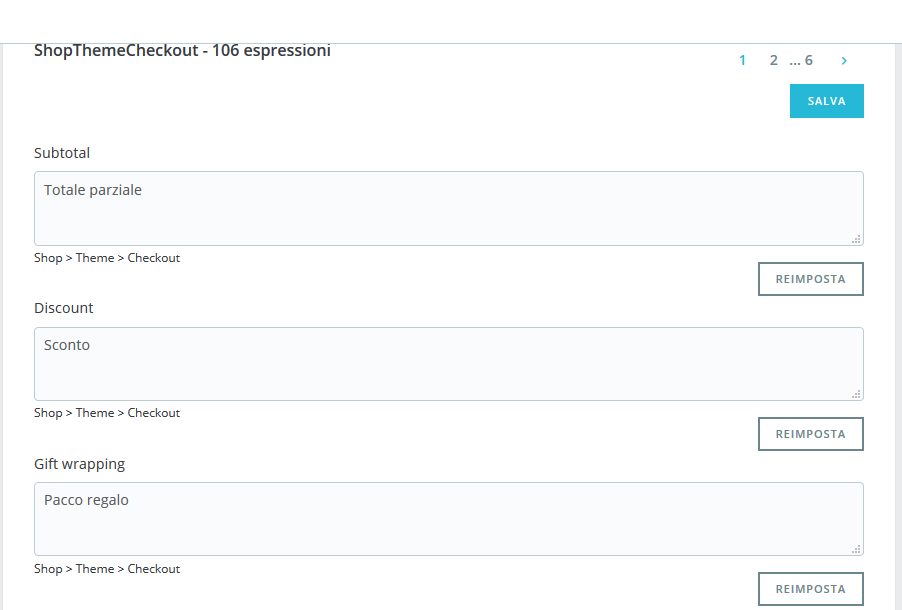
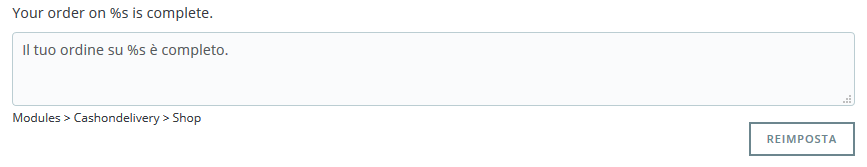
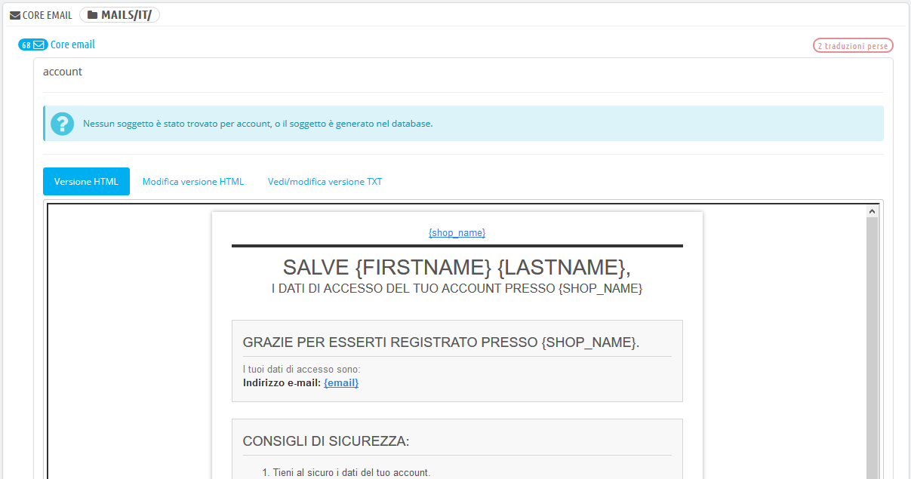
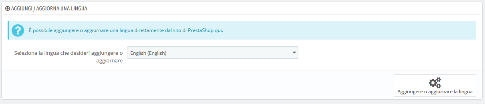
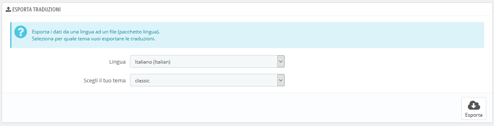
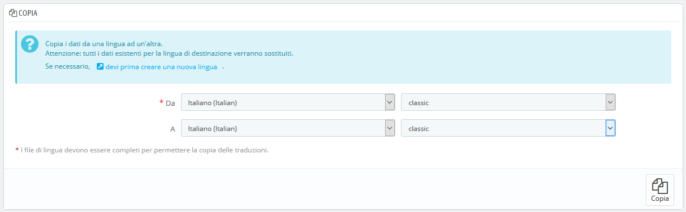

# Traduzioni

PrestaShop ti offre uno strumento di traduzione completo per il tuo negozio. In questo modo è possibile aggiungere e modificare le traduzioni delle pagine. Sarai così padrone del tuo negozio e potrai gestire le stringhe e le espressioni tradotte, senza dover aspettare che i traduttori ufficiali pubblichino le proprie correzioni. Infatti, PrestaShop offre molte lingue e sia il pannello di amministrazione sia il tema predefinito sono già tradotti in più di 25 lingue, anche se alcune lingue non sono ancora complete.

Se non si desidera correggere il lavoro dei traduttori, è comunque possibile modificare il tono che hanno scelto di utilizzare \(meno formale, più essenziale, ecc.\) e personalizzare il testo disponibile in modo da ottimizzare il tuo sito web per il pubblico; per esempio, un negozio di abbigliamento hip-hop potrebbe prediligere espressioni diverse da quello di un negozio di orologi di lusso.

Il processo di adattamento di un programma a lingue straniere è chiamato _internazionalizzazione e localizzazione_, o in breve i18n e L10n.

L'internazionalizzazione è il primo passo con cui gli sviluppatori scelgono un meccanismo per la traduzione del software. Tutte le stringhe del software vengono quindi convertite per utilizzare questo meccanismo. La localizzazione è il secondo passo in cui gli utenti bi o multi lingue del software effettivamente traducono le stringhe originali nella propria lingua. La localizzazione può anche includere la fornitura di dati locali per migliorare ulteriormente il software per quegli utenti.

Puoi saperne di più su i18n e L10n su questa pagina di Wikipedia: [http://en.wikipedia.org/wiki/Internationalization\_and\_localization](http://en.wikipedia.org/wiki/Internationalization_and_localization)

Il team PrestaShop ha scelto di utilizzare il proprio strumento di traduzione integrato, affinché chiunque abbia un'installazione PrestaShop possa personalizzare il proprio negozio alle proprie esigenze.

Le traduzioni disponibili sono eseguite dalla nostra comunità tramite uno strumento online, situato all'indirizzo [https://crowdin.net/project/prestashop-official](https://crowdin.net/project/prestashop-official). Iscriviti e aiutaci in modo che PrestaShop sia completamente tradotto anche nella tua lingua!

Video - 5 domande da porsi prima di tradurre il tuo negozio online

## Modificare una traduzione 

Lo strumento più importante della pagina "Traduzione" si trova nella sezione "Modifica le traduzioni". È qui che puoi scegliere di aggiungere una traduzione e personalizzare completamente ogni frase se lo desideri.

Seleziona la parte della traduzione che desideri modificare:

* **Traduzioni back office**. Il testo del pannello di amministrazione visibile a te e al team del tuo negozio.
* **Traduzioni a tema**. Il testo visibile ai tuoi clienti durante la navigazione nel tuo negozio.
* **Traduzione dei moduli installati**. Il contenuto dei moduli. Nota che i moduli disponibili ma non installati non verranno visualizzati nello strumento.
* **Traduzioni di posta elettronica**. I termini utilizzati nei modelli email predefiniti.
* **Altre traduzioni**. Questa categoria è destinata a scomparire nella versione in arrivo. Esso contiene espressioni che non sono ancora state identificate dal tema o dal back office.

Se stai cercando un'espressione specifica nelle sezioni "Back office", "Tema" o "Modelli di posta elettronica" e non riesci a trovarla, potrebbe essere presente nella sezione "Altre traduzioni".

Alcune categorie hanno un secondo elenco a discesa con i temi disponibili. I temi di PrestaShop hanno le proprie stringhe, ma possono anche avere i propri moduli e modelli di posta elettronica. L'elenco a discesa consente di scegliere il tema su cui si desidera lavorare.

Una volta selezionato, scegli il codice della lingua in cui desideri modificare la categoria di traduzione e clicca su "Modifica".

Si aprirà una nuova pagina in cui è possibile gestire le traduzioni. È organizzato in diverse sezioni.

### Cercare un’espressione 

Nella parte superiore della pagina è presente una barra di ricerca per aiutarti a trovare una parola, una frase o un'espressione specifica che si desidera modificare o tradurre. A destra, è presente il numero di espressioni disponibili in quella sezione e di quante non sono ancora state tradotte nella lingua selezionata.

Inserisci l'espressione da cercare e clicca su "Cerca" per trovarla.

Le espressioni corrispondenti alla tua ricerca verranno mostrate di seguito. Puoi modificarla o tradurla e cliccare su "Salva" per salvare le modifiche. Cliccando su "Ripristina" sostituirai la tua traduzione personalizzata con le traduzioni ufficiali di PrestaShop: puoi ripristinare la traduzione iniziale se una traduzione è disponibile oppure lasciare vuoto il campo se non è disponibile una traduzione.

Puoi consultare il menù a sinistra per trovare tutte le frasi corrispondenti alla tua ricerca:

###  

### Esplorazione le traduzioni 

La colonna di sinistra ti aiuta a navigare attraverso le varie stringhe disponibili nella categoria che vuoi tradurre o modificare. Essa si basa su ciò che noi chiamiamo domini di traduzione: ogni espressione all'interno di PrestaShop viene assegnata a un dominio, conferendo ai traduttori più contesto, rendendo possibile sapere dove questa espressione viene visualizzata in PrestaShop e di cosa si tratta.

Per la sezione back office e front office, vedrai due domini principali, il secondo è in moduli. Infatti, i moduli dispongono di contenuti che possono essere visualizzati nel back e nel front office, per cui queste espressioni saranno disponibili quando si desidera tradurre il back o il front office.

Accanto a ciascun dominio, viene visualizzato il numero di espressioni mancanti. Ti aiuta a sapere dove ti devi concentrare se desideri tradurre completamente PrestaShop.

Per mostrare le espressioni di un dominio, clicca sul nome corrispondente: vedrai a destra tutte le espressioni.

Struttura dei Domini

Anche se in un primo momento può sembrare complicato cercare i domini delle traduzioni, capirai rapidamente come funziona e troverai facilmente la tua strada attraverso l'albereratura di dominio.

Ogni sezione \(back office o tema\) è ulteriormente divisa in domini funzionali, corrispondenti a ciascuna sezione del back office \(o tema\).

Ad esempio, per il back office, i seguenti domini corrispondono alle relative pagine dell'interfaccia:

* _AdminCatalog, AdminModules, AdminDesign, AdminShipping, AdminPayment, AdminInternational, AdminShopParam_ e _AdminAdvParameters._
* _AdminOrdersCustomers_ contiene le espressioni per le sezioni "Ordini", "Clienti" e "Servizio clienti" del back office.

Questi domini possono avere più sottocategorie: funzione, notifica e aiuto. Significa quanto segue:

* _Funzione_: specifica a un dominio funzionale. Se sei nella sezione "Spedizione", il dominio _Admin.Shipping.Feature_ contiene tutte le espressioni che vengono visualizzate nel menu Spedizione, che sono relative a queste pagine.
* _Notifica_: informazioni, successi, messaggi di avviso o di errore specifici per il dominio funzionale e per le pagine che esso include.
* _Aiuto_: testo di aiuto e segnaposti.

D'altra parte, alcuni domini sono più generici:

* _AdminNavigation_ riguarda tutte le stringhe del menu, del footer e dell'header del back office.
* _AdminActions_ raccoglie tutti i comandi alle azioni, i pulsanti o i collegamenti che si trovano nel back office e sono abbastanza generici \("Salva", "Aggiungi", "Elimina", ecc.\)
* _AdminNotifications_ sono tutti i messaggi di avviso, errore o di successo che possono essere visualizzati nel back office. Dovranno essere generali applicabili a qualsiasi parte del software \(ad esempio "Impostazioni aggiornate"\).
* _AdminGlobal_ contiene qualcosa che non rientra nelle altre categorie, ma è correlato al back office, dato che può essere trovato in molte occasioni \("Stato", "Impostazioni", "Abilitato" ecc.\) e anche in diverse parti del software.

La stessa logica può essere applicata alle traduzioni dei temi:

* _ShopTheme_ e ai suoi sottolivelli \(_Catalog, CustomerAccount, Checkout, Actions_\) sono le espressioni del tema predefinito e delle sezioni principali.
* _ShopForms_ sono specifiche per i vari form che si trovano sul tema predefinito
* _ShopNotifications_ sono i messaggi che vengono mostrati sul tuo negozio, siano essi errori o messaggi di successo.

### Modificare le traduzioni 

Quando si apre un dominio per mostrare le sue stringhe, è possibile modificare le traduzioni esistenti o compilare quelle mancanti.

Cliccando su "Salva" le modifiche verranno salvate.

Cliccando su "Ripristina" la tua traduzione personalizzata sostituirà la traduzione ufficiale di PrestaShop: ripristina la traduzione iniziale se è disponibile una traduzione o lascia vuoto il campo se non è disponibile alcuna traduzione.

Alcune stringhe utilizzano una sintassi speciale con segnaposto, ad esempio `%s`, `%d`, `%1$s`, `%2$d` ecc.

Quando si trova una stringa con tale segnaposto, significa che PrestaShop la sostituirà con un valore dinamico effettivo prima di mostrare la stringa tradotta.

Ad esempio, nella stringa "Il tuo ordine su `%s` è completo", `%s` verrà sostituito dal nome del negozio. Pertanto dovresti lasciarlo nella tua traduzione finale; per esempio, in francese, sarebbe "Votre commande sur `%s` a bien été enregistrée".

Tecnicamente i segnaposto impediscono che le stringhe vengano divise in parti. 

Nel caso di una stringa con un segnaposto, è necessario assicurarsi che il contenuto di tale segnaposto venga inserito nel corretto flusso della frase ed eviti la traduzione letterale.

I segnaposti numerati \(`%1$s`, `%2$d` ecc.\) consentono ai traduttori di riordinare il segnaposto nella stringa mantenendo le informazioni sostituite. In questo modo un traduttore francese potrebbe scegliere di tradurre "Ordine% 1 $ d da% 2 $ s" in "Commande n °% 1 $ s du% 2 $ s" o "Le% 2 $ s, Commande n °% 1 $ s".

###  

### Traduzione moduli 

Quando desideri tradurre uno specifico modulo, scegli "Traduzione dei moduli installati", quindi seleziona il modulo da modificare. Si aprirà una nuova pagina con il contenuto del modulo e con tutte le relative stringhe disponibili.

A seconda del modulo che si sta guardando, l'interfaccia potrebbe essere diversa. Alcuni moduli utilizzano un sistema di traduzione specifico per 1.7, mentre altri utilizzano ancora il sistema precedente alla versione 1.6. Alla fine non cambia nulla per te, in quanto potrai tradurre i tuoi moduli allo stesso modo.

### Template email 

Il modo in cui vengono gestite le traduzioni dei modelli email è un po’ diverso dalle altre traduzioni.

Le stringhe sono suddivise in campi, ma non sono solo semplici campi di testo. Ogni email ha due modelli: uno HTML, in stile e colorato, e uno testuale, chiaro e semplice. Mentre il testo normale può essere modificato direttamente nel campo di testo, l'HTML può essere modificato solo cliccando sul pulsante "Modifica questo modello email" in fondo all'anteprima. Questo clic trasforma l'anteprima in un campo di testo WYSIWYG \(ciò che vedi è ciò che ottieni\), con un editor completo nella parte superiore \(basato su TinyMCE: [http://www.tinymce.com/](http://www.tinymce.com/)\). Oltre a modificare il testo, è possibile modificare il design del form, ad esempio è possibile modificare i colori per adattarlo al design del tuo negozio.

Si noti che i modelli email dispongono di segnaposto, come ad esempio `{lastname}` o `{shop_name}`, che PrestaShop sostituisce con i valori effettivi durante l'invio dell’email. Assicurati di lasciarli nel testo tradotto.

## Aggiungi / Aggiorna una Lingua 

Le traduzioni di PrestaShop sono disponibili in pacchetti che contengono tutte le diverse categorie di traduzioni in un file zip. Molti pacchetti linguistici sono liberamente disponibili per il download e per l'installazione, direttamente dai server PrestaShop. PrestaShop si occuperà di scaricare il pacchetto linguistico, estrarlo e creare la sottocartella corretta nella cartella di installazione /`translation`.

Puoi quindi gestire la nuova lingua nella pagina "Lingue" del menu "Localizzazione".

## Esporta una Lingua 

Puoi creare il tuo pacchetto di lingua utilizzando questo strumento, sia per eseguire un backup delle tue personalizzazioni, sia per condividere le tue traduzioni con un'altra installazione di PrestaShop - tua o di qualcun altro.

Basta scegliere la lingua e il tema della traduzione che si desidera esportare e cliccare sul pulsante "Esporta".

Nota che il pacchetto conterrà il tema che si suppone che la tua traduzione supporti.

## **Copia** 

È possibile copiare il contenuto di una lingua in un'altra. Ciò è particolarmente utile quando si desidera sostituire la lingua di un tema con la stessa lingua di un altro tema.

Scegli la lingua di origine e il tema, quindi la lingua di destinazione e il tema, ora clicca sul pulsante "Copia". Nella maggior parte dei casi, la lingua deve restare uguale in entrambi gli elenchi a discesa.

Se nel tema di destinazione è già presente una cartella per quella lingua, verrà sostituita dai file della lingua e del tema che si sta copiando.

Prima di copiare la lingua di origine potresti preferire creare una nuova lingua per il tema della destinazione.

