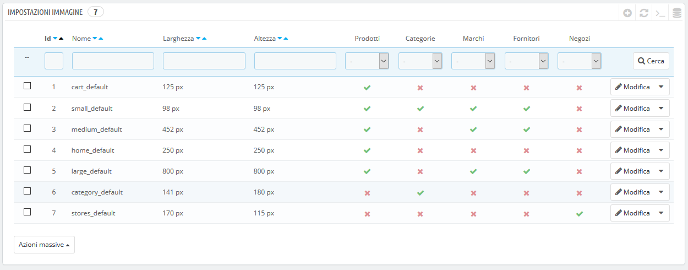
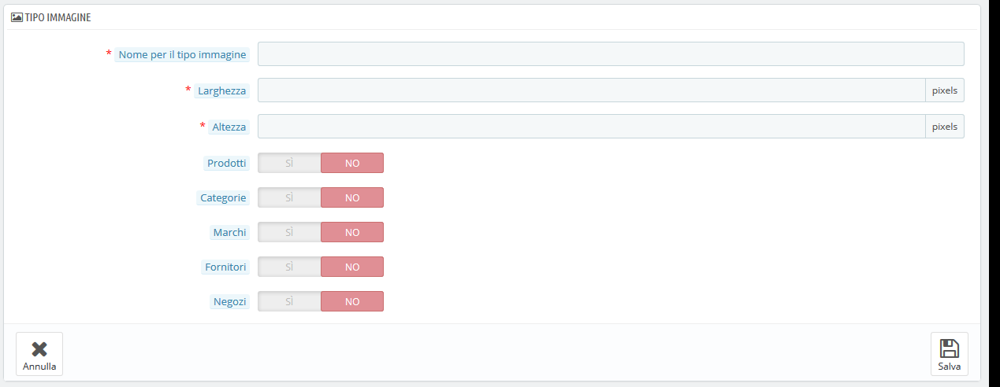
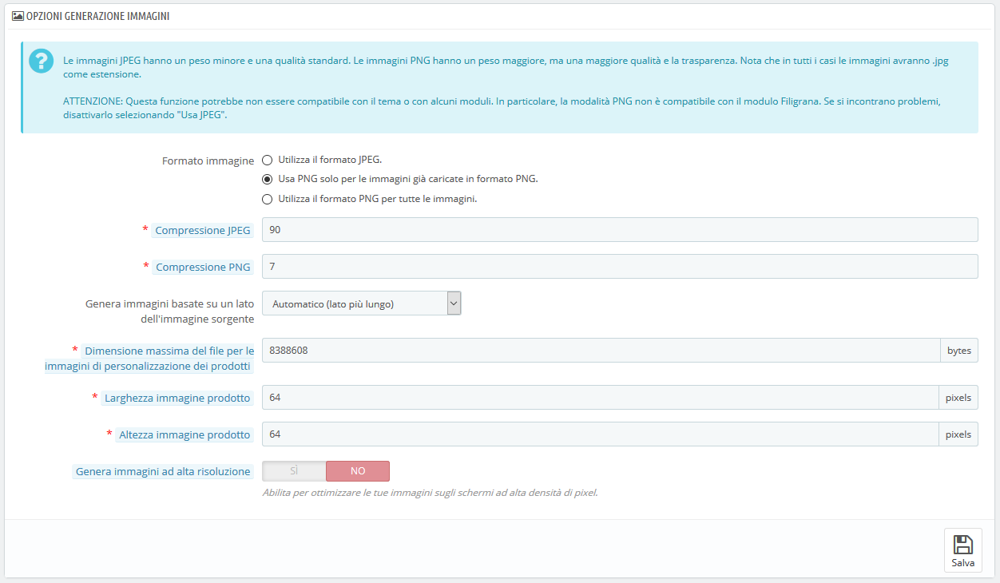
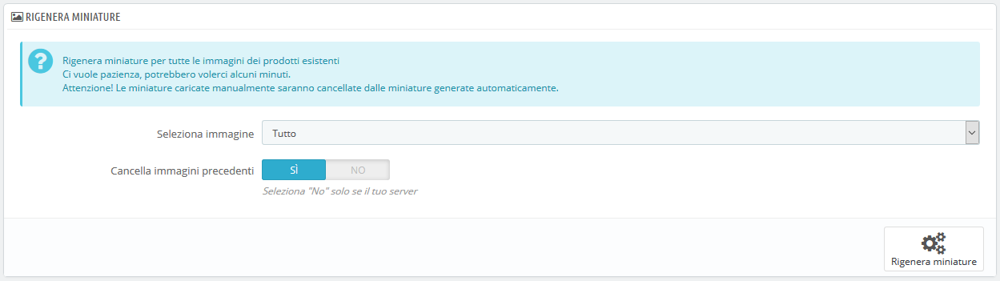

# Impostazioni Immagine

La pagina "Impostazioni immagine" consente di configurare le varie dimensioni delle immagini che i tuoi clienti vedranno nel tuo negozio.

Quando carichi un'immagine su PrestaShop, PrestaShop ne genera automaticamente diverse dimensioni, tra cui miniature e altre versioni più piccole dell'immagine. Occorre quindi caricare una versione "master" della tua immagine, abbastanza grande da poter essere ridimensionata negli altri formati.

Se si desideri assicurarti che la tua immagine venga ridimensionata correttamente, devi caricare un'immagine che corrisponda alle varie dimensioni delle immagini. Se l'immagine caricata non ha lo stesso rapporto larghezza / altezza rispetto alle impostazioni in uso, rischi di vedere gli spazi vuoti nell'immagine ridimensionata.

È possibile abilitare la dimensione dell'immagine per determinati tipi di contenuti, direttamente nell'elenco delle dimensioni delle immagini.

Quando aggiungi un nuovo tema al tuo negozio, il tema aggiungerà le dimensioni delle immagini necessarie. Per impostazione predefinita, la pagina visualizza le dimensioni dell'immagine dal tema predefinito.

## Aggiungere nuovi tipi di immagini 

È possibile aggiungere facilmente una nuova dimensione dell'immagine e impostare il tipo di contenuto a cui si applica.

Clicca sul pulsante "Aggiungi nuovo tipo di immagine", quindi:

1. Digita il nome, la larghezza e l'altezza della dimensione.
2. Scegli a quale tipo di contenuto si applica.
3. Salva.

## Preferenze immagine 

* **Formato immagine**. È possibile scegliere tra due dei principali formati di file: JPEG e PNG. Entrambi sono ben consolidati tra i browser. JPEG ha un buon rapporto di compressione, ma può risultare visibilmente artefatto. L'algoritmo di compressione del PNG non è buono come quello del JPEG, ma presenta relativamente meno artefatti visivi; tuttavia, i browser più vecchi potrebbero non riconoscere questo formato. La scelta fra l'uno e l'altro è spesso una questione di gusto. Detto questo, JPEG rimane la scelta consigliata. Se preferisci evitare la perdita di informazioni a causa della modifica di un formato, scegli la seconda opzione "Utilizza PNG solo se l'immagine di base è in formato PNG”.
* **Compressione JPEG**. Non scegliere immagini sotto gli 80 o ancora peggio i 75, per timore di una bassa risoluzione. 
* **Compressione PNG**. Non scegliere immagini sopra i 6 o ancora peggio i 7, per timore di una bassa risoluzione. 
* **Generare immagini basate su un lato dell’immagine sorgente.** Questa funzione consente di posizionare l'immagine del prodotto nello spazio predefinito: 
  * Scegli "Altezza" per riempire l'altezza del riquadro \(la larghezza viene quindi ricalcolata mantenendo lo stesso rapporto altezza / larghezza come nel file di origine\).
  * Scegli "Larghezza" in modo che l'immagine riempia la larghezza del riquadro \(l'altezza viene quindi ricalcolata mantenendo la stessa proporzione\).
  * Scegli "Automatico" in modo che la larghezza e l'altezza siano calcolati per massimizzare lo spazio che può occupare nel riquadro.
* **Dimensione massima del file per le immagini di personalizzazione dei prodotti**. I tuoi clienti possono caricare immagini personalizzate dei propri prodotti. Per impostazione predefinita, PrestaShop imposta questo valore all'impostazione massima PHP - che può significare svariati megabyte: per esempio, 8.888.608 byte significa 8 Mb. È possibile espandere questo valore se necessario, ma assicurati che l'installazione di PHP sia in grado di caricare i file di questa dimensione.
* **Larghezza immagine prodotto**. Per impostazione predefinita, i clienti possono caricare immagini con una larghezza massima di 64 pixel.
* **Altezza immagine prodotto**. Per impostazione predefinita, i clienti possono caricare immagini con un'altezza massima di 64 pixel.
* **Genera immagini ad alta risoluzione**. Gli schermi più recenti con elevata densità di pixel \(retina e tecnologie simili\) richiedono immagini ad alta risoluzione. È possibile attivare questa funzione per assicurarsi che le immagini vengano visualizzate correttamente anche su questo tipo di schermi. Verrà generato un nuovo file per ciascuna delle tue immagini, con una risoluzione due volte superiore. Ciò raddoppierà il numero immagini, quindi utilizzalo con saggezza se disponi di uno spazio di archiviazione limitato.

## Rigenerare Miniature 

Potresti essere insoddisfatto della dimensione delle miniature del tuo negozio. Questa sezione consente di rigenerarle tutte - o solo quelle destinate a un determinato tipo di contenuto:

1. Modifica le impostazioni della dimensione immagine nella tabella nella parte superiore della pagina in preferenze "Immagini".
2. Seleziona le immagini da rigenerare.
3. Indica se le miniature precedenti devono essere mantenute o meno.
4. Clicca su "Rigenera miniature".

Le miniature caricate manualmente verranno eliminate e sostituite da miniature generate automaticamente.

