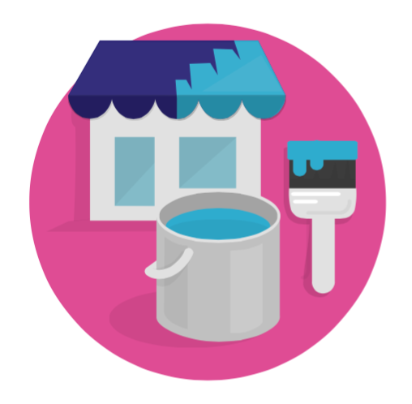

# Migliorare il tuo Negozio

Dato che il tuo negozio e la tua attività si evolveranno, col passare del tempo, vorrai aggiungere nuove funzionalità o esplorare nuovi mercati. Questa sezione riguarda la personalizzazione del tuo negozio: modellare il negozio online per rispecchiare la tua attività corrente, effettuare modifiche con nuovi moduli, nuovi Paesi e lingue, metodi di pagamento o corrieri.

Questo capitolo contiene le seguenti sezioni:

* [Gestire i Moduli](gestire-moduli/)
* [Personalizzare il Design del tuo Negozio](personalizzare-design-negozio/)
* [Gestire le Spedizioni](gestire-spedizioni/)
* [Gestire i Pagamenti](gestire-pagamenti/)
* [Diventare Internazionali](diventare-internazionali/)

