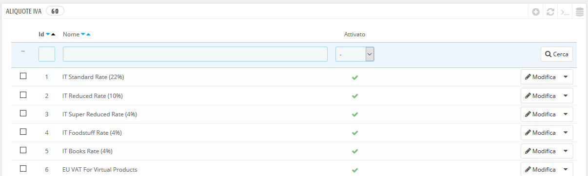
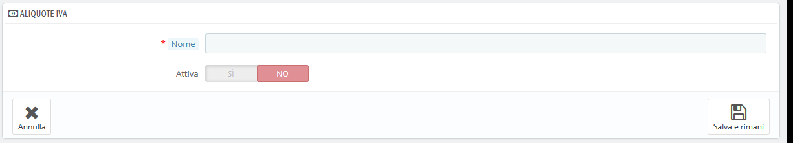
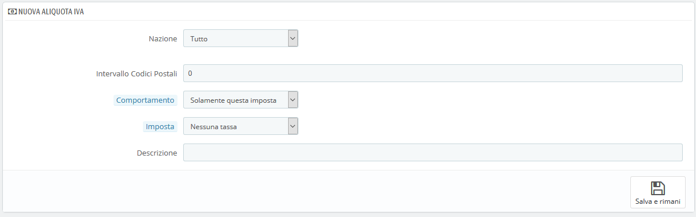

# Regole Fiscali

Le regole fiscali fanno in modo che le imposte vengano applicate solo ai Paesi selezionati.

Per impostazione predefinita in PrestaShop, un'imposta si applica a tutti i Paesi / Stati / zone. Per applicare una tariffa specifica a un singolo Paese o a un insieme di Paesi (escludendone altri), è necessario creare una regola fiscale. La regola fiscale viene quindi applicata in base al prodotto, durante la creazione dello stesso (scheda "Prezzi").

Non è possibile applicare direttamente una tassa a un prodotto; puoi applicare solo regole fiscali. Pertanto, devi prima registrare tutte le imposte pertinenti, creare una regola fiscale per quella imposta per specificare i Paesi in cui si applica la tassa e infine impostare la regola fiscale sul prodotto.

Alcune regole di imposta sui campioni sono già in vigore, dipendono dal Paese che hai scelto per il tuo negozio durante l'installazione di PrestaShop. Le regole fiscali dipendono da ciascuna tassa e da ciascun Pease.

Dovresti modificare un paio di regole già preimpostate per avere una migliore comprensione di come si impostano le regole fiscali.

## Aggiungere Aliquote IVA 

È possibile aggiungere il maggior numero di regole fiscali necessarie all'installazione di PrestaShop. Dovresti inoltre assicurarti che tutte le regole fiscali necessarie siano registrate nel tuo negozio.

La creazione di una nuova regola fiscale avviene in due fasi:

1. Crea la regola fiscale:\

   * Clicca sul pulsante "Aggiungi nuovo gruppo di regole fiscali".
   * Nel form che compare, assegna la regola. Utilizza un nome: inserisci il codice fiscale del Paese, il nome, magari anche il tasso, in modo da trovarlo facilmente in seguito. Se PrestaShop dispone già di regole fiscali per il Paese destinatario, per coerenza, utilizza il suo nome. \
     \
     \

   * Seleziona se la regola deve essere abilitata da subito o meno. Puoi attivarla in seguito, se necessario.
   * Clicca sul pulsante "Salva e rimani". La pagina viene ricaricata, con l'intestazione della tabella in basso e una nuova maschera.
2. Specificare il Paese e i comportamenti:\

   * Compila i campi della sezione "Nuova aliquota IVA": \
     \
     

*
  *
    * **Nazione.** Il Paese di destinazione per la regola che stai creando.
      * **Stato.** Alcuni Paesi hanno stati federati registrati in PrestaShop (vedi la pagina "Stati", sotto il menu "Localizzazione"). In tal caso, è possibile rendere ancora più specifica la tassa o scegliere di applicarla a tutto il Paese. È possibile selezionare più di uno Stato premendo il tasto Ctrl quando si clicca sui nomi di stato.
    * **Intervallo codici postali.** Se il Paese ha registrato o meno gli Stati, è possibile specificare l'applicazione fiscale utilizzando il codice postale del cliente. Questo campo consente di definire codici postali in cui deve essere applicata la tassa: inserire un singolo codice postale o definire un intervallo utilizzando il trattino. Ad esempio, utilizzare "75000-75012" per creare un intervallo per tutti i codici postali tra questi due.
    * **Comportamento.** Alcuni clienti potrebbero avere un indirizzo che corrisponde a più di una delle tue norme fiscali. In questo caso, puoi scegliere come funziona questa regola fiscale:\

      * **Solamente questa imposta.** Applicherà solo questa tassa, nessuna delle altre imposte corrispondenti.
      * **Combina.** Combina le tasse. Ad esempio: 100 € + (10% + 5% => 15%) => 115 €.
      * **Una dopo l'altra.** Applica le tasse una dopo l'altra. Ad esempio: 100 € + 10% => 110 € + 5% => 115,5 €.
    * **Imposta.** L'imposta da utilizzare per questa regola fiscale. Tale imposta deve già essere registrata in PrestaShop. In caso contrario: scegli "Nessuna tassa", disattiva la regola fiscale, salva, vai e crea una tassa nella pagina "Imposte", quindi torna per modificare la regola fiscale.
    * **Descrizione.** Puoi aggiungere un breve testo come un promemoria del motivo per cui questa regola fiscale esiste per questo Paese.
  * Clicca su "Salva e rimani". Il Paese viene aggiunto alla tabella successiva e puoi iniziare ad aggiungere un altro Paese a questo gruppo di regole di imposta cliccando su "Aggiungi una nuova regola fiscale".

Tieni presente che il tasso di default applicato ai tuoi prodotti sarà basato sul Paese predefinito del tuo negozio.
