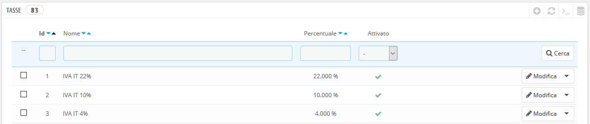
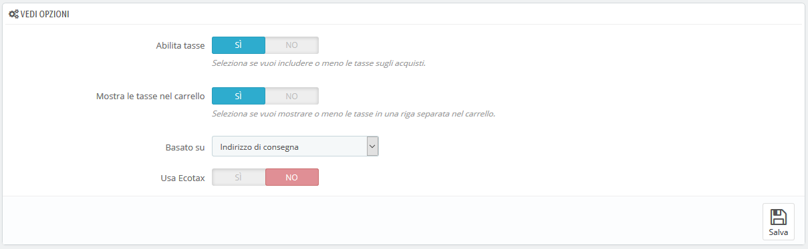

# Tasse

Questa pagina elenca tutte le tasse già create nel tuo negozio. Permette anche di creare nuove tasse, se necessario.

Per ogni imposta, vedrai il nome, l’aliquota e lo Stato. Puoi attivarla o disattivarla direttamente dall'elenco oppure puoi modificarla o eliminarla utilizzando il pulsante di azione a destra.

## Opzioni Tasse 

Nella parte inferiore della pagina è presente la sezione "Opzioni fiscali". Queste opzioni si applicano a tutto il negozio e per tutti gli ordini.

* **Abilita Tasse.** Se le tasse sono incluse in ogni acquisto.
* **Mostra le tasse nel carrello.** Potresti preferire che il cliente non sia a conoscenza delle imposte applicate all'ordine. In tal caso disattiva questa opzione.
* **Basato su.** Il cliente può scegliere di non farsi consegnare il prodotto allo stesso indirizzo in cui viene inviata la fattura dell'ordine. Ciò può avere un grande impatto sulle imposte. Per impostazione predefinita, PrestaShop basa le sue tariffe fiscali sull'indirizzo di recapito, ma è possibile scegliere di basarle sull'indirizzo di fatturazione.
* **Usa Ecotax.** Le ecotax sono "tasse destinate a promuovere attività ecologicamente sostenibili attraverso incentivi economici". È una tassa che i proprietari dei negozio pagano per "l'onere sociale delle proprie azioni". Ulteriori informazioni sull’ecotax in questa pagina di Wikipedia: [http://en.wikipedia.org/wiki/Ecotax](http://en.wikipedia.org/wiki/Ecotax).\
  Una volta che hai abilitato l'utilizzo di ecotax, la pagina back office di tutti i tuoi prodotti disporrà di un campo "Ecotax (incluse)" nella scheda "Prezzi". Dovresti riempire questo campo con il valore esatto della tassa, che dipende dalle leggi fiscali del tuo Paese (probabilmente è basata sul prezzo del prodotto).

Se decidi di abilitare l'ecotax dopo aver aggiunto i prodotti, dovrai modificarli tutti per impostare correttamente l'imposta di ciascun prodotto.

Tieni presente che se hai già impostato l’ecotax per i tuoi prodotti e hai scelto di disattivarla, tutti i tuoi prodotti perderanno le impostazioni ecotax. Riabilitare l'ecotaxe significherà impostarla nuovamente in tutti i prodotti.

L'ecotax apparirà anche al cliente, sulla pagina del prodotto

## Aggiungere una Nuova Tassa 

L'aggiunta di una nuova imposta è molto semplice, poiché le norme fiscali tengono conto del Paese in cui viene applicata. Il modulo di creazione è quindi molto breve:

* **Nome**. Sii molto specifico, ti aiuterà a creare regole fiscali più velocemente.\
  È consigliabile aggiungere promemoria all'interno del nome, ad esempio Paese / gruppo / zona in cui si applica la tassa e la sua tariffa. Ti aiuterà a ricordare quale imposta deve essere utilizzata in una regola fiscale.
* **L’aliquota**. Il tasso esatto, nel formato XX.XX.
* **Abilita**. Puoi disattivare e riattivare una tassa in qualsiasi momento.
